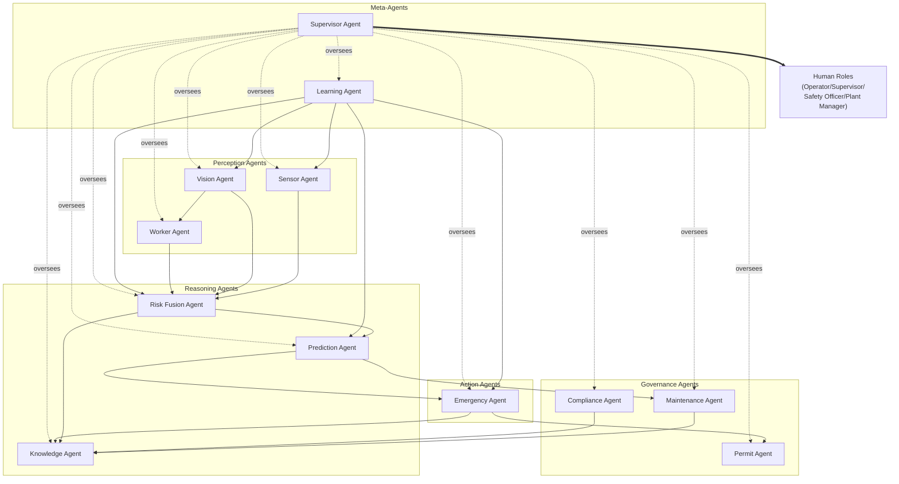
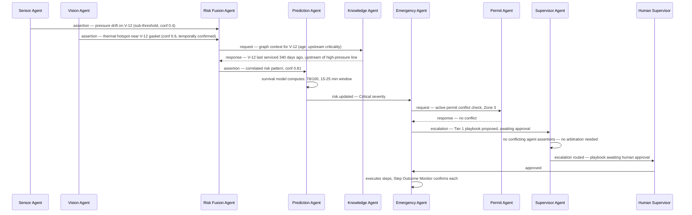

# AEGIS AI — Multi-Agent System Architecture
### Twelve Autonomous Agents, One Fleet, Zero Silent Failures

**Classification:** Internal — Engineering / AI Systems
**Document Owner:** Office of the CTO / AI Systems Architecture
**Version:** 1.0
**Companion Documents:** `ARCHITECTURE.md` (§9 AI Architecture, §15 Agentic AI Architecture — this document is the agent-fleet decomposition of both), `UI_UX_SPECIFICATION.md`, `DATABASE_SCHEMA.md`

---

## 0. Meta-Architecture: Principles Shared by Every Agent

### 0.1 Resolving a Real Tension: "Every Agent Has a Prompt" vs. "Interpretable-First, LLM-Last"

`ARCHITECTURE.md` §9.2 makes an explicit, load-bearing commitment: **the LLM never touches raw sensor data and never independently declares a hazard** — Layers 1-3 (signal processing, correlation, risk scoring) are deterministic, auditable, versionable statistical/ML models, and the LLM's role is strictly to narrate conclusions already reached elsewhere. That commitment does not change here. But a fleet of twelve *agents* — as opposed to twelve *models* — needs more than detection: it needs to communicate findings in language other agents and humans can act on, make judgment calls in genuinely ambiguous situations no threshold rule anticipated, and explain itself on demand. That is what an LLM is for in this architecture, and it is the only thing an LLM is for here.

**Every agent in this document is therefore a hybrid, with two layers:**

1. **The Core** — a deterministic, statistical, or rule-based engine that perceives and decides. This is the part that is unit-tested, versioned, and never touches an LLM. For most agents, this is the entire safety-relevant decision path.
2. **The Reasoning Shell** — an LLM-mediated layer wrapped around the Core, responsible for exactly three things: **(a)** composing natural-language communication (to other agents over the Agent Bus, §0.3, and to humans), **(b)** making narrow, explicitly-scoped judgment calls in situations the Core's rules didn't anticipate (never overriding a Core decision, only filling a gap the Core declines to fill), and **(c)** self-explanation on demand (the "Why?" affordance from `UI_UX_SPECIFICATION.md` §0.2).

The **Prompt** specified for each agent below is the operating charter for that agent's Reasoning Shell — never the mechanism by which the agent perceives the plant or decides whether something is dangerous. Where an agent's Core is the entire decision path (Sensor Agent, Risk Fusion Agent, Prediction Agent), this is stated explicitly, and the Prompt section describes only the narrow band of behavior the Shell is permitted to influence.

### 0.2 Fleet Overview



**A naming clarification worth stating once, prominently:** "Supervisor Agent" (§12) and "Supervisor" the human role (Marcus, `ARCHITECTURE.md` §4.2) are different things that share an unfortunate but unavoidable name. Throughout this document, "Supervisor Agent" always refers to the meta-agent in §12; the human role is always written as "the human Supervisor" or "Marcus's role" to keep the two unambiguous.

Agents are grouped into five functional bands: **Perception** (turn raw reality into structured assertions), **Governance** (enforce rules that gate action — permits, maintenance process, compliance), **Reasoning** (correlate, retrieve, and predict), **Action** (execute in the physical/organizational world), and **Meta** (oversee and improve the fleet itself). This grouping is not arbitrary — it mirrors the five-layer system architecture in `ARCHITECTURE.md` §6.1, so an agent's band tells you which architectural layer it primarily serves.

### 0.3 The Agent Bus — Shared Communication Protocol

Every agent communicates over the same substrate: `ARCHITECTURE.md`'s Event Backbone (§10), with a dedicated set of topics reserved for inter-agent coordination (distinct from the raw data topics like `telemetry.raw`), collectively referred to as **the Agent Bus**:

| Topic | Carries |
|---|---|
| `agent.assertion` | A structured observation/finding one agent publishes for others to consume (e.g., Sensor Agent's anomaly flags) |
| `agent.request` / `agent.response` | Synchronous-style request/response pairs correlated by `correlation_id`, used when an agent needs another's answer before proceeding (e.g., Emergency Agent → Permit Agent) |
| `agent.escalation` | An assertion or arbitration outcome routed toward a human, always passing through the Supervisor Agent |
| `agent.health` | Heartbeat/liveness telemetry every agent emits, consumed by the Supervisor Agent (§12) and the observability stack (`ARCHITECTURE.md` §25.3) |

**The standard message envelope**, used on every topic above:

```
{
  agent_id, agent_version, message_type (assertion|request|response|escalation|health),
  correlation_id, confidence, evidence_refs[], payload, produced_at
}
```

`evidence_refs` is non-negotiable on any `assertion` or `escalation` message — a pointer back to the raw data (sensor reading IDs, camera event IDs, graph node IDs) that produced the claim. This is the Agent Bus's concrete enforcement of `NFR-9` (explainability) at the inter-agent level, not just the human-facing UI level.

### 0.4 Memory Architecture — Three Tiers, Applied Consistently

Every agent's Memory section below is structured around the same three tiers, so the fleet's memory model is learnable once rather than twelve times:

- **Working Memory** — ephemeral, scoped to a single reasoning episode (a correlation window, a playbook execution, a conversation). Never persisted beyond the episode's lifetime.
- **Episodic Memory** — this specific agent's own history of past assertions/decisions and their eventual outcomes. Persisted (in the relevant `DATABASE_SCHEMA.md` tables), owned by the agent, and is the primary raw material the Learning Agent (§11) consumes.
- **Shared/World Memory** — the Knowledge Graph and Digital Twin (`ARCHITECTURE.md` §13, §16), read by nearly every agent, but **written to directly by almost none of them** — Knowledge Agent (§6) is the sole authorized writer for graph updates, and Digital Twin state updates flow through the standard event topics, never a direct cross-agent write. This single-writer discipline is what prevents the shared world-model from becoming inconsistent under concurrent agent activity.

### 0.5 Confidence Score Standard

Every agent's confidence score is a normalized `[0,1]` value with the same three calibration bands system-wide (matching `risk_scores.confidence` in `DATABASE_SCHEMA.md` §10 and the uncertainty-as-first-class-data principle in `ARCHITECTURE.md` §9.4):

| Band | Range | Meaning | Autonomy Implication |
|---|---|---|---|
| **High** | > 0.85 | Strong statistical/model support | Eligible for Tier 2+ autonomous action (`ARCHITECTURE.md` §15.2), subject to the action's own tier ceiling |
| **Medium** | 0.5 – 0.85 | Plausible but not conclusive | Tier 1 (recommend) only — human approval required regardless of the acting agent |
| **Low** | < 0.5 | Weak/early signal | Tier 0 (inform) only — surfaced to a "watch list," never actioned |

Critically: **confidence bands govern autonomy ceiling, never truthfulness framing** — a Low-confidence assertion is not hidden or suppressed, it is labeled honestly and routed to a lower-urgency surface (`UI_UX_SPECIFICATION.md` §2's watch-list tier), consistent with the "never invent false certainty" principle established throughout the prior documents.

### 0.6 Failure Philosophy — Fail-Closed vs. Fail-Open, Stated Per Agent

Every agent's Failure Handling section states, explicitly, whether that agent **fails closed** (its unavailability blocks the action it would have gated — used when acting without it is more dangerous than not acting at all) or **fails open with degradation** (its unavailability narrows the system's capability but does not block the baseline safety path — used for perception/enrichment agents where `NFR-2`'s "basic alarms always work" guarantee must hold). This single word choice, made deliberately for each agent rather than defaulted, is one of the most consequential design decisions in this document.

---

## 1. Sensor Agent

### Mission
Continuously watch every registered sensor's live stream and detect per-signal statistical anomalies — the agent-level implementation of `ARCHITECTURE.md` §9.1 Layer 1. This is a perception agent: it observes and asserts, it never correlates across signals (that's Risk Fusion Agent, §7) and never decides an incident is warranted.

### Inputs
`sensor_readings` hypertable stream (`DATABASE_SCHEMA.md` §20), `sensors` metadata (calibration, expected range, sensor type), each sensor's own rolling historical baseline window.

### Outputs
`agent.assertion` messages (anomaly flags, one per sensor, published to `anomaly.detected`); sensor data-quality flags (feeding `sensor_readings.quality`); baseline-recalibration proposals.

### Memory
- **Working:** a rolling per-sensor buffer (window size tuned to the sensor's sample rate, e.g. 5-30 minutes) holding exactly what the statistical model needs — mean, variance, recent control-chart state — discarded once the window slides past.
- **Episodic:** this sensor's own history of past anomaly flags and their eventual disposition (true anomaly vs. sensor fault vs. ignored) — the raw material for both this agent's own adaptive-baseline tuning and the Learning Agent's (§11) fleet-wide calibration review.
- **Shared:** read-only access to `equipment_types`/`sensor_types` expected-range metadata; no writes to shared world memory.

### Prompt
The Core (statistical anomaly detection) uses no prompt at all — this is the agent where that statement is most literally true in the entire fleet. The Reasoning Shell activates only for the narrow case of **novel-pattern framing**: when a sensor's behavior is anomalous by every statistical measure but doesn't match any known failure signature, the Shell drafts a plain-language description for the Agent Bus rather than leaving the anomaly uncharacterized. Representative Shell prompt:

> *"A statistical anomaly has been detected on sensor {tag} monitoring {equipment}. It does not match a known failure signature in the corpus. Given the raw deviation pattern below, describe in one sentence what is unusual, in plain engineering language, without speculating about root cause. Do not assign a severity — that is decided elsewhere."*

### Reasoning Strategy
An ensemble of interpretable statistical methods — EWMA (exponentially weighted moving average) control charts, seasonal-adjusted thresholding, and isolation-forest outlier scoring — voting together; the Reasoning Shell is invoked only post-hoc, for characterization, never for the detection decision itself.

### Confidence Score
Derived directly and solely from the statistical ensemble's own agreement level (e.g., normalized z-score magnitude, or the fraction of ensemble members voting anomalous) — never from the LLM Shell, per §0.1's hard boundary.

### Communication Protocol
Asynchronous, publish-only under normal operation: emits `agent.assertion` on the Agent Bus and `anomaly.detected` on the data plane simultaneously. Consumes no other agent's output directly (a deliberately "leaf" position in the fleet graph, §0.2).

### Tools
Read access to `sensor_readings`/`sensors`; a baseline-recalibration invocation tool; a data-quality-flag-setting tool (writes `sensor_readings.quality`).

### Failure Handling
**Fails open with degradation.** If a Sensor Agent instance for a given sensor (or shard of sensors) goes down, raw readings continue landing in `sensor_readings` uninterrupted (ingestion is agent-independent per `ARCHITECTURE.md` §17.2) and any existing OT-level threshold alarms continue operating exactly as they would with no AI layer at all — directly satisfying `NFR-2`. The only loss is the *early, sub-threshold* anomaly detection this agent adds on top.

### Retry Logic
Exponential backoff with jitter on transient reads against the time-series store; after 3 consecutive failed read attempts against a given sensor's window, the agent flags that sensor as "monitoring degraded" (a distinct, visible state, not a silent gap) and yields to a standby instance via the standard consumer-group rebalancing pattern (`ARCHITECTURE.md` §10.5).

### Knowledge Sources
Primarily self-referential (a sensor's own history); secondarily, a narrow query to Knowledge Agent (§6) for equipment-specific known-failure-signature patterns when the Shell is characterizing a novel anomaly.

### Decision Strategy
Publish an assertion whenever the ensemble's combined confidence crosses a calibrated per-sensor-type threshold (tuned to that sensor class's typical noise floor, not a single global constant). Never makes a final, actionable determination alone — this agent's entire output is an input to Risk Fusion Agent, by design.

### Escalation Policy
Tier 0 (inform only) by construction — this agent has no path to directly notify a human. Its only escalation is upward, to Risk Fusion Agent (routine) and, for genuinely novel unclassifiable patterns, a flagged query to Knowledge Agent — never a direct Notification Service call, keeping the layering from `ARCHITECTURE.md` §9.1 intact at the agent level.

---

## 2. Vision Agent

### Mission
Run the Computer Vision Service's inference pipelines (`ARCHITECTURE.md` §18) across every camera feed — thermal anomaly detection, smoke/fire, PPE compliance, intrusion, leak/spill, equipment visual state — turning raw frames into structured, temporally-smoothed detection events.

### Inputs
Live camera frame streams (RGB + thermal), `cameras` metadata, zone hazard classification (`zones.hazard_class`, to contextually bias detection thresholds), prior-frame buffer for temporal smoothing.

### Outputs
`camera_events` rows, `vision.inference` events, candidate `ppe_violations` (unconfirmed — Worker Agent, §3, adds identity attribution before these are finalized).

### Memory
- **Working:** a short rolling buffer of the last N frames per camera-capability pair, used exclusively for the mandatory temporal-persistence check (`ARCHITECTURE.md` §18.2) that suppresses single-frame false positives.
- **Episodic:** per-camera, per-capability detection history, specifically tracking confirmed-vs-false-positive rate — this agent self-tunes its own confidence calibration per camera over time (a camera in a steamy, humid zone learns to require more evidence before flagging "smoke," for instance).
- **Shared:** writes equipment visual-state observations into the Digital Twin's state layer (`ARCHITECTURE.md` §16.2) via the standard event topic, never a direct write.

### Prompt
The Core (per-capability CV models + temporal smoothing) makes every detection decision. The Reasoning Shell activates for **disambiguation between visually similar but operationally distinct phenomena** (steam vs. smoke; a maintenance worker's reflective vest vs. a genuine PPE-compliant vest) when model confidence for two competing classes is close. Representative Shell prompt:

> *"Two detection models returned near-equal confidence for this frame: {class_a} at {conf_a} and {class_b} at {conf_b}, in zone {zone} with hazard class {hazard_class}. Given the zone context, which classification is more operationally plausible, and what single additional piece of evidence (e.g., a thermal reading, a gas sensor) would resolve the ambiguity? Do not resolve the ambiguity yourself if the zone's hazard class does not clearly favor one reading — flag as unresolved instead."*

### Reasoning Strategy
Parallel per-capability specialized detectors (§18.1) with a mandatory N-consecutive-frame temporal-consistency gate before any event is emitted; the Reasoning Shell is invoked only in the narrow, explicitly bounded disambiguation case above, and never overrides a confident detection.

### Confidence Score
The detector's own per-frame confidence (softmax/sigmoid output) multiplied by a temporal-persistence factor that increases with consecutive-frame agreement — a single detection frame, however confident, cannot alone produce a high fused score.

### Communication Protocol
Asynchronous publish (`agent.assertion` + `vision.inference`); consumed directly by Risk Fusion Agent (§7) and Worker Agent (§3, for PPE/intrusion detections specifically).

### Tools
Frame-sampling rate control, ROI-crop utility, per-capability model-inference invocation, zone-polygon lookup (for intrusion/occupancy geometry).

### Failure Handling
**Fails open with degradation, but loudly.** A camera or feed outage does not block any other modality (sensor-based detection continues independently, no shared failure domain per `NFR-3`), but — unlike Sensor Agent's quieter degradation — this agent surfaces an explicit, persistent "vision coverage degraded in Zone X" status precisely because a silently-blind camera is a materially different risk profile than a silently-degraded pressure sensor (loss of visual confirmation for PPE/intrusion/fire has a distinct, human-safety-relevant failure mode).

### Retry Logic
Best-effort, latest-frame-wins for stream continuity (a dropped frame is not retried — the next frame arrives momentarily and matters more); persistent reconnection retry with backoff for a fully dropped camera connection; a dead-letter path for frames that repeatedly fail inference (corrupted formats, codec issues) rather than blocking the stream on them.

### Knowledge Sources
The labeled training corpus per CV capability (`ARCHITECTURE.md` §18.4); `zones.hazard_class` for threshold contextualization; its own episodic false-positive history for self-calibration.

### Decision Strategy
Hard, non-negotiable temporal-smoothing gate (N consecutive frames) before any event emission — this rule is not subject to Shell override under any circumstance, since it is the primary defense against the alarm-fatigue failure mode `UI_UX_SPECIFICATION.md` §0.1 identifies as the design thesis's central enemy.

### Escalation Policy
Routine detections (thermal drift, general equipment-state) flow to Risk Fusion Agent at Tier 0. **PPE violations and intrusion-into-elevated-risk-zone detections bypass the normal correlation latency** and escalate directly to Worker Agent and, for the latter, toward Emergency Agent — an explicit fast-path carve-out justified by the immediate personal-safety stakes, distinct from the standard equipment-risk correlation pipeline.

---

## 3. Worker Agent

### Mission
Maintain real-time personnel location and safety-state awareness by fusing Vision Agent's person-detections with badge/RFID identity data, tracking zone occupancy against configured safe limits and PPE compliance — the agent behind Worker Tracking (`UI_UX_SPECIFICATION.md` §6).

### Inputs
`vision.inference` person-detection and PPE-candidate events, badge/RFID scan events, `zones.safe_occupancy_limit`, `shift_assignments` (expected on-site roster).

### Outputs
Live worker-location state (feeds Digital Twin), confirmed `ppe_violations` rows, occupancy-threshold assertions, worker-in-hazard-zone escalations.

### Memory
- **Working:** current per-worker location state, held in a fast in-memory/Redis-backed cache (matching the Digital Twin State Layer pattern, `ARCHITECTURE.md` §16.2) — not the historical record, the *current* fact only.
- **Episodic:** **deliberately minimal by default.** Per the ethics note in `UI_UX_SPECIFICATION.md` §6, this agent does not retain historical movement trails as a matter of course — only current-state, short-TTL data, unless a Safety-Officer-justified, access-logged query explicitly requests a broader historical view for a legitimate safety investigation. This is a privacy-by-design constraint stated as an architectural requirement, not an incidental omission.
- **Shared:** writes current worker positions into the Digital Twin state feed via the standard event path.

### Prompt
The Core (badge-to-CV fusion logic, occupancy/hazard-intersection checks) is fully deterministic. The Reasoning Shell composes plain-language occupancy summaries for the UI ("Zone 4 is at 8 of 6 safe capacity") and handles **identity-mismatch flagging** — when a badge scan's expected headcount disagrees with CV-derived person count, the Shell describes the discrepancy for human review rather than silently picking one source as authoritative. Representative Shell prompt:

> *"Badge data indicates {n_badge} personnel in Zone {zone}; vision-based headcount indicates {n_cv}. Do not attempt to resolve which count is correct — describe the discrepancy factually for a Supervisor's attention, and note any recent badge-scan or camera-health anomalies that might explain the gap."*

### Reasoning Strategy
Deterministic identity-and-position fusion: badge/RFID scans are treated as ground truth for *identity*, CV detections as ground truth for *position and count* — the Core's job is to reconcile these two independent signals and flag disagreement rather than silently resolve it, since resolving it wrong (misattributing a location to the wrong named person) is a distinct, serious harm this design explicitly avoids (per the ethics note in `UI_UX_SPECIFICATION.md` §6).

### Confidence Score
Two independent scores, not one: **identity-confidence** (how certain the badge/identity match is) and **location-confidence** (how certain the CV-derived position is) — reported and acted on separately, since conflating them would obscure exactly the kind of error this agent is designed to surface rather than hide.

### Communication Protocol
Publishes to a dedicated `worker.location` / `worker.ppe_violation` topic; maintains a direct, high-priority Agent Bus link to Emergency Agent (§9) specifically for evacuation-relevant occupancy breaches, bypassing the standard correlation-latency path used for equipment risk.

### Tools
Badge-reader query interface, CV person-count query (from Vision Agent), zone occupancy-limit lookup, an evacuation-broadcast tool (Tier 2 — requires a human Supervisor-role trigger per RBAC, `ARCHITECTURE.md` §21.2, this agent cannot invoke it unilaterally).

### Failure Handling
**Fails open with explicit degradation labeling, asymmetric by source.** Camera outage degrades count-confidence but leaves a coarser badge-based roster available; badge-reader outage leaves an anonymous, CV-only headcount. Both states are explicitly flagged as reduced-confidence — this agent never defaults silently to "all clear" when either input source is degraded, directly implementing the Factory Map's (`UI_UX_SPECIFICATION.md` §4) "personnel tracking degraded" error-state design.

### Retry Logic
Standard backoff on both data-source reads. **Evacuation broadcasts are never automatically retried** — a duplicate evacuation alarm is itself a hazard (crowd/panic risk) — these are idempotency-keyed and deduplicated rather than retried on ambiguous delivery-confirmation failure.

### Knowledge Sources
`workers`/`shift_assignments` for the expected roster baseline; `zones` for hazard/occupancy configuration.

### Decision Strategy
Rule-based: occupancy-threshold comparison and hazard-zone-intersection check (is a currently-tracked worker physically inside a zone whose risk score just became elevated) — fully deterministic, no LLM judgment call anywhere in this safety-critical path.

### Escalation Policy
"Worker currently inside a newly-elevated-risk zone" is the single highest-priority escalation type this agent produces — routed simultaneously to the zone's on-duty human Supervisor (notification) and to Emergency Agent (as a candidate playbook trigger input), bypassing normal batched/correlated review given the immediacy of personal-safety stakes.

---

## 4. Permit Agent

### Mission
A gatekeeper, not a detector: continuously track work-permit validity and check any proposed automated action (an Emergency Agent playbook step) against currently active permits before that action is allowed to proceed — e.g., never autonomously isolate a line with an active hot-work permit downstream without human review.

### Inputs
`permits` table lifecycle state, proposed playbook steps (a synchronous query from Emergency Agent), the zone/equipment scope of the proposed action.

### Outputs
Conflict-check verdicts (approve / flag-for-human-review), permit-expiry-warning notifications.

### Memory
- **Working:** a fast, current-state index of active permits per zone/equipment, rebuilt incrementally as permits change status — optimized purely for low-latency lookup, since this agent is called synchronously in a time-sensitive execution path.
- **Episodic:** permit issuance and conflict history, feeding compliance trend reporting (consumed by Compliance Agent, §5).
- **Shared:** none — this agent does not participate in the Knowledge Graph/Digital Twin shared memory; its authoritative data is entirely relational (`permits`, `DATABASE_SCHEMA.md` §7).

### Prompt
The Core (permit-scope-intersection logic) is a deterministic database lookup — a genuine fact, not an inference. The Reasoning Shell's only job is parsing a permit's free-text `conditions` field into a structured constraint when the structured fields alone are insufficient, and composing a human-readable conflict explanation. Representative Shell prompt:

> *"This permit's structured fields do not fully capture its scope. Its free-text conditions read: '{conditions}'. Does this text impose any constraint relevant to the proposed action '{action_description}' on equipment '{equipment}'? Answer only 'constraint found: [description]' or 'no additional constraint identified' — if genuinely unsure, say so explicitly rather than guessing either answer."*

### Reasoning Strategy
Deterministic set-intersection (does the proposed action's zone/equipment scope overlap any active permit's scope) as the Core; LLM-assisted free-text parsing as a narrow Shell supplement, invoked only when structured fields don't resolve the check outright.

### Confidence Score
Represents **parsing-confidence on free-text conditions only** — the underlying conflict fact itself (is there an active permit in this scope) is a database fact, not a probabilistic claim, and is never scored as anything other than certain.

### Communication Protocol
Primarily **synchronous request/response** (`agent.request`/`agent.response`) — one of only two agents in the fleet (with Knowledge Agent) primarily invoked as a blocking query rather than an async publisher, because this is a gate an action must pass through, not an observation to react to later.

### Tools
Permit-scope lookup query, free-text conditions parser, dual-signoff requirement checker (`permit_types.requires_dual_signoff`).

### Failure Handling
**Fails closed.** If Permit Agent is unreachable when Emergency Agent needs a conflict check, the default is "cannot verify — treat as a potential conflict and escalate to a human," never "assume no conflict and proceed." This is a deliberate, explicit fail-closed design — the one clear case in the fleet where failing open would be strictly more dangerous than failing closed, since an executed action that violates an active hot-work or lockout-tagout permit is a severe, direct safety hazard.

### Retry Logic
Fast retry (low latency, low volume queries) with a short timeout, after which the fail-closed escalation above triggers — this agent does not retry indefinitely in a time-sensitive execution path; it fails fast into the safe state.

### Knowledge Sources
`permits`, `permit_types`, `employers`, `workers` tables — no external corpus required.

### Decision Strategy
Deterministic; any parsing ambiguity on free-text conditions always escalates to a human rather than guessing in either direction — this agent never overrides a detected conflict autonomously, regardless of the requesting action's autonomy tier.

### Escalation Policy
Any detected conflict, or any conditions-parsing ambiguity, routes to the human Supervisor role via the Notification Service before the gated action is allowed to proceed — full stop, with no autonomy-tier exception, since permit conflicts are a category of risk this fleet treats as categorically requiring human judgment.

---

## 5. Maintenance Agent

### Mission
Manage the maintenance lifecycle end to end: turn Prediction Agent's failure forecasts into scheduled work orders, dispatch them to available technicians, and capture field findings as the ground-truth data that closes the continuous-learning loop (`ARCHITECTURE.md` §9.5).

### Inputs
`predictions` (equipment failure forecasts), `maintenance_records`, technician availability (`shift_assignments`/`workers`).

### Outputs
New `maintenance_records` rows (work orders), technician dispatch notifications, ground-truth outcome writes back to `predictions.actual_outcome`.

### Memory
- **Working:** the current open work-order queue, prioritized live as new predictions and technician availability change.
- **Episodic:** the full historical maintenance-outcome record — which predictions led to confirmed findings versus false alarms — this agent's episodic memory is one of the two primary raw inputs (with Emergency Agent's) to the Learning Agent's retraining evaluation.
- **Shared:** none directly; reads Knowledge Agent for manual excerpts rather than holding its own copy.

### Prompt
The Core (priority scheduling) is rule-based. The Reasoning Shell drafts the human-facing work-order description and pulls in a relevant manual excerpt (via a Knowledge Agent query) into plain, technician-facing language. Representative Shell prompt:

> *"Draft a work order for a technician inspecting {equipment} for a predicted {failure_mode}, confidence {confidence}, predicted window {window}. Include the relevant manual excerpt retrieved below verbatim, cited by section. Do not add any diagnostic claim beyond what the prediction and the manual excerpt state."*

### Reasoning Strategy
A priority-queue scheduling algorithm (criticality × urgency × technician availability and certification match) as the Core; LLM-assisted natural-language composition as the Shell, always grounded in retrieved manual content rather than freely generated.

### Confidence Score
Inherits the triggering Prediction Agent assertion's confidence directly, displayed alongside this agent's own (separate) scheduling-priority score — the two are never conflated into one number, since "how sure are we this will fail" and "how urgently should this be scheduled given current staffing" are genuinely different questions.

### Communication Protocol
Asynchronous, event-driven: subscribes to `risk.updated`/`predictions`, publishes `maintenance.work_order_created`; makes a synchronous query to Knowledge Agent for manual excerpts during work-order drafting.

### Tools
Work-order creation tool, technician dispatch/notification tool, Knowledge Agent RAG query tool.

### Failure Handling
**Fails open with a visible backlog signal.** If this agent is down, predictions simply accumulate unactioned rather than silently vanishing — a monitored queue-depth metric (per `ARCHITECTURE.md` §25.3) makes this backlog visible to operations immediately, so "no work order was generated" is always a loud, detectable state, never a silent gap.

### Retry Logic
Standard exponential backoff on dispatch-notification delivery; work-order creation is **idempotent, keyed by `prediction_id`**, specifically to prevent a retried creation call from generating a duplicate work order for the same forecast.

### Knowledge Sources
This agent's own historical maintenance-outcome record; Knowledge Agent for equipment manuals and procedure references.

### Decision Strategy
Priority-queue scheduling, criticality-weighted; never autonomous on cost-impacting decisions above a configured threshold (e.g., ordering expensive replacement parts) — those always require human approval regardless of prediction confidence.

### Escalation Policy
Technician unavailability for a Critical-severity predicted failure escalates directly to the human Supervisor role for an emergency staffing decision — this agent does not silently delay a Critical work order to the next available slot without surfacing that delay as an explicit escalation.

---

## 6. Knowledge Agent

### Mission
Serve as both the "Ask AEGIS" conversational front door (`ARCHITECTURE.md` §14, `UI_UX_SPECIFICATION.md` §11) and the shared evidence/context provider every other agent queries — the sole authorized writer to the Knowledge Graph (§13) and the fronting service for the RAG vector store.

### Inputs
Natural-language queries (from humans or other agents), the full RAG corpus (manuals, incident reports, procedures), Knowledge Graph traversal requests, corpus-update submissions (e.g., a closed incident's findings).

### Outputs
Grounded answers with inline citations, subgraph context payloads (consumed by Risk Fusion Agent for correlation reasoning), similarity-search results, corpus-gap flags.

### Memory
- **Working:** current conversation/query context (multi-turn "Ask AEGIS" sessions).
- **Episodic:** the history of what's been asked and how well it was answerable — a repeatedly-unanswerable query pattern is itself a signal, flagged as a documentation/corpus gap rather than silently tolerated.
- **Shared:** **this agent effectively *is* the fronting service for the Knowledge Graph and vector store** — the one agent in the fleet whose primary memory tier is the shared world-memory itself, and the sole agent authorized to write graph updates (every other agent that has graph-relevant findings submits a proposal through this agent, never writing directly).

### Prompt
The most LLM-central agent in the fleet — its entire output is Shell-generated, but under the strictest grounding discipline in the system. Representative core prompt (matching `ARCHITECTURE.md` §14.3's citation-enforcement contract exactly):

> *"Answer the question using only the retrieved context chunks and graph facts provided below. Every factual or causal claim in your answer must cite a specific chunk ID or graph fact ID. If the retrieved context does not support a confident answer, say so explicitly rather than generating a plausible-sounding but ungrounded response. Never speculate about root cause beyond what the retrieved evidence states."*

### Reasoning Strategy
The full hybrid-retrieval pipeline from `ARCHITECTURE.md` §14.3: vector similarity + keyword/BM25 + Knowledge Graph subgraph retrieval, re-ranked, then citation-enforced generation.

### Confidence Score
Derived from retrieval relevance (top-k similarity scores) combined with **citation-coverage ratio** — the percentage of generated claims successfully mapped back to a supporting citation. Low citation-coverage doesn't suppress the answer; it changes its framing to an explicit "here's what I can confirm, and here's what I'm uncertain about" structure.

### Communication Protocol
Primarily **synchronous request/response**, since most consumers (a human asking a question, Risk Fusion Agent needing graph context mid-correlation) need an immediate grounded answer; a separate, slower asynchronous path handles corpus-update ingestion (new incidents, new manuals).

### Tools
Vector-search invocation, keyword/BM25 search, Knowledge Graph traversal, citation-verification (checks that a generated claim actually maps to its cited source).

### Failure Handling
**Fails open with explicit reduced-grounding labeling.** If the vector store or graph is unreachable, this agent falls back to whichever retrieval modality remains available, with an explicit "reduced grounding — some context sources unavailable" flag attached to the response — never silently degrading answer quality without labeling the degradation.

### Retry Logic
Standard backoff on store connections; LLM generation calls route through a provider-agnostic client with automatic failover to a secondary model (`ARCHITECTURE.md` §9.3), so a single LLM provider outage doesn't take down grounded-answer capability fleet-wide.

### Knowledge Sources
The entire RAG corpus (`ARCHITECTURE.md` §14.2) and Knowledge Graph (§13.2) — this agent *is* the knowledge-source layer every other agent in the fleet ultimately depends on for anything beyond its own immediate sensory input.

### Decision Strategy
Never generates an answer without at least one supporting citation above a minimum relevance threshold; explicitly declines rather than guesses — the single strictest "don't invent" discipline of any agent in the fleet, appropriate given how directly this agent's output reaches human trust-critical surfaces (`UI_UX_SPECIFICATION.md` §11).

### Escalation Policy
A query that repeatedly cannot be grounded is logged and escalated to the human Safety Officer role as a "documentation gap" item for corpus improvement — not silently answered with degraded confidence and left there, and not endlessly retried against an corpus that structurally lacks the answer.

---

## 7. Risk Fusion Agent

### Mission
The agent-level implementation of `ARCHITECTURE.md` §9.1 Layer 2: take Sensor Agent, Vision Agent, and Worker Agent assertions and determine whether they jointly indicate a real, correlated hazard pattern — as opposed to isolated, unrelated noise — using the Knowledge Graph's topology to constrain which signals are even worth correlating.

### Inputs
`agent.assertion` messages from Sensor Agent, Vision Agent, and Worker Agent; Knowledge Graph equipment-relationship context (queried from Knowledge Agent); current Digital Twin state.

### Outputs
Correlated-risk assertions (`risk.correlated`, consumed by Prediction Agent), structured `contributing_factors` payloads.

### Memory
- **Working:** an active, time-bounded correlation window — which assertions are currently "in play" as candidates for joint correlation — naturally aged out as the window slides, so a stale assertion cannot be correlated against a fresh one from hours later.
- **Episodic:** past correlation patterns and their eventual real-world outcome (did this specific combination of signals actually precede an incident) — a critical training signal for the Learning Agent (§11), and arguably the single most valuable episodic record in the fleet given how central cross-signal correlation is to the product's core value proposition.
- **Shared:** read-only access to the Knowledge Graph via Knowledge Agent; no direct writes.

### Prompt
This is the agent where the "interpretable-first, LLM-last" boundary from `ARCHITECTURE.md` §9.2 is most safety-critical to restate explicitly: **the Reasoning Shell never invents or approves a correlation** — correlation is decided entirely by the graph-constrained statistical Core. The Shell's only role is translating an already-decided correlation into natural-language `contributing_factors` text. Representative Shell prompt:

> *"The following signals were statistically correlated by the Core reasoning engine, constrained to a graph-verified relationship: {signal_list}, connected via {graph_relationship}. Describe this combination in one or two plain sentences suitable for a contributing-factors field. Do not add, remove, or reweight any signal — describe only what is given."*

### Reasoning Strategy
**Graph-constrained correlation**: only signals the Knowledge Graph explicitly marks as topologically or causally related are ever considered together, preventing the combinatorial-explosion and spurious-correlation risks of naively correlating every signal with every other signal at scale. Within that constrained neighborhood, a statistical joint-anomaly scoring model (e.g., a graph-aware correlation/GNN-style scorer) computes the fused signal.

### Confidence Score
A joint-probability-style score combining each contributing signal's individual confidence, discounted by graph-relationship strength (a directly-connected piece of equipment contributes more than one two hops removed) — never an LLM-generated estimate.

### Communication Protocol
Asynchronous (subscribes to `agent.assertion` from the three perception agents, publishes `risk.correlated`) plus a synchronous request/response query to Knowledge Agent for graph context on each candidate correlation.

### Tools
Graph-context query tool, Digital Twin state query tool, the correlation-scoring model invocation.

### Failure Handling
**Fails open with degradation.** If this agent is down, Sensor/Vision/Worker Agent assertions still exist independently as single-signal alerts — a real, if lesser, safety net remains active (degraded to per-signal alerting rather than cross-signal prediction), directly consistent with `NFR-2`/`NFR-3`'s no-shared-failure-domain requirement.

### Retry Logic
Standard exponential backoff; because correlation windows are inherently time-bounded, a delayed retry naturally excludes stale candidates rather than risking a correlation computed against out-of-date assertions.

### Knowledge Sources
The Knowledge Graph's topology (via Knowledge Agent), plus each contributing perception agent's own historical false-positive rate (used as a corroboration-weighting input).

### Decision Strategy
Never correlates signals the graph doesn't structurally connect — a hard constraint, not a tunable preference. Publishes an assertion only above a calibrated joint-confidence threshold specific to the hazard class involved.

### Escalation Policy
Every above-threshold assertion escalates directly to Prediction Agent (§8) as a matter of course. A distinct, secondary escalation path exists for **persistently recurring but graph-unjustified co-occurrence** — multiple individually low-confidence signals repeatedly appearing together without an existing graph relationship — which escalates to Knowledge Agent/the human Safety Officer as a candidate "should this relationship be added to the graph?" proposal, a deliberate mechanism for the graph to improve itself from observed reality rather than remaining static.

---

## 8. Prediction Agent

### Mission
The agent-level implementation of `ARCHITECTURE.md` §9.1 Layer 3: take Risk Fusion Agent's correlated assertions and produce the final, survival-analysis-based risk score and time-to-event forecast that the rest of the system acts on.

### Inputs
`risk.correlated` events from Risk Fusion Agent, equipment maintenance history, historical incident outcomes (labeled training data via the Learning Agent's feedback loop).

### Outputs
`risk_scores` rows, `predictions` rows — the direct data source for the Incident Service's auto-open threshold and the Dashboard/Risk Timeline screens (`UI_UX_SPECIFICATION.md` §2, §9).

### Memory
- **Working:** current per-equipment prediction state, recomputed as new correlated assertions arrive.
- **Episodic:** the complete prediction-vs.-actual-outcome history — the single most direct input to the Learning Agent's model-performance evaluation (§11), since this is the agent whose calibration accuracy most directly determines whether the whole system's "we predicted this before it happened" promise is real or noise.
- **Shared:** none directly — writes only to its own output tables, read by everything downstream.

### Prompt
The Core (the survival/time-to-event statistical model) makes the entire scoring decision — this is a second agent, alongside Sensor Agent and Risk Fusion Agent, where the Reasoning Shell's role is close to zero in the safety-critical path. The Shell is invoked only to hand off structured prediction data toward Layer 4 explanation generation (owned by Knowledge Agent), never to compute or adjust the score itself.

### Reasoning Strategy
A versioned, testable survival/time-to-event statistical model (e.g., a gradient-boosted survival model per `ARCHITECTURE.md` §9.1) — deterministic given its inputs, developed and validated like conventional safety-relevant software, not prompt-engineered.

### Confidence Score
The model's own calibrated confidence interval / uncertainty band (`ARCHITECTURE.md` §9.4) — explicitly and categorically not an LLM-generated number, restated here because this is the agent where getting that distinction wrong would most directly undermine the product's core trust claim.

### Communication Protocol
Asynchronous, event-driven: publishes `risk.updated` (the exact topic name used in `ARCHITECTURE.md` §10.3), consumed by the Incident Service, Notification Service, and Emergency Agent.

### Tools
Model-inference invocation via the Model Inference Interface (`ARCHITECTURE.md` §9.3 — the stable contract that lets this model be retrained/swapped without touching any downstream service), historical-outcome query tool.

### Failure Handling
**Fails open with degradation.** If this agent is unavailable, Risk Fusion Agent's correlated assertions still exist as unscored, flagged patterns — visible to operators but without a time-to-event estimate, a materially degraded but still-safe fallback state, never a silent absence of any signal at all.

### Retry Logic
Standard backoff; model-serving calls are wrapped in a circuit breaker that fails over to a simpler heuristic scoring model after repeated timeouts against the primary model — ensuring risk scoring never goes fully dark even under a primary-model outage.

### Knowledge Sources
Its own historical prediction-outcome pairs; equipment criticality metadata (`equipment.criticality`).

### Decision Strategy
Publishes a `risk_scores` row whenever recomputation crosses a materially-changed threshold (avoiding noisy, constant republishing on negligible fluctuation). The auto-incident-opening threshold itself is a configured business rule consumed downstream by the Incident Service — this agent computes a score, it explicitly does not decide incident-opening policy, maintaining the same computation/policy separation established in `DATABASE_SCHEMA.md` §10's design note on `risk_scores`.

### Escalation Policy
A score crossing the Critical threshold triggers the downstream Incident Service/Notification path immediately via the standard event mechanism — this agent's own "escalation" is purely the act of publishing, with actual human notification and playbook triggering owned downstream by Emergency Agent and the Notification Service, keeping this agent's responsibility surface narrow and singular: compute the best possible score, publish it, nothing else.

---

## 9. Emergency Agent

### Mission
The agent-level implementation of the Agentic Orchestrator (`ARCHITECTURE.md` §15): given an open incident, plan and execute an emergency-response playbook, strictly respecting the autonomy-tier model (§15.2) at every step.

### Inputs
`incidents`/`risk_scores` (triggering events), `playbooks`/`playbook_steps` (templates), Permit Agent conflict-check responses, Digital Twin simulation output (impact preview).

### Outputs
`emergency_events`/`emergency_event_steps` rows, typed tool invocations (`notify()`, `isolate_zone()`, `create_work_order()`, `query_twin()`), playbook execution status updates.

### Memory
- **Working:** the current active playbook execution state machine, one per open incident — which step is in progress, what its expected post-condition is, whether it has been approved.
- **Episodic:** the full historical record of playbook executions and their outcomes (did each step achieve its intended effect) — a primary Learning Agent input, second only to Prediction Agent's outcome history in importance for improving the fleet.
- **Shared:** reads the Digital Twin/Knowledge Graph for impact simulation; writes no shared state directly (all effects happen via typed tool calls to their owning services).

### Prompt
The Reasoning Shell fills natural-language fields (notification messages, work-order descriptions) and assists with the **closest-fit playbook match** when no exact hazard-class template exists — but never controls step sequencing or execution logic, which is entirely the Core's deterministic state machine. Representative Shell prompt:

> *"No playbook exactly matches hazard class '{hazard_class}'. The closest candidate is '{playbook_name}' (matched on {shared_attributes}). Do not adapt or improvise additional steps — report the match and its degree of fit, and explicitly flag any respect in which this incident's context differs from the playbook's intended scenario, for a human's approval before any step proceeds."*

### Reasoning Strategy
A structured planner-executor: match the incident's risk profile against the playbook library on structured criteria (hazard class, equipment type, zone occupancy — never free-form LLM judgment for this match, per `ARCHITECTURE.md` §15.3), then sequence steps through the typed Tool-Calling Layer, monitoring each step's outcome before proceeding.

### Confidence Score
Per-step **execution-success confidence** — did the tool call's observed result match its expected post-condition — a distinct score from the triggering risk assessment's own confidence, since "are we sure this is dangerous" and "are we sure our response action worked" are different questions this agent must track separately.

### Communication Protocol
Asynchronous subscription to `incident.opened`/`risk.updated`; synchronous tool-calling to typed service interfaces for execution; a synchronous conflict-check request to Permit Agent before any gated step.

### Tools
The full Tool-Calling Layer (`ARCHITECTURE.md` §15.3): `notify()`, `create_work_order()`, `isolate_zone()`, `update_incident()`, `query_twin()` — each with its own hard, independently-enforced autonomy-tier ceiling that this agent cannot exceed regardless of what it requests, a defense-in-depth control independent of this agent's own planning logic.

### Failure Handling
**Fails closed, the most strictly of any agent in the fleet.** A step failure halts the entire sequence and escalates immediately (the Step Outcome Monitor pattern, `ARCHITECTURE.md` §15.3); this agent's own unavailability triggers an immediate "no automated playbook available — direct human escalation" fallback rather than any silent no-op or default action, since a partially-executed or silently-skipped emergency response is a uniquely dangerous failure mode.

### Retry Logic
Individual tool calls retry with backoff up to a small, bounded limit. **The playbook sequence itself is never blindly retried from the top on failure** — that could re-trigger already-executed irreversible steps — resumption is step-aware and idempotency-keyed, resuming only from the point of actual failure with full awareness of what has already, irreversibly, happened.

### Knowledge Sources
The `playbooks`/`playbook_steps` library, Digital Twin simulation layer (for Impact Preview, `UI_UX_SPECIFICATION.md` §10), Permit Agent.

### Decision Strategy
Strict, non-negotiable autonomy-tier obedience (§15.2) — this agent never exceeds a step's tier ceiling regardless of its own confidence in the situation. Unrecognized situations default to direct human escalation, never an improvised autonomous action — the single most important decision rule in the entire fleet.

### Escalation Policy
The most human-integrated agent by design: Tier 1+ steps are **structurally** incapable of proceeding without an explicit approval event (`ARCHITECTURE.md` §19.3's code-level guarantee, not a UI convention) — escalates to whichever human role holds approval authority for that specific action class, per the RBAC × autonomy-tier intersection defined in `ARCHITECTURE.md` §21.4.

---

## 10. Compliance Agent

### Mission
Continuously monitor the audit trail, retention-policy adherence, and overall regulatory-readiness posture; generate and validate compliance exports; detect and flag integrity issues — the agent behind the Compliance screen (`UI_UX_SPECIFICATION.md` §13).

### Inputs
`audit_logs`, `incident_timeline_events`, `permits`, the configured retention-policy parameters (`DATABASE_SCHEMA.md` §22.3).

### Outputs
Compliance-status reports, integrity-verification results, retention-policy-breach warnings, regulatory export packages.

### Memory
- **Working:** the state of a compliance sweep currently in progress.
- **Episodic:** historical audit findings and export history — used for trend reporting ("342 days since last reportable incident," `UI_UX_SPECIFICATION.md` §13) but **not** used for any adaptive/learning behavior — this agent's logic is deliberately non-adaptive, prioritizing predictability in a regulatory context over any self-tuning.
- **Shared:** none — reads directly from the relational audit tables; does not participate in the Knowledge Graph.

### Prompt
The Core (rule-based compliance checking) makes every pass/fail determination. The Reasoning Shell drafts the human-readable narrative sections of exported reports, under the same citation-enforcement discipline as Knowledge Agent — every narrative claim must trace to a specific underlying audit record. Representative Shell prompt:

> *"Summarize the following audit findings for a regulatory export, citing the specific audit_log entry ID for every claim. Do not characterize a finding as 'compliant' or 'non-compliant' yourself — state only what the Core rule evaluation determined, and note explicitly if jurisdiction-specific context for '{jurisdiction}' may not be fully modeled in the current rule set."*

### Reasoning Strategy
Rule-based policy evaluation: is every safety-relevant action logged, are retention windows honored, does the audit-log tamper-evidence chain verify — no probabilistic judgment anywhere in the core compliance-verification logic.

### Confidence Score
Near-binary per individual rule (compliant/non-compliant is a factual evaluation, not a probability) — the Shell-authored narrative separately reports a **self-assessed completeness confidence** (e.g., flagging that jurisdiction-specific regulatory context may be incompletely modeled) rather than expressing the underlying pass/fail determination itself as uncertain.

### Communication Protocol
Primarily scheduled/batch (periodic compliance sweeps) plus on-demand synchronous query when the Reports/Compliance screens request an export; publishes `compliance.violation_detected` on any rule breach.

### Tools
Audit-log integrity-verification tool (validates the tamper-evidence hash chain, `DATABASE_SCHEMA.md` §16), retention-policy checker, export-package generator.

### Failure Handling
**Fails open, with zero impact on the underlying guarantee it monitors.** This agent's downtime does not affect the correctness of `audit_logs` itself — the database-level immutability trigger (`DATABASE_SCHEMA.md` §16) stands entirely independent of this agent's operation. Its unavailability only delays *detection* of a compliance issue; it never causes one, a distinction worth stating explicitly given how easy it is to conflate "the monitor is down" with "the thing being monitored is broken."

### Retry Logic
Standard backoff on scheduled sweep failures; a repeated sweep failure itself raises an alert (a monitoring-of-the-monitor concern, consistent with `ARCHITECTURE.md` §25.3's observability philosophy).

### Knowledge Sources
Regulatory framework reference data (OSHA/Seveso/IEC 61511-style rule definitions, configured per jurisdiction), plus the `audit_logs`/`permits`/`incidents` tables directly.

### Decision Strategy
Deterministic rule evaluation against human-authored, configured rules — this agent never independently interprets what "compliant" means in an ambiguous case; any such ambiguity is escalated rather than resolved autonomously.

### Escalation Policy
Any detected violation or retention-policy breach escalates directly to the human Safety Officer role; Critical-classified violations additionally notify the human Plant Manager role — compliance findings are never silently logged and left for later discovery.

---

## 11. Learning Agent

### Mission
The agent-level implementation of the continuous-learning feedback loop (`ARCHITECTURE.md` §9.5): evaluate the fleet's model performance against real-world outcomes, propose retraining, propose Knowledge Graph updates, and recommend confidence-calibration adjustments — the mechanism by which AEGIS AI compounds in value over time rather than remaining a static system.

### Inputs
`maintenance_records.findings`, `predictions.actual_outcome`, closed `incidents.root_cause`, `emergency_event_steps` outcomes, and — uniquely among the fleet — the aggregated episodic memory of every other agent.

### Outputs
Retrained model artifact proposals (versioned, via the Model Inference Interface), Knowledge Graph update proposals, recalibrated confidence-threshold recommendations per agent.

### Memory
- **Working:** the state of a training/evaluation run currently in progress.
- **Episodic:** the full historical record of fleet-wide model performance over time — this agent's episodic memory is, distinctively, a meta-memory *about* the rest of the fleet's collective experience, not primarily its own first-hand observations.
- **Shared:** submits Knowledge Graph update *proposals* through Knowledge Agent — never a direct, unreviewed write, consistent with the single-writer discipline established in §0.4.

### Prompt
The Reasoning Shell drafts human-readable "what changed and why" summaries of any proposed model update, for Safety Officer review — it is never used in the actual statistical training or performance-evaluation computation. Representative Shell prompt:

> *"Model {model_name} v{old_version} is proposed for replacement by v{new_version}. Summarize, in terms a Safety Officer without a data-science background can evaluate, what changed in the training data, what performance metrics moved and by how much, and any equipment class where the new model's behavior diverges most from the old one. Do not recommend approval or rejection — present the comparison neutrally."*

### Reasoning Strategy
Offline batch evaluation — precision/recall/calibration-drift analysis against labeled real-world outcomes — triggering a **human-gated** retraining pipeline. Deliberately not a fully autonomous self-improvement loop: an unsupervised model update in a safety-critical system is treated as an unacceptable risk regardless of technical feasibility, a position stated here as a hard design commitment, not a temporary limitation.

### Confidence Score
A meta-level confidence about the fleet's own performance-drift detection — e.g., "with 95% statistical confidence, the false-positive rate for gas-detection correlation has increased by X% over the trailing 30 days" — appropriately a confidence *about a confidence*, given this agent's one level of remove from direct plant observation.

### Communication Protocol
A scheduled batch job (not real-time), publishing `model.retrain_proposed`; promotion to production requires an explicit human (Safety Officer) approval event, publishing `model.promoted` only after that sign-off — never an automatic promotion path under any configuration.

### Tools
Training-pipeline invocation, model-registry versioning tool, a Knowledge Graph write-*proposal* tool (proposals only, never a direct write).

### Failure Handling
**Fails open, with the safest possible failure profile of any agent in the fleet.** This agent's downtime means the fleet simply does not improve during that window — zero impact on current live safety operation, a design goal stated and achieved explicitly, worth calling out precisely because it is such a clean, low-stakes failure mode relative to every other agent in this document.

### Retry Logic
Standard job-orchestration backoff; this is deliberately the lowest retry-priority agent in the fleet (off-peak-scheduled, non-latency-sensitive), since nothing time-critical depends on this agent completing quickly.

### Knowledge Sources
The entire historical outcome record across every other agent in the fleet — genuinely the only agent whose primary knowledge source is "the rest of the system's own track record" rather than any external corpus or live sensory input.

### Decision Strategy
Never auto-promotes a retrained model — always proposes, always requires explicit human approval, directly mirroring the playbook-authoring governance model in `ARCHITECTURE.md` §15.4 (safety-relevant configuration changes are human-gated, full stop).

### Escalation Policy
Significant model drift, or a detected systematic failure pattern (e.g., an entire equipment class's predictions trending consistently wrong), escalates to the human Safety Officer role as a priority review item — distinct from, and higher-urgency than, this agent's routine scheduled retraining proposals.

---

## 12. Supervisor Agent

### Mission
The meta-level coordinator over the other eleven agents: arbitrate conflicting assertions, monitor fleet health, own the human-escalation nexus, and serve as the final authority on whether the fleet's collective output is coherent enough to act on. **Naming note, restated from §0.2:** this is distinct from the human Supervisor role (Marcus) — this document always writes "Supervisor Agent" in full to avoid ambiguity.

### Inputs
Every other agent's `agent.assertion`/`agent.escalation` messages, agent health/heartbeat telemetry (`agent.health`), human override/approval events.

### Outputs
Arbitration verdicts (when two agents disagree — e.g., Vision Agent reports smoke while Sensor Agent's gas readings show nothing unusual, which interpretation governs the response), fleet-health status, final escalation routing decisions.

### Memory
- **Working:** the current cross-agent arbitration context for each active incident — what every relevant agent currently asserts, and whether those assertions agree.
- **Episodic:** the history of past arbitration decisions and whether they were subsequently borne out as correct — a meta-learning signal that feeds into the Learning Agent's own evaluation, closing a loop one level higher than any single agent's own outcome history.
- **Shared:** holds the authoritative, fleet-level view of "what does the collective system currently believe" — a distinct memory tier from any individual agent's own working memory, existing precisely because no single perception or reasoning agent has visibility into the whole fleet's state at once.

### Prompt
The most consequential Reasoning Shell prompt in the fleet, because it governs judgment *under disagreement* rather than routine narration. Representative prompt:

> *"Agent {agent_a} asserts {claim_a} with confidence {conf_a}; agent {agent_b} asserts {claim_b} with confidence {conf_b}, and these claims conflict. Do not average or split the difference between them. If either claim is Critical severity, it must not be downgraded by the other's disagreement — surface both claims explicitly to a human with your assessment of why they might diverge (e.g., differing sensor modalities, a known blind spot in one agent), and make no autonomous choice between them beyond that framing."*

### Reasoning Strategy
A meta-reasoning layer that does not originate new detections — it only arbitrates and routes between what other agents have already asserted, governed by a documented **conservative-precedence rule set**: a single agent's Critical-severity assertion can never be downgraded by another agent's disagreement or by aggregate consensus, only corroborated or explicitly referred to a human for resolution. LLM-assisted synthesis is used only to compose the human-facing explanation of a disagreement, never to resolve it unilaterally.

### Confidence Score
Reports an **aggregate fleet-confidence metric** distinct from any individual agent's score — specifically, the degree of agreement or dissent across relevant agents for a given situation. Dissent is treated as informative signal in its own right, never averaged away as noise, which is the single most important property of this agent's design.

### Communication Protocol
The hub of the entire Agent Bus (§0.3) — the only agent with a standing subscription to every inter-agent topic in the fleet, by explicit design, since arbitration requires full visibility that no single specialist agent needs or should have.

### Tools
An agent-health-query tool (heartbeats, latency, error rates per agent — extending `ARCHITECTURE.md` §25.3's observability stack to the agent fleet itself, not just the underlying services), an arbitration-log tool, a human-escalation-routing tool (resolves which human role to notify, given RBAC/autonomy-tier configuration).

### Failure Handling
**Fails closed, with a tested hard-coded fallback rule.** A Supervisor Agent outage is treated as one of the most serious failure states in the entire fleet — its unavailability triggers an automatic fallback to a simple, hard-coded arbitration rule ("escalate every unresolved disagreement directly to a human, no LLM arbitration available") rather than leaving the fleet's internal disagreements silently unresolved. This fallback path is itself tested and monitored as a first-class failover path, not an untested afterthought.

### Retry Logic
Deliberately conservative: this agent does **not** silently retry an arbitration decision it cannot complete confidently. Any arbitration that fails or times out is passed directly to a human rather than reattempted — re-arbitrating a live safety disagreement is not a "just try again" scenario, and a repeated-but-still-uncertain automated attempt would only delay the human attention the situation actually needs.

### Knowledge Sources
The real-time state of every other agent in the fleet (not a static corpus) — this agent's "knowledge" is fundamentally the fleet's current collective state, plus the RBAC/autonomy-tier configuration (via the Identity & RBAC Service, `ARCHITECTURE.md` §21) governing who can be escalated to for what class of decision.

### Decision Strategy
Conservative-precedence arbitration (never downgrade severity via averaging or consensus) combined with full transparency — every arbitration decision is logged with its reasoning, auditable exactly like an incident timeline event (`DATABASE_SCHEMA.md` §9.1), because an unexplained arbitration verdict would undermine the same explainability discipline (`NFR-9`) every other layer of this system is built to uphold.

### Escalation Policy
The terminus of the entire agent fleet's escalation path: when the Supervisor Agent itself cannot resolve a disagreement or a novel situation, the next and final step is a human — Marcus, Dr. Kwan, or James, depending on severity and domain per the RBAC scope model (`ARCHITECTURE.md` §21.1) — never another agent. This is the design decision that closes the loop the fleet is built around: eleven specialist agents feed one coordinating agent, which feeds humans, and the chain never loops back on itself or terminates in an automated dead end.

---

## 13. The Fleet in Motion: The Predicted Leak, Narrated by Agent

This walks the exact "Predicted Leak" journey from `ARCHITECTURE.md` §5.1 through the specific agents responsible for each step — the concrete proof that these twelve specifications compose into the single coherent system the rest of this document series describes, not twelve independent tools that happen to share a document.



Notice what this trace demonstrates structurally: no agent above Sensor/Vision Agent ever originates a hazard claim from raw data directly — every claim is either corroborated cross-signal (Risk Fusion Agent) or computed by a versioned statistical model (Prediction Agent); the Supervisor Agent is consulted but, in this trace, has nothing to arbitrate (a single coherent claim, no disagreement) and simply passes the escalation through; and Emergency Agent cannot execute a single Tier 1+ step without both a clean Permit Agent check and an explicit human approval — the entire chain from `ARCHITECTURE.md` §5.1 rendered as an agent-to-agent conversation instead of a service-to-service one.

---

## Closing Note: How This Document Relates to the Rest of the System

This document is the agent-fleet decomposition of `ARCHITECTURE.md` §9 (AI Architecture) and §15 (Agentic AI Architecture) — every Core described here is one of that document's Layer 1-5 components given its own mission, memory, and failure semantics; every Reasoning Shell is bounded by the same "interpretable-first, LLM-last" commitment stated in §9.2, restated and enforced independently in each agent's own Prompt and Decision Strategy sections rather than assumed globally. The Confidence Score standard (§0.5) is the fleet-level implementation of `UI_UX_SPECIFICATION.md`'s "Why?" affordance and Aegis Cyan convention; the Memory Architecture standard (§0.4) is what keeps `DATABASE_SCHEMA.md`'s tables and the Neo4j Knowledge Graph consistent under twelve simultaneously-operating agents rather than becoming an uncoordinated free-for-all. A reviewer asking "is this actually one system or twelve separate ones stapled together" should look first at §13 — if a new agent, or a new capability on an existing one, cannot be narrated into that same sequence diagram without contradiction, it does not belong in this fleet yet.

**End of Document.**

