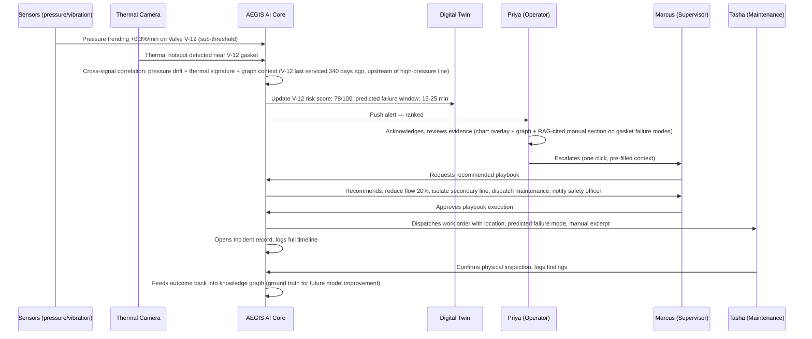
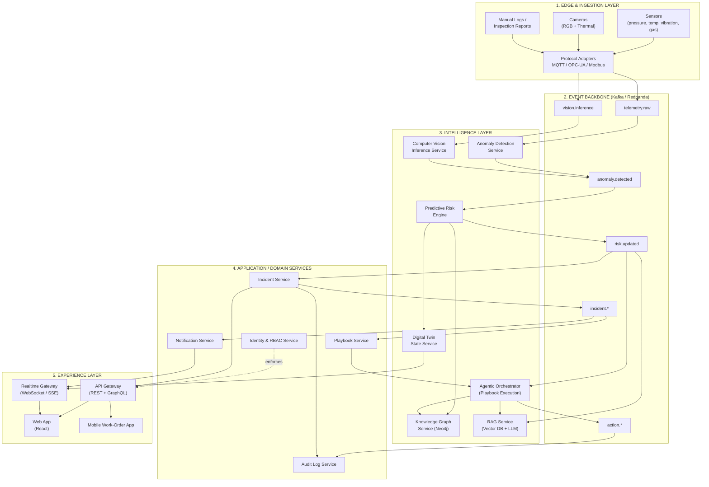
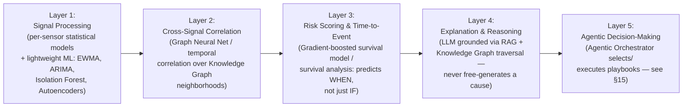
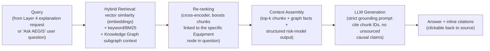
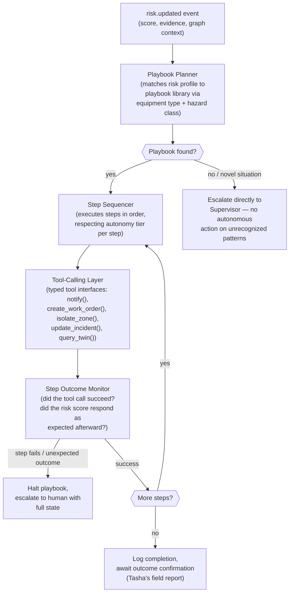
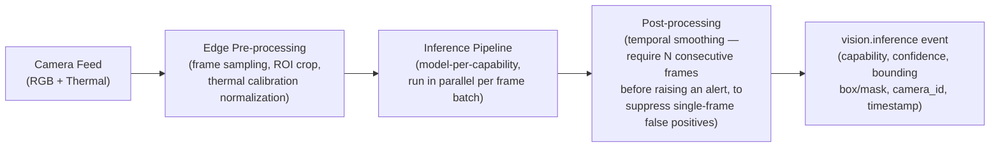
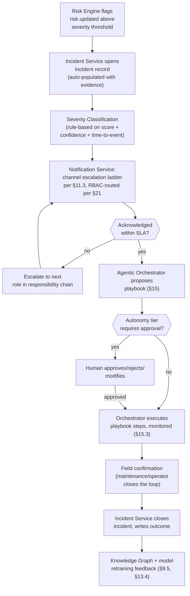
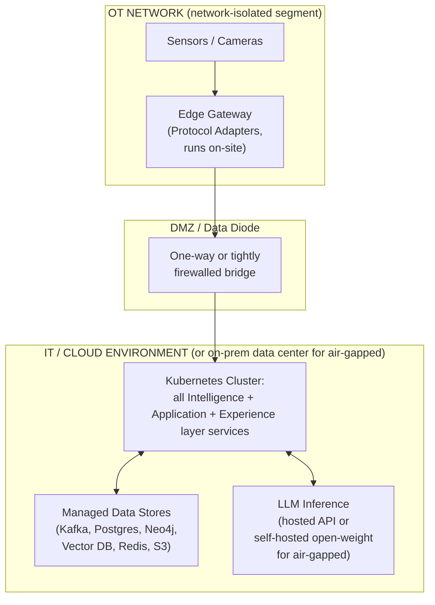

# AEGIS AI
## Autonomous Industrial Safety Operating System
### Enterprise Architecture Document

**Classification:** Internal — Engineering & Product
**Document Owner:** Office of the CTO
**Version:** 1.0
**Status:** Foundational Architecture (Pre-Implementation)

---

## How to Read This Document

This is not a feature spec. It is the architectural constitution for AEGIS AI — the set of decisions that will not be casually revisited once implementation starts. Every section states a decision, then the *why*, then the *trade-off we accepted*. Where a decision is hackathon-scoped (i.e., simplified for a 48-hour build but designed to not be a dead end), it is explicitly flagged as **[HACKATHON SCOPE]** with the commercial-grade version described alongside it.

The guiding design law for this entire system:

> **AEGIS AI must always be able to explain, in plain language, why it believes something dangerous is about to happen — and what it did about it.**

Every architectural choice below is downstream of that one sentence. A black-box model that predicts an explosion with 97% confidence and cannot say why is not a safety system — it is a liability generator. This shapes our AI architecture (interpretable ensembles + LLM reasoning over structured evidence, not end-to-end opaque deep nets), our event architecture (every decision is an auditable event), and our UX (every alert carries its evidence chain).

---

## Table of Contents

1. [Overall Product Vision](#1-overall-product-vision)
2. [Functional Requirements](#2-functional-requirements)
3. [Non-Functional Requirements](#3-non-functional-requirements)
4. [User Personas](#4-user-personas)
5. [User Journey](#5-user-journey)
6. [Complete System Architecture](#6-complete-system-architecture)
7. [Frontend Architecture](#7-frontend-architecture)
8. [Backend Architecture](#8-backend-architecture)
9. [AI Architecture](#9-ai-architecture)
10. [Event-Driven Architecture](#10-event-driven-architecture)
11. [Real-Time Communication Architecture](#11-real-time-communication-architecture)
12. [Database Architecture](#12-database-architecture)
13. [Knowledge Graph Architecture](#13-knowledge-graph-architecture)
14. [RAG Architecture](#14-rag-architecture)
15. [Agentic AI Architecture](#15-agentic-ai-architecture)
16. [Digital Twin Architecture](#16-digital-twin-architecture)
17. [Sensor Architecture](#17-sensor-architecture)
18. [Computer Vision Architecture](#18-computer-vision-architecture)
19. [Emergency Response Workflow](#19-emergency-response-workflow)
20. [Authentication Model](#20-authentication-model)
21. [RBAC Design](#21-rbac-design)
22. [API Design Philosophy](#22-api-design-philosophy)
23. [Folder Structure](#23-folder-structure)
24. [Deployment Architecture](#24-deployment-architecture)
25. [DevOps Architecture](#25-devops-architecture)
26. [Future Scalability](#26-future-scalability)

---

## 1. Overall Product Vision

### 1.1 The One-Sentence Vision

**AEGIS AI is the autonomous nervous system of an industrial plant** — it perceives (sensors + cameras), understands (knowledge graph + digital twin), predicts (time-series + causal models), decides (agentic AI orchestration), and acts (automated + human-in-the-loop emergency response) — continuously, in real time, with a full audit trail.

### 1.2 What Category of Product This Is

We are explicitly positioning AEGIS AI in the same category as:

| Reference Product | What We Borrow From It |
|---|---|
| **Palantir Foundry** | Ontology-driven data model (Knowledge Graph as the spine of the whole system), operational AI over messy real-world data |
| **Honeywell Forge** | Industrial IoT sensor fusion at plant scale, predictive maintenance patterns |
| **Siemens Xcelerator / MindSphere** | Digital twin as first-class architectural citizen, not an afterthought |
| **Microsoft Industry Cloud (Manufacturing)** | Event-driven backbone, edge-to-cloud data architecture |
| **Tesla Gigafactory MES/monitoring** | Real-time computer vision on the line, tight OT/IT integration |

We are deliberately **not** building: a Grafana-style passive dashboard, a ticketing system with an LLM bolted on, or a chatbot with a nice UI. The differentiator is **autonomy with accountability** — the system takes action (or recommends action with one-click execution) and can always justify itself.

### 1.3 The Core Problem We Solve

Industrial accidents (explosions, toxic leaks, equipment failure cascades, fires) are overwhelmingly **not** sudden — they are preceded by a detectable pattern of anomalies across multiple signals (pressure trending up, a sensor drifting out of calibration, a thermal camera showing a hotspot, a vibration signature changing) that no single human operator, and no single-signal threshold alarm, can correlate fast enough. Plants run SCADA/DCS systems that are excellent at "value X exceeded threshold Y" and terrible at "these 40 weakly-anomalous signals across 3 subsystems together mean something is about to fail in 20 minutes."

AEGIS AI's job is to sit **above** existing OT systems (not replace them) and do the cross-signal, cross-time, cross-subsystem reasoning that turns "40 weak signals" into "one confident, explained, actionable prediction."

### 1.4 Product Pillars

1. **Perceive** — ingest sensor telemetry, CCTV/thermal video, and manual inspection reports into one unified stream.
2. **Understand** — maintain a live Digital Twin and Knowledge Graph representing the plant's true current state and how components relate/depend on each other.
3. **Predict** — forecast failure/hazard probability ahead of the event, with a stated time horizon and confidence.
4. **Explain** — every prediction and every autonomous action is backed by a retrievable evidence chain (RAG over manuals/incident history + graph traversal + raw sensor evidence).
5. **Act** — orchestrate emergency response: notify the right humans, trigger safety interlocks (where authorized), open compliance-grade incident records, and coordinate multi-step response playbooks via agentic AI.
6. **Learn** — every incident (real or near-miss) feeds back into the knowledge graph and model retraining loop, so the system compounds in value over time.

### 1.5 Why This Wins a Hackathon *and* Survives Contact with Reality

Judges reward systems that visibly *do* something end-to-end (ingest → reason → act) rather than static dashboards. Our vision is built so that a 5-minute demo can show: a simulated sensor drift → AI correlates it with a thermal anomaly on a digital twin → predicts a valve failure in 12 minutes → opens an incident, notifies the shift supervisor via a live alert, and shows its reasoning chain. That same architecture, unmodified in its core contracts (event schema, knowledge graph, API boundaries), is what a real deployment would run — only the sensor simulator and scale get swapped for real OT integrations.

---

## 2. Functional Requirements

Functional requirements are grouped by capability domain. Each has a priority: **P0** (must exist for the demo to make sense), **P1** (should exist, differentiates the product), **P2** (roadmap / stretch).

### 2.1 Ingestion & Perception
- **FR-1 (P0):** Ingest streaming time-series data from simulated/real sensors (pressure, temperature, vibration, gas concentration, flow rate) at configurable frequency (1–100 Hz per sensor).
- **FR-2 (P0):** Ingest video/image feeds (CCTV, thermal) and run computer vision inference (object detection, thermal anomaly detection, PPE compliance, smoke/fire detection).
- **FR-3 (P1):** Ingest unstructured operator logs, maintenance tickets, and inspection reports as text, embedding them into the knowledge base.
- **FR-4 (P1):** Support multi-protocol OT ingestion adapters (MQTT, OPC-UA, Modbus-TCP) behind a unified internal event schema.

### 2.2 Situational Awareness
- **FR-5 (P0):** Maintain a live Digital Twin reflecting current sensor values, equipment status, and topology (what's connected to what) for the whole simulated plant.
- **FR-6 (P0):** Maintain a Knowledge Graph encoding equipment, subsystems, dependencies, historical incidents, maintenance records, and safety procedures.
- **FR-7 (P0):** Provide a real-time 2D/3D visualization of plant state with color-coded risk levels per zone/equipment.

### 2.3 Prediction & Reasoning
- **FR-8 (P0):** Detect anomalies per-signal (statistical + ML-based) and cross-signal (correlated anomaly patterns across subsystems).
- **FR-9 (P0):** Produce a risk score (0–100) per equipment/zone with a predicted time-to-failure/incident window and a natural-language explanation.
- **FR-10 (P1):** Retrieve and cite relevant historical incidents, equipment manuals, and safety procedures (RAG) as evidence for any prediction.
- **FR-11 (P1):** Support "what-if" simulation queries against the digital twin (e.g., "if valve V-12 fails, what else is affected?") via graph traversal.

### 2.4 Autonomous Action
- **FR-12 (P0):** Automatically open an Incident record when risk crosses a defined threshold, with full evidence attached.
- **FR-13 (P0):** Notify the correct human role(s) in real time (in-app, push, SMS/email escalation) based on incident severity and RBAC-defined responsibility.
- **FR-14 (P1):** Execute (or recommend, pending human approval, depending on autonomy tier) a multi-step Emergency Response Playbook via an agentic AI orchestrator — e.g., isolate a zone, notify fire safety, page the plant manager, log a regulatory-compliance record.
- **FR-15 (P2):** Direct integration with physical safety interlocks/actuators (real PLC/SCADA write-access) — gated behind strict human confirmation and audit in v1.

### 2.5 Human Interface
- **FR-16 (P0):** Role-based dashboard: Control Room Operator, Shift Supervisor, Safety Officer, Plant Manager, Maintenance Technician each see a view tailored to their responsibility.
- **FR-17 (P0):** Conversational AI assistant ("Ask AEGIS") that can answer natural-language questions about plant state, using RAG + knowledge graph + live telemetry as grounding.
- **FR-18 (P1):** Full audit trail / incident timeline view — replayable, exportable (for regulatory compliance, e.g., OSHA/PSM-style investigations).

### 2.6 Administration
- **FR-19 (P0):** Authentication with role assignment; admin can manage users, roles, and permissions.
- **FR-20 (P1):** Configurable alert thresholds and escalation policies per plant/zone/equipment class.
- **FR-21 (P2):** Multi-tenant support (multiple plants/sites under one deployment).

---

## 3. Non-Functional Requirements

Non-functional requirements (NFRs) are what separate "impressive demo" from "system an actual plant would run." We state numeric targets where meaningful, even if the hackathon build only proves the architecture supports them rather than hitting them at full industrial scale.

### 3.1 Reliability & Availability
- **NFR-1:** Core ingestion and alerting path must target **99.95%** availability in production design (the "can we detect a leak" path must never share a failure domain with, e.g., the reporting/analytics path).
- **NFR-2:** Graceful degradation — if the AI reasoning layer is down, raw threshold alarms (the OT baseline) must still fire. AEGIS AI augments, never gates, basic safety alarms.
- **NFR-3:** No single point of failure in the alerting path from sensor to human notification.

### 3.2 Latency
- **NFR-4:** Sensor-to-anomaly-flag latency target: **< 2 seconds** (streaming path, P0 for demo).
- **NFR-5:** End-to-end sensor-to-human-notification latency target: **< 10 seconds** for critical severity.
- **NFR-6:** Digital twin visualization must update at **≥ 1 Hz** perceived refresh in the UI regardless of underlying sensor frequency (client-side interpolation/throttling allowed).

### 3.3 Scalability
- **NFR-7:** Architecture must scale horizontally from "1 simulated plant, 200 sensors" (hackathon) to "50 real plants, 500,000 sensors" (commercial) without a rewrite of core contracts (event schema, API, data model).
- **NFR-8:** Ingestion layer must be horizontally partitionable by plant/site/zone (sharding key established from day one).

### 3.4 Explainability & Trust
- **NFR-9:** Every AI-generated risk score or autonomous action must have a retrievable, human-readable justification chain. No "confidence: 94%" without an accompanying "because."
- **NFR-10:** All autonomous actions are logged as immutable, timestamped events before or atomically with execution (audit precedes/accompanies effect, never trails it unrecoverably).

### 3.5 Security
- **NFR-11:** OT/IT boundary is respected — AEGIS AI is read-only against control systems by default; any write-path (interlock triggering) is a distinct, heavily gated capability (see §19, §21).
- **NFR-12:** All data in transit encrypted (TLS 1.3); at rest encrypted (AES-256).
- **NFR-13:** RBAC enforced at the API layer, not just the UI layer (defense in depth — see §21).

### 3.6 Maintainability & Modularity
- **NFR-14:** Each architectural domain (ingestion, AI reasoning, digital twin, notification, etc.) is an independently deployable service with a versioned contract — no domain requires another to change its internal implementation to evolve.
- **NFR-15:** AI models are swappable behind a stable inference interface (today: a specific ensemble + LLM; tomorrow: a better model) — see §9.

### 3.7 Observability
- **NFR-16:** The system that monitors the plant must itself be monitored (metrics, logs, traces) to commercial SRE standards — "who watches the watchmen" is a first-class requirement, not an afterthought.

### 3.8 Compliance-Readiness
- **NFR-17:** Data retention, incident export formats, and audit immutability are designed with OSHA PSM / Seveso III / IEC 61511 (SIL/functional safety) style regulatory expectations in mind, even though full certification is out of scope for the hackathon.

---

## 4. User Personas

Personas drive both the RBAC model (§21) and the frontend's role-based views (§7). Each persona is defined by what they need to decide, not just what they want to see.

### 4.1 Priya — Control Room Operator
- **Context:** Watches live plant state continuously, 8-hour shifts, first line of response.
- **Core need:** Zero-ambiguity, low-cognitive-load alerts. Cannot afford a UI that requires interpretation under stress.
- **Primary view:** Live digital twin + ranked risk feed + one-click acknowledge/escalate.
- **Success metric:** Time from alert to acknowledged action.

### 4.2 Marcus — Shift Supervisor
- **Context:** Manages the floor, coordinates across operators, is the human decision-maker for "do we evacuate this zone."
- **Core need:** Cross-zone view, escalation authority, direct line to Safety Officer and Plant Manager.
- **Primary view:** Zone-level risk overview + incident command panel + playbook execution controls.
- **Success metric:** Correct escalation decisions, minimized false-alarm fatigue.

### 4.3 Dr. Elena Kwan — Safety Officer / Process Safety Engineer
- **Context:** Owns regulatory compliance, incident investigation, and safety procedure design. Deeply technical.
- **Core need:** Deep explainability — she is the persona who will actually read the evidence chain, query the knowledge graph, and challenge the AI's reasoning.
- **Primary view:** "Ask AEGIS" conversational analyst + incident timeline replay + knowledge graph explorer.
- **Success metric:** Can defend every AI-flagged incident to a regulator or auditor.

### 4.4 James — Plant Manager
- **Context:** Accountable for uptime, safety record, and cost. Not in the control room; needs summarized, business-relevant signal.
- **Core need:** Executive summary view — plant health score, open incidents, trend over time, cost-of-downtime implications.
- **Primary view:** Executive dashboard, notification only on high-severity events.
- **Success metric:** Confidence that risk is being managed without needing to watch it personally.

### 4.5 Tasha — Maintenance Technician
- **Context:** Dispatched to physically inspect/repair equipment flagged as at-risk.
- **Core need:** Precise location, predicted failure mode, relevant manual excerpts, and a way to close the loop (mark repaired, which feeds back into the model).
- **Primary view:** Mobile-first work-order view with AR/photo-annotated equipment location, linked manuals (RAG).
- **Success metric:** Mean time to repair for flagged issues.

### 4.6 System Administrator (secondary persona)
- **Context:** IT/OT admin responsible for onboarding sensors, managing users, configuring thresholds.
- **Core need:** Low-friction sensor/zone/threshold configuration, user & role management.
- **Primary view:** Admin console (§21).

---

## 5. User Journey

### 5.1 Primary Journey — "The Predicted Leak" (the hackathon demo spine)

This is the journey the entire demo is built to narrate, and the journey every architectural decision is validated against.



### 5.2 Secondary Journey — "Ask AEGIS" Conversational Query
Dr. Kwan, investigating a near-miss from last week, asks: *"Why did AEGIS flag Reactor 3 last Tuesday, and what's the history of similar events on that unit?"* The assistant retrieves the incident record, the sensor evidence at the time, relevant knowledge graph neighbors (similar equipment, past incidents), and RAG-cited procedure references, and composes a grounded answer with links back into the raw data — never a hallucinated summary.

### 5.3 Tertiary Journey — Executive Health Check
James opens the executive dashboard once per day: plant health trend line, count of predicted-and-averted incidents this month (the ROI story), and any items requiring his sign-off.

---

## 6. Complete System Architecture

### 6.1 Architectural Style

AEGIS AI is a **layered, event-driven, microservice-oriented system** organized around one non-negotiable rule: **the Event Bus is the source of truth for everything that happened; the Databases are derived, rebuildable projections.** This is what lets us later say "replay the last 6 hours and show the AI's reasoning" — a hard requirement for both the demo's "wow" moment and real regulatory audits.

We use **five horizontal layers**, each with a one-sentence charter:

1. **Edge & Ingestion Layer** — get data from the physical/simulated world into the system, normalized, as fast as possible.
2. **Event Backbone** — the durable, ordered, replayable spine every other layer reads from and writes to.
3. **Intelligence Layer** — anomaly detection, prediction, knowledge graph, RAG, agentic orchestration. The "brain."
4. **Application/Domain Services Layer** — incidents, notifications, playbooks, users/RBAC, digital twin state — the "business logic."
5. **Experience Layer** — APIs (REST/GraphQL/WebSocket) and the frontend applications that humans touch.

### 6.2 High-Level Diagram



### 6.3 Why This Shape (Design Rationale)

- **Event backbone as the spine, not point-to-point calls.** If the Anomaly Detection service called the Incident service directly, adding a new consumer (say, a future "Insurance Risk Export" service) would require modifying the producer. With an event bus, new consumers subscribe without touching anything upstream. This is the single highest-leverage decision in the whole architecture for **NFR-14 (modularity)**.
- **Intelligence Layer is deliberately separated from Application Services.** The AI layer's job is to produce *signal* (risk scores, evidence, recommendations). The Application layer's job is to turn signal into *process* (incidents, notifications, human workflow). Keeping these separate means we can swap AI models constantly (hackathon iteration speed) without touching business logic, and vice versa — change escalation policy without retraining anything.
- **Digital Twin is a first-class service, not a UI concept.** Because §16 requires "what-if" queries and other services (Predictive Risk Engine, Agentic Orchestrator) need to *read* current plant topology/state, the Twin must be a queryable service with its own API, not something computed ad hoc inside a frontend component.
- **Two realtime paths, not one.** The Realtime Gateway (WebSocket/SSE) is separate from the request/response API Gateway. Digital twin updates and live risk feeds are push-based and high-frequency; CRUD-style operations (create playbook, assign role) are pull-based and low-frequency. Conflating them would force the whole API into a streaming model it doesn't need (see §11).

### 6.4 Data Flow Summary (Text Form)

`Sensor/Camera → Protocol Adapter → telemetry.raw / vision.inference topics → Anomaly Detection + CV Inference → anomaly.detected topic → Predictive Risk Engine (reads Knowledge Graph + Digital Twin for context) → risk.updated topic → [Incident Service opens Incident if threshold crossed] + [RAG Service prepares explanation] + [Agentic Orchestrator prepares/executes playbook] → incident.* / action.* topics → Notification Service (pushes via Realtime Gateway) + Audit Log Service (immutable record) → Frontend (role-based views)`

### 6.5 Deployment Topology Preview

Edge adapters run close to the OT network (on-prem or edge-cloud); everything from the Event Backbone up runs in the cloud (or on-prem data center for air-gapped commercial deployments — see §24). This split is intentional: OT networks are latency-sensitive and often required to be network-isolated, while the Intelligence and Application layers benefit from cloud elasticity.

---

## 7. Frontend Architecture

### 7.1 Technology Stance

- **Framework:** React (with TypeScript) — non-negotiable for a system with this much real-time, stateful, role-differentiated UI. Server-rendered frameworks (Next.js) used for the shell/routing/auth pages; the live-operations views are heavy client-side SPA regions because they hold persistent WebSocket state and a 3D/2D twin canvas that must not remount on navigation.
- **Rendering the Digital Twin:** WebGL-based (via a scene-graph library) for the 3D plant visualization; falls back to a 2D SVG/Canvas schematic view for lower-end devices or the mobile app. The 3D view is the hackathon "wow" surface; the 2D schematic is what a real control room actually uses day to day (control rooms prize clarity over spectacle).
- **State Management:** Split by data temperature —
  - **Live/hot state** (sensor values, risk scores, twin positions): a dedicated real-time store (e.g., Zustand/Recoil-style atoms) fed directly by the WebSocket client, deliberately *not* routed through the general HTTP data-fetching cache.
  - **Warm state** (incidents, playbooks, users): a query-cache library (React Query-style) with normalized caching, background refetch, optimistic updates for actions like "acknowledge alert."
  - **Cold state** (auth session, role, preferences): global app context.
- **Design System:** A dedicated component library (buttons, alert severity chips, risk gauges, timeline components) built once and shared across role-based dashboards — this is what makes the product *look* like Siemens/Palantir rather than a hackathon prototype: consistent density, consistent color-coding for severity, consistent motion language for "something changed."

### 7.2 Application Structure

The frontend is organized as **role-based experience shells** sharing a common component/data layer, not five separate apps:

```
Shell (auth, nav, notification tray, theme)
 ├─ Operator Experience      (live twin, risk feed, acknowledge/escalate)
 ├─ Supervisor Experience    (zone overview, incident command, playbook controls)
 ├─ Safety Officer Experience(Ask AEGIS, incident replay, knowledge graph explorer)
 ├─ Executive Experience     (health score, trends, ROI summary)
 └─ Maintenance Experience   (mobile-first work orders, AR annotation, manual excerpts)
```

Each experience is a set of route-level modules that compose shared "widgets" (RiskGauge, TwinViewport, IncidentTimeline, EvidencePanel, ChatPanel) rather than each rebuilding its own version — this is the concrete mechanism behind **NFR-14**.

### 7.3 Real-Time Rendering Strategy

The Digital Twin viewport subscribes to a filtered WebSocket channel (only the zones currently in view, to bound bandwidth — see §11) and applies incoming state via a diff/patch model (only changed nodes re-render), not full-scene re-fetch. Risk-level color transitions are animated (never instant hard-cuts) specifically so a human's eye is drawn to *what just changed* — a deliberate perceptual-design decision for an alert-fatigue-prone audience.

### 7.4 Explainability-First UI Pattern

Every alert card, risk gauge, or AI-authored message carries a persistent **"Why?" affordance** that expands into: the raw signal chart, the graph-context (what this equipment is connected to), and RAG-cited source excerpts. This is a UI-level enforcement of **NFR-9** — explainability isn't a page you can navigate to, it's inline everywhere a claim is made.

### 7.5 Accessibility & Field Conditions

Control rooms and industrial floors have their own display conditions: this drives high-contrast color palettes validated for color-vision deficiency (severity is never color-only — always paired with icon + text), large touch targets for the mobile maintenance app (used with gloves), and offline-tolerant caching for the mobile app (a technician in a shielded structure may lose connectivity mid-inspection).

---

## 8. Backend Architecture

### 8.1 Service Decomposition Principle

Services are decomposed along **domain boundaries that change for different reasons**, not by technical layer. A service exists because a distinct team/concern owns it and it has its own data lifecycle:

| Service | Owns | Changes When |
|---|---|---|
| **Ingestion Gateway** | Protocol adapters, schema normalization | New sensor type/protocol onboarded |
| **Anomaly Detection Service** | Per-signal statistical/ML anomaly models | Detection algorithm improves |
| **Computer Vision Service** | Video/image inference pipelines | New CV model/capability added |
| **Predictive Risk Engine** | Cross-signal correlation, risk scoring, time-to-failure estimation | Prediction methodology evolves |
| **Digital Twin Service** | Live plant state graph + topology | Plant topology changes, new equipment types |
| **Knowledge Graph Service** | Equipment/incident/procedure graph | Ontology evolves |
| **RAG Service** | Embedding, retrieval, grounded generation | Knowledge base grows, retrieval strategy changes |
| **Agentic Orchestrator** | Playbook planning & execution, tool-calling | New playbook types, new integrated tools |
| **Incident Service** | Incident lifecycle (open/ack/escalate/close) | Incident workflow policy changes |
| **Notification Service** | Multi-channel delivery, escalation policy | New channel added, escalation rules change |
| **Identity & RBAC Service** | Users, roles, permissions, sessions | Org structure/policy changes |
| **Audit Log Service** | Immutable event/action history | Compliance requirements evolve |

### 8.2 Technology Stance

- **Primary service language:** Python for AI-adjacent services (Anomaly Detection, CV, Predictive Risk Engine, RAG, Agentic Orchestrator) — this is where the ecosystem (PyTorch, scikit-learn, LangGraph-style agent frameworks, embedding libraries) lives. Node.js/TypeScript or Go for high-throughput, low-latency I/O services (Ingestion Gateway, Notification Service, Realtime Gateway, API Gateway) where raw request-handling throughput and a large async I/O ecosystem matter more than ML tooling.
- **Inter-service communication:** Asynchronous via the Event Backbone (§10) for anything that is a *fact about something that happened* (a sensor reading, a risk update, an incident state change). Synchronous gRPC/REST only for *queries* where a caller needs an immediate answer (e.g., Frontend asking Digital Twin Service "what's the current state of Zone 3 right now"). This split (event for facts, RPC for queries) is the CQRS pattern applied at the service-mesh level and is what keeps the system both real-time-reactive and interactively-queryable.
- **Service framework:** Each service is a small, independently deployable unit behind a consistent internal contract (health check, metrics endpoint, structured logging, schema-versioned event contracts) enforced via a shared internal service template/scaffold — so a new service can be spun up in minutes, not days (this is a direct commercial-scalability requirement, §26).

### 8.3 Why Microservices (and Not a Modular Monolith) Here Specifically

We considered a modular monolith seriously — it's usually the right hackathon call. We rejected it here because: (a) the AI services have fundamentally different scaling profiles (CV inference is GPU-bound and bursty; notification delivery is I/O-bound and constant) that benefit from independent scaling; (b) the explicit NFR that "if AI reasoning is down, basic alarms still work" (**NFR-2**) is much easier to *guarantee* with process/deployment isolation than with in-process module boundaries; (c) the demo narrative benefits from being able to show "look, these are independently running services with their own logs," which is a legitimate part of hackathon technical credibility. The cost we accept: more operational complexity, mitigated by a strong shared service template and docker-compose-based local dev (§25).

### 8.4 Internal API Contracts

Every service exposes:
1. A **command/query API** (gRPC internally, REST/GraphQL at the edge) — versioned, schema-first (Protobuf/OpenAPI as the source of truth, not the implementation).
2. A set of **event contracts** (Avro/JSON-Schema on Kafka topics) it produces and/or consumes, registered in a schema registry with backward-compatibility enforcement — this is what allows independent deployability (**NFR-14**) without breaking consumers.

---

## 9. AI Architecture

### 9.1 The Central AI Design Decision: Layered Intelligence, Not One Big Model

We explicitly reject a single end-to-end deep-learning model that takes in raw sensor streams and outputs "danger: yes/no." That approach is fast to build and impossible to trust or debug — which fails **NFR-9** outright and would not survive a safety officer's first question ("why did it say that?"). Instead, AI at AEGIS AI is a **pipeline of purpose-built models feeding an LLM reasoning layer that operates over structured evidence**, not raw tensors:



- **Layer 1 (Signal Processing)** answers: "is this one signal behaving abnormally relative to its own history?" Deliberately simple, fast, interpretable models (statistical control charts, isolation forests, autoencoder reconstruction error) — because this layer must run at sensor frequency (up to 100Hz) with sub-second latency, and because per-signal anomaly logic is exactly the kind of thing a control engineer needs to be able to sanity-check.
- **Layer 2 (Cross-Signal Correlation)** answers: "do these several weakly-anomalous signals, across subsystems that the Knowledge Graph says are related, form a known-dangerous or novel-dangerous pattern?" This is the layer doing the work no legacy SCADA threshold alarm can do. It uses the Knowledge Graph's topology (what's physically/causally connected to what) to constrain *which* signals are even worth correlating — avoiding the combinatorial explosion of naively correlating everything with everything.
- **Layer 3 (Risk Scoring)** answers: "how confident are we, and by when." We deliberately frame this as a **survival analysis / time-to-event problem**, not classification, because "there is 15-25 minutes before this likely fails" is what a human can act on; "94% probability of anomaly" is not.
- **Layer 4 (Explanation)** is where the LLM lives — and critically, the LLM is *never* the thing that decides there is a risk. It receives Layer 1-3's structured outputs (which signals, what pattern, what graph context, what historical precedent via RAG) and its job is purely to **compose a faithful natural-language explanation grounded in that evidence** — a strict "explain, don't invent" contract enforced via prompt design and, in the commercial version, output-citation-verification (every factual claim in the explanation must trace to a retrieved source or a structured evidence field).
- **Layer 5 (Agentic Decision-Making)** takes the explained risk and decides/executes a response — detailed in §15.

### 9.2 Why Interpretable-First, LLM-Last

This ordering is the single most defensible technical decision in the whole document when presented to judges with a safety/industrial background: **the LLM never touches raw sensor data and never independently declares a hazard.** It only narrates conclusions already reached by auditable, testable, versionable statistical/ML models. This means: (a) we can unit-test and validate Layers 1-3 the way you'd validate any safety-critical software; (b) an LLM hallucination can produce a *badly worded* explanation but never a *fabricated* risk — the risk score exists independent of the LLM; (c) it directly satisfies **NFR-9**.

### 9.3 Model Lifecycle & Serving

- **Training data sources:** simulated sensor data (hackathon) generated from physics-informed simulation profiles (realistic drift/noise/failure-injection patterns) so the anomaly models are trained on plausible failure signatures, not pure noise — this is what makes the demo prediction believable rather than scripted. In production: historical plant telemetry + labeled incident outcomes (fed back per §9.5).
- **Serving:** All Layer 1-3 models sit behind a single **Model Inference Interface** (a stable internal contract: `predict(signal_window, graph_context) -> {score, confidence, contributing_factors}`) so models can be retrained, swapped, or A/B tested without touching any downstream service (**NFR-15**). The LLM (Layer 4/5) is accessed via a provider-agnostic inference client (supporting hosted frontier models and, for air-gapped commercial deployments, self-hosted open-weight models) — never hard-coded to one vendor.
- **[HACKATHON SCOPE]** For the demo, Layer 1-3 models are trained on a physics-informed simulator rather than years of real plant data, and a curated, small-but-realistic incident/manual corpus backs RAG (§14). The interfaces are identical to the commercial version — only the training corpus size and model sophistication differ.

### 9.4 Confidence & Uncertainty as First-Class Data

Every score AEGIS AI produces carries an explicit confidence/uncertainty band, not just a point estimate — because a false "we're sure" is more dangerous than an honest "we're not sure yet, watching closely." Low-confidence-but-rising-risk situations are surfaced differently in the UI (a "watch list" tier) than high-confidence actionable predictions (§7.4).

### 9.5 Continuous Learning Loop

Every incident's real-world outcome (confirmed failure, false positive, near-miss averted) is captured (Tasha's "confirmed findings" in §5.1) and written back as labeled ground truth, closing the loop for periodic retraining of Layers 1-3 and for growing the Knowledge Graph/RAG corpus (§13, §14). This is what makes AEGIS AI a compounding asset rather than a static model — a key point for the "future commercial deployment" framing in §26.

---

## 10. Event-Driven Architecture

### 10.1 Why Event-Driven Is the Backbone, Not a Feature

Section 6 already established the event backbone as the system's spine. Here we go one level deeper into *why* and *how*.

An industrial safety system's defining property is that **everything is a fact that happened at a point in time**, and many independent parties need to react to that fact without knowing about each other. A sensor reading, an anomaly detection, a risk update, an incident being opened, a human acknowledging an alert, an agent executing a playbook step — all of these are immutable facts, not mutable rows in a table. Modeling the system this way (event sourcing at the backbone level) gives us, for free: full audit trail (**NFR-10**), replay-for-debugging and replay-for-demo ("show me what the AI saw"), and the ability to add new consumers without touching producers (**NFR-14**).

### 10.2 Technology Choice

**Kafka (or Redpanda for lower-ops-overhead Kafka-API-compatible deployments)** as the backbone. Rationale: partition-based ordering guarantees (critical — anomaly detection must see sensor readings for a given sensor in order), durable log retention (enables replay), mature ecosystem (Kafka Streams/ksqlDB for stream processing, Schema Registry for contract enforcement), and horizontal scalability story that matches **NFR-7/NFR-8** (partition by plant/zone/sensor for the ingestion topics).

### 10.3 Topic Design

| Topic | Partition Key | Retention | Producers | Key Consumers |
|---|---|---|---|---|
| `telemetry.raw` | `sensor_id` | 7 days (hot), archived to cold storage | Ingestion Gateway | Anomaly Detection, Digital Twin |
| `vision.inference` | `camera_id` | 7 days | CV Service | Predictive Risk Engine, Digital Twin |
| `anomaly.detected` | `equipment_id` | 90 days | Anomaly Detection, CV Service | Predictive Risk Engine |
| `risk.updated` | `equipment_id` | 90 days | Predictive Risk Engine | Incident Service, RAG, Agentic Orchestrator, Realtime Gateway |
| `incident.opened` / `.escalated` / `.closed` | `incident_id` | 7 years (compliance) | Incident Service | Notification, Audit, Playbook |
| `action.recommended` / `.executed` / `.rejected` | `incident_id` | 7 years (compliance) | Agentic Orchestrator | Audit, Notification, Frontend |
| `user.activity` | `user_id` | 1 year | All app services | Audit, Identity |

Long-retention topics (`incident.*`, `action.*`) are the literal, technical implementation of the compliance-grade audit trail required by **NFR-10/NFR-17** — not a separate "logging system" bolted on after the fact.

### 10.4 Stream Processing

Cross-signal correlation (Layer 2, §9.1) and risk aggregation are implemented as **stateful stream processing jobs** (windowed joins across `telemetry.raw` + `anomaly.detected`, keyed by the Knowledge Graph's equipment-relationship data pulled in as a queryable side-input) rather than batch jobs — this is what achieves the **NFR-4 (< 2s anomaly flag latency)** target: no batch window to wait for.

### 10.5 Failure Semantics

- **At-least-once delivery** with idempotent consumers (each event carries a unique ID; consumers dedupe) — we accept occasional duplicate processing over the risk of dropping a safety-relevant event.
- **Dead-letter topics** per consumer group for events that fail processing after retries, with alerting on DLQ depth (observability, §25) — a stuck/failing consumer must never silently drop plant safety data.
- **Backpressure isolation:** a slow consumer (e.g., a struggling analytics job) cannot block a fast consumer (e.g., Notification Service) because Kafka consumer groups are independent — this is the concrete mechanism behind **NFR-2/NFR-3** (no shared failure domain between critical and non-critical paths).

---

## 11. Real-Time Communication Architecture

### 11.1 Two Distinct Real-Time Needs

We separate **"push state to many passive viewers"** from **"bidirectional, addressed, guaranteed-delivery messaging"** because conflating them either over-engineers the dashboard feed or under-delivers on notification guarantees.

### 11.2 Digital Twin / Risk Feed Streaming — WebSocket (Fan-Out)

- **Transport:** WebSocket via a dedicated Realtime Gateway service (not the API Gateway) subscribing internally to `risk.updated`, `telemetry.raw` (throttled/sampled), and `vision.inference` (summarized) topics, and fanning out to connected clients.
- **Subscription model:** clients subscribe to specific zones/equipment currently in view (topic-filtered subscriptions, not "everything") to bound per-client bandwidth — essential once a deployment has hundreds of thousands of sensors (**NFR-7**).
- **Delivery guarantee:** best-effort, latest-value-wins for pure telemetry (a dropped intermediate pressure reading is fine, the client will get the next one within the refresh window per **NFR-6**); at-least-once for `risk.updated` and any severity-carrying message (a missed risk escalation is not acceptable — these are delivered with a client-side ack and gap-fill-via-REST-refetch fallback).
- **Fallback:** Server-Sent Events (SSE) for constrained network environments (some industrial networks restrict WebSocket); long-polling as the final fallback tier.

### 11.3 Alerting / Notification Delivery — Guaranteed, Multi-Channel

- Notification Service consumes `incident.*` and `risk.updated` (above threshold) events and delivers via a **channel escalation ladder**: in-app push (via Realtime Gateway) → mobile push notification → SMS → phone call (via a voice API) for critical, unacknowledged alerts, each with a defined timeout before escalating to the next channel *and* the next person up the responsibility chain (RBAC-defined, §21).
- This path is built on guaranteed-delivery primitives (durable queue per channel adapter, retry with backoff, delivery receipts), explicitly *not* on the best-effort WebSocket fan-out — a critical alert must not be "lost" because a browser tab was backgrounded. This dual-path design (best-effort stream + guaranteed alert channel) is the direct implementation of **NFR-5**.

### 11.4 Conversational AI Streaming

"Ask AEGIS" (§14/§15) responses stream token-by-token over the same Realtime Gateway (a dedicated channel per conversation) so the UI can render progressive generation — a UX expectation for any modern AI assistant, and functionally important here so a user sees *retrieval happening* ("searching incident history…", "querying knowledge graph…") before the final grounded answer, reinforcing trust in the explainability model.

---

## 12. Database Architecture

### 12.1 Polyglot Persistence, Deliberately

No single database engine is good at time-series ingestion, graph traversal, vector similarity search, and transactional business records simultaneously. We use **purpose-fit stores behind each service's own API** (never shared databases across service boundaries — a service's database is a private implementation detail, per standard microservice data ownership rules) rather than forcing everything into one general-purpose RDBMS.

| Store | Technology | Owned By | Why This Engine |
|---|---|---|---|
| **Time-Series DB** | TimescaleDB (Postgres-based) or InfluxDB | Ingestion Gateway, Anomaly Detection | Purpose-built compression + windowed queries for `telemetry.raw` at high cardinality (sensor_id × time) |
| **Graph DB** | Neo4j | Knowledge Graph Service, Digital Twin Service | Native multi-hop traversal ("what's downstream of Valve V-12") is the core query pattern — doing this in SQL via recursive joins doesn't scale or stay readable |
| **Vector DB** | pgvector (Postgres) or a dedicated vector store (Qdrant/Weaviate) | RAG Service | Semantic similarity search over embedded manuals/incident text |
| **Document Store** | MongoDB or Postgres/JSONB | Incident Service, Playbook Service | Incident records have a semi-structured, evolving shape (varying evidence attachments per incident type) — document flexibility beats rigid schema here |
| **Relational (OLTP)** | PostgreSQL | Identity & RBAC Service, Audit Log Service (write path) | Strong consistency + transactions are non-negotiable for user/permission data and audit records |
| **Object Storage** | S3-compatible (MinIO for on-prem) | CV Service, Audit Log (archival) | Raw video frames, thermal snapshots, long-term cold telemetry archives |
| **Cache** | Redis | API Gateway, Realtime Gateway | Session state, rate-limiting counters, hot digital-twin state for fast reads |

### 12.2 The "Source of Truth" Rule

Per §10, the **event log (Kafka) is the canonical source of truth** for anything that happened. Every database above is a **materialized, rebuildable projection** of that event log for a specific query pattern (a read model, in CQRS terms). Practically: if the Neo4j knowledge graph became corrupted, it can be rebuilt by replaying `risk.updated`, `incident.*`, and equipment-topology events from Kafka — it is never the only copy of anything safety-relevant. This is what makes **NFR-10** (audit precedes/accompanies effect) actually true rather than aspirational.

### 12.3 Consistency Model

- **Strong consistency** required for: RBAC/permissions (a stale permission check is a security bug), Audit Log writes (must be durable before/atomic with the action they record).
- **Eventual consistency** acceptable (and expected) for: Digital Twin visual state, risk scores propagating to dashboards, knowledge graph updates from new incidents — bounded by the latency targets in **NFR-4/NFR-5/NFR-6**, not "eventually someday."

### 12.4 Data Lifecycle & Retention

Hot telemetry (Timescale) retains 30-90 days of full-resolution data, then downsamples and archives to object storage (cold, queryable via batch jobs for model retraining, §9.5). Incident and action records retain 7 years by default (configurable per jurisdiction) to satisfy **NFR-17** compliance posture — this retention policy is a first-class, documented parameter, not a hardcoded constant, because different regulatory regimes (OSHA vs. Seveso vs. regional equivalents) require different windows.

---

## 13. Knowledge Graph Architecture

### 13.1 Role in the System

The Knowledge Graph is AEGIS AI's model of **"what is true and how things relate"** — equipment, its physical/process connections, its maintenance history, its associated safety procedures, and the history of past incidents and their causes. It is the thing that lets Layer 2 correlation (§9.1) ask "these two sensors are in different subsystems, but are they causally connected?" instead of naively correlating everything.

### 13.2 Ontology (Node & Relationship Model)

**Core node types:**
- `Plant`, `Zone`, `Unit`, `Equipment` (typed: Valve, Pump, Reactor, Sensor, Pipe, Tank, …)
- `Sensor` (linked to the Equipment it monitors)
- `MaintenanceRecord`, `InspectionReport`
- `Incident`, `NearMiss`
- `SafetyProcedure`, `ManualSection` (also embedded for RAG, §14)
- `Person` (role, not identity — links to Identity Service by reference, not duplicated PII)

**Core relationship types:**
- `(:Equipment)-[:LOCATED_IN]->(:Zone)`
- `(:Equipment)-[:CONNECTED_TO {flow_direction, medium}]->(:Equipment)` — the physical/process topology backbone
- `(:Sensor)-[:MONITORS]->(:Equipment)`
- `(:Equipment)-[:HAS_MAINTENANCE_HISTORY]->(:MaintenanceRecord)`
- `(:Incident)-[:INVOLVED]->(:Equipment)`
- `(:Incident)-[:SIMILAR_TO {score}]->(:Incident)` — computed via embedding similarity, periodically refreshed
- `(:Equipment)-[:GOVERNED_BY]->(:SafetyProcedure)`

### 13.3 Why a Property Graph, Not Relational Tables

The dominant query shape in this system is **variable-depth traversal**: "everything within 2 hops downstream of this valve," "all equipment that has ever been involved in an incident similar to this one," "the maintenance history of every piece of equipment in this zone." These are natural, indexed, constant-per-hop traversals in a property graph (Neo4j/Cypher) and require increasingly unreadable recursive CTEs in SQL as depth grows. Given that "what's connected to what and how does risk propagate" is the core value proposition (not an edge case), the graph engine is a foundational choice, not an optimization.

### 13.4 Living Document, Not Static Import

The graph is continuously updated: new equipment onboarding (via Digital Twin Service, §16), every closed incident writes back its findings (§9.5's feedback loop), every RAG-indexed manual section links into the relevant equipment node. This is what separates AEGIS AI's Knowledge Graph from a one-time "digital twin CAD import" — it accumulates institutional knowledge the way an experienced plant veteran does, except it's queryable and never retires.

### 13.5 Graph as Context for the LLM (Bridge to §14/§15)

Rather than dumping the whole graph into an LLM prompt (infeasible and unnecessary), the RAG/Agentic layers query a **bounded subgraph** (e.g., "2-hop neighborhood of Equipment X, plus any linked incidents/procedures") and serialize that subgraph into structured context — this is the graph half of the "grounded, don't hallucinate" contract established in §9.1.

---

## 14. RAG Architecture

### 14.1 Purpose

RAG (Retrieval-Augmented Generation) is what lets AEGIS AI cite **equipment manuals, safety procedures, and historical incident reports** as evidence — turning "the AI thinks this is dangerous" into "the AI thinks this is dangerous, and here's the manual section on gasket failure modes plus 2 similar past incidents at this plant that support that." Without RAG, the LLM layer would either stay silent on causation or, worse, hallucinate plausible-sounding mechanisms — unacceptable per **NFR-9**.

### 14.2 Corpus Composition

- Equipment manufacturer manuals and technical datasheets (chunked by section, preserving heading hierarchy as metadata).
- Historical incident reports and near-miss records (structured fields + free-text narrative).
- Internal safety procedures (SOPs), lockout-tagout procedures, and regulatory reference documents.
- Maintenance logs and inspection notes (shorter, noisier chunks — weighted lower in retrieval ranking unless directly matched).

### 14.3 Retrieval Pipeline



- **Hybrid retrieval** (vector + keyword + graph) rather than pure vector search: pure embedding similarity misses exact-match technical identifiers (part numbers, valve tags) that keyword search catches trivially, and misses relational context ("what else is connected to this") that only the graph provides.
- **Graph-aware retrieval bias:** retrieval is *scoped* by the Knowledge Graph whenever the query is about a specific piece of equipment — we don't search the entire corpus blind; we search the corpus *filtered/boosted* to documents linked to that equipment's node and its neighbors. This dramatically improves precision over generic RAG.
- **Citation enforcement:** the generation prompt requires every factual/causal claim to reference a specific retrieved chunk ID or structured evidence field; the response renderer only displays claims it can map back to a citation, and (commercial-grade) a verification pass flags any generated sentence with no supporting citation for human review before it's shown as an authoritative explanation.

### 14.4 Embedding & Indexing Strategy

Domain-adapted embedding model (fine-tuned or strongly prompted for industrial/technical vocabulary — generic embeddings underperform on part numbers, chemical names, and process terminology). Chunking is **semantic-boundary-aware** (section/paragraph, not fixed token windows) so a retrieved chunk is a coherent unit of meaning (e.g., "Section 4.2: Gasket Failure Modes," not an arbitrary 512-token slice cutting across two topics).

### 14.5 [HACKATHON SCOPE] vs. Commercial

For the demo: a curated corpus of representative manuals/incident reports (tens to low hundreds of documents) indexed in pgvector, sufficient to prove the retrieval-and-citation pattern convincingly. Commercially: this scales to the full corpus of a real plant's documentation (thousands of manuals across many equipment vendors) via a dedicated vector store (Qdrant/Weaviate) with incremental indexing pipelines — the retrieval interface and citation contract do not change.

---

## 15. Agentic AI Architecture

### 15.1 What "Agentic" Means Here (and What It Deliberately Does Not Mean)

The Agentic Orchestrator is a **constrained planner-executor over a fixed, human-authored library of tools and playbooks** — not an open-ended autonomous agent free-reasoning its way to arbitrary actions. In a safety-critical system, "the AI decided to try something creative" is a failure mode, not a feature. Agency here means: given a risk assessment, select the most applicable pre-approved playbook (or the closest matching steps from one), sequence its steps, call the right tools/services to execute each step, monitor for step failure, and escalate to a human the moment anything falls outside the playbook's defined scope.

### 15.2 Autonomy Tiers

Every playbook step is tagged with an autonomy tier, and the Orchestrator strictly obeys it — this is the architectural answer to "how much do we trust the AI to act on its own":

| Tier | Definition | Example |
|---|---|---|
| **Tier 0 — Inform** | AI only surfaces information; takes no action | "Risk score updated, here's why" |
| **Tier 1 — Recommend** | AI proposes an action; requires explicit human approval to execute | "Recommend reducing flow 20% — Approve / Reject" |
| **Tier 2 — Execute with notification** | AI executes automatically but notifies a human immediately, reversibly | Opening an Incident record, dispatching a work order |
| **Tier 3 — Execute with veto window** | AI executes after a short countdown unless a human intervenes | Triggering a non-destructive safety interlock in a low-occupancy zone |
| **Tier 4 — Full autonomy** | Reserved for hard-wired, physically-fail-safe actions only, and gated by dedicated safety-system certification (IEC 61511 SIL-rated), explicitly **out of scope for AEGIS AI itself** — AEGIS recommends into, but never replaces, a certified Safety Instrumented System | Emergency shutdown interlocks (remain owned by the existing certified SIS, not by AEGIS AI) |

This tiering is what lets us say, honestly, in a hackathon pitch: *"the AI can act autonomously"* while also being honest with a real safety engineer that **we never claim authority over hard safety-instrumented actions** — AEGIS AI augments and orchestrates the human/process response around a hazard; it does not replace certified emergency shutdown systems. That boundary is a deliberate trust-building design choice, not a limitation to apologize for.

### 15.3 Orchestrator Architecture



- **Playbook Planner** matches on structured criteria (hazard class, equipment type, zone occupancy) — not free-form LLM judgment — for *which* playbook applies. The LLM's role in the Orchestrator is restricted to filling natural-language fields (the notification message, the work-order description) from structured data, never to deciding control flow. This mirrors the §9.2 "interpretable-first" principle at the action layer.
- **Tool-Calling Layer** is a strict, typed interface (each tool has a schema, an owner service, and a declared autonomy-tier ceiling it will never exceed regardless of what the planner requests) — a defense-in-depth control independent of the planner's own logic.
- **Step Outcome Monitor** closes the loop: an agentic system that executes a step and never checks whether it worked is not trustworthy. If isolating a secondary line doesn't reduce the pressure trend within an expected window, the Orchestrator halts and escalates rather than blindly proceeding to step 3.
- **Unrecognized situations escalate to humans by default** — this "fail to human, not fail to autonomous-guess" default is the single most important trust-building property of the whole agentic design.

### 15.4 Playbook Authoring

Playbooks are authored and version-controlled by Safety Officers (Dr. Kwan's persona, §4.3) through an admin interface, structurally represented as a directed graph of typed steps (not free-text scripts) — this keeps them auditable, testable in simulation against the Digital Twin (§16) before ever running live, and reviewable in a change-management process appropriate for safety-relevant configuration.

---

## 16. Digital Twin Architecture

### 16.1 Definition and Scope

The Digital Twin is the **live, queryable representation of the plant's physical topology and current state** — not a pre-rendered 3D model, but a stateful service backed by the Knowledge Graph's topology plus a real-time state overlay from telemetry. Two things are true simultaneously: it's a data service other services query (Predictive Risk Engine, Agentic Orchestrator), and it's a visualization the frontend renders.

### 16.2 Architecture Layers of the Twin

1. **Topology Layer** (static-ish, changes only on physical plant modification): equipment, zones, connections — sourced from the Knowledge Graph (§13).
2. **State Layer** (real-time, changes continuously): current sensor values, computed risk scores, equipment operational status — sourced from `telemetry.raw`/`risk.updated` events, held in an in-memory/Redis-backed state store keyed by equipment ID for fast reads.
3. **Simulation Layer** (on-demand, computed): "what-if" queries — traverses the Topology Layer from a given equipment node to compute blast-radius/dependency-impact answers ("if V-12 fails, Reactor 3 and the downstream cooling loop are affected") without mutating real state.

### 16.3 Why the Twin Is a Separate Service from the Knowledge Graph

They are related but serve different access patterns: the Knowledge Graph is optimized for **complex relational/historical traversal** (ontology, incident similarity, RAG linkage) and updates on the order of minutes/hours; the Digital Twin's State Layer is optimized for **extremely frequent, simple key-lookup reads** ("what's the current value of this node") and updates continuously at sensor frequency. Forcing real-time per-sensor state updates directly into Neo4j at high frequency would create write contention that degrades the graph's traversal performance for everyone else — so the Twin fronts a fast state cache and reads topology from the graph on a much slower cadence (or on-demand with caching).

### 16.4 Visualization Strategy

The frontend's 3D/2D rendering (§7.2) is a **client of the Twin's state API/WebSocket feed**, never a separate source of truth — equipment coordinates, connection topology, and current status all come from the Twin service, so the visualization can never drift from what the AI reasoning layer is actually seeing. This single-source-of-truth guarantee is what makes the "what you see is what the AI knows" trust promise architecturally real rather than a UI claim.

### 16.5 Fidelity Roadmap

**[HACKATHON SCOPE]** Topology is authored via a simple schematic-import format (equipment list + connections, hand-modeled to represent a realistic mid-size process unit) and rendered as a stylized 2D/3D scene — not a CAD-accurate model. **Commercial trajectory:** ingestion from real plant CAD/P&ID (Piping & Instrumentation Diagram) data and BIM formats, and (roadmap) fusion with physics-based simulation (CFD for gas dispersion modeling, structural simulation for stress prediction) to make the "what-if" layer physically predictive, not just topologically informative.

---

## 17. Sensor Architecture

### 17.1 Sensor Classes Supported

| Class | Examples | Typical Frequency | Primary Failure Signature |
|---|---|---|---|
| Pressure | Line pressure, differential pressure | 1-10 Hz | Sudden spike/drop, slow drift |
| Temperature | Process temp, ambient, thermal couples | 1 Hz | Gradual rise, oscillation |
| Vibration | Accelerometers on rotating equipment | 10-100 Hz | Frequency-signature shift (bearing wear) |
| Gas Concentration | Toxic gas, combustible gas (LEL) | 1 Hz | Any non-zero reading is significant |
| Flow Rate | Volumetric/mass flow | 1 Hz | Deviation from expected process curve |
| Level | Tank/vessel level | 0.1-1 Hz | Rate-of-change anomalies |
| Acoustic | Ultrasonic leak detection | 10-50 Hz | Signature frequency of leak/cavitation |

### 17.2 Edge Ingestion Design

- **Protocol adapters** normalize heterogeneous field protocols (MQTT for modern IIoT sensors, OPC-UA for DCS/SCADA integration, Modbus-TCP for legacy PLC-connected instruments) into one canonical internal schema (`sensor_id, equipment_id, timestamp, value, unit, quality_flag`) at the edge, before anything enters the Event Backbone — this is the architectural chokepoint that lets every downstream service remain protocol-agnostic (**NFR-7**, new sensor types/protocols only require a new adapter, never changes to Anomaly Detection or beyond).
- **Quality flagging at the source:** every reading carries a data-quality flag (good/uncertain/bad, sensor self-diagnostic where available) — because an AI system that treats a malfunctioning sensor's garbage readings as ground truth is worse than no AI at all. Anomaly Detection explicitly discounts or excludes `bad`-flagged readings and separately flags sensor-health issues as their own (lower-severity) alert category, distinct from process-hazard alerts.
- **Edge buffering:** adapters buffer locally (bounded ring buffer) and retry on network interruption between the OT floor and the Event Backbone, so a transient network blip doesn't silently lose safety telemetry — this is standard IIoT edge-resilience practice and directly supports **NFR-2/NFR-3**.

### 17.3 Sensor Onboarding & Metadata

New sensors are registered through the Digital Twin/Knowledge Graph (linking `Sensor -[:MONITORS]-> Equipment`) via the Admin console (§21), which is what makes a raw stream meaningful — a pressure reading is just a number until the system knows *which* equipment, in *which* zone, with *which* neighbors it is. This registration step is mandatory before a sensor's data is used in cross-signal correlation (Layer 2, §9.1), though raw ingestion/storage can begin immediately.

### 17.4 [HACKATHON SCOPE]

A physics-informed sensor simulator generates realistic multi-signal time series (including injected failure scenarios with plausible pre-failure drift patterns) rather than integrating real plant hardware — this is what makes live demo scenarios reproducible on demand. The simulator publishes onto the exact same `telemetry.raw` schema and topic that a real MQTT/OPC-UA adapter would, so swapping in real hardware later requires zero changes downstream of the adapter layer.

---

## 18. Computer Vision Architecture

### 18.1 Capability Set

| Capability | Model Type | Purpose |
|---|---|---|
| **Thermal anomaly detection** | Segmentation + temporal baseline comparison on thermal camera feed | Detect hotspots (bearing overheating, gasket leaks, electrical fault heat signatures) |
| **Smoke / fire detection** | Object detection (fine-tuned) on RGB feed | Early visual fire/smoke confirmation, corroborating gas/temp sensors |
| **PPE compliance** | Object detection (person + PPE class) | Detect missing hard hats/safety gear in hazardous zones |
| **Intrusion / zone occupancy** | Object detection + zone-polygon logic | Detect personnel in a zone the system is about to flag high-risk (critical for safe playbook execution — don't isolate a zone with a person unaccounted for) |
| **Leak/spill visual detection** | Segmentation | Visual confirmation of liquid leaks on the floor |
| **Equipment visual state** | Classification/detection | Valve position (open/closed) verification against expected state, corrosion/visible-damage flagging |

### 18.2 Pipeline Architecture



- **Frame sampling, not every-frame inference:** full-frame-rate inference on every camera is computationally wasteful and unnecessary for a domain where physical change is gradual (a gasket doesn't start leaking between one frame and the next 200ms later); we sample at a capability-appropriate rate (e.g., 2-5 fps for thermal drift detection, higher for fast-motion intrusion detection) — this is a direct, deliberate cost/latency trade-off consistent with **NFR-4**'s "fast enough to matter, not wastefully instantaneous."
- **Temporal smoothing is mandatory**, not optional: single-frame computer vision false-positives (a reflection misread as a hotspot) are a primary source of alert fatigue, which is a direct threat to the whole trust model (§7.4). Requiring persistence across N frames before an event is even emitted onto `vision.inference` is a cheap, high-value filter applied before the signal ever reaches the Intelligence Layer.
- **CV inference results feed the same `anomaly.detected`/correlation pipeline as sensor data** (§9.1, §10) — a thermal hotspot is just another anomalous signal to be correlated against pressure/vibration/graph context, not a separate silo. This is why the CV Service publishes onto the shared Event Backbone rather than maintaining its own alerting path.

### 18.3 Model Serving & Compute

Inference runs on GPU-accelerated inference servers (or edge AI accelerators/NVIDIA Jetson-class hardware for on-prem, network-isolated deployments where frame data cannot leave the OT network for latency/security reasons) — the CV Service is architected so inference location (cloud GPU vs. edge appliance) is a deployment-time choice, not a code-time one (same model-serving interface either way), which is directly relevant to §24's air-gapped deployment story.

### 18.4 [HACKATHON SCOPE]

Pre-trained/fine-tuned open object-detection and segmentation models (e.g., YOLO-class detector fine-tuned on a small labeled set for PPE/smoke/fire; a simple thresholded-delta approach for thermal anomaly on simulated thermal frames) are sufficient to demonstrate the pipeline and its integration into cross-signal correlation convincingly. Commercial deployment would invest in larger labeled datasets per plant/vendor camera type and potentially domain-specific foundation model fine-tuning — the pipeline architecture above does not change.

---

## 19. Emergency Response Workflow

### 19.1 Severity Model

Every incident is classified into one of four severities, each with a distinct workflow contract (response time SLA, required notifications, required sign-offs):

| Severity | Definition | Notification SLA | Required Acknowledgment |
|---|---|---|---|
| **Critical** | Imminent risk to life/major asset, short predicted time-to-event | < 10s to primary responder, escalates through full ladder | Supervisor + Safety Officer |
| **High** | Significant risk, longer time-to-event window, clear causal evidence | < 30s to primary responder | Operator + Supervisor |
| **Medium** | Emerging anomaly pattern, moderate confidence, "watch list" | < 5 min, in-app only initially | Operator |
| **Low / Advisory** | Single-signal anomaly, low confidence, informational | Batched, non-interrupting | None required |

### 19.2 End-to-End Workflow



### 19.3 Human-in-the-Loop Is a Structural Guarantee, Not a UX Nicety

Any step tagged Tier 1 or above in §15.2 structurally *cannot* proceed in the Orchestrator's state machine without either an explicit approval event or an elapsed veto window — this is enforced in the Step Sequencer's code path (a missing/rejected approval event is a hard blocking condition), not merely a UI convention that a determined API call could bypass. This matters because the entire trust case for "autonomous action in a safety system" rests on the guarantee being structural.

### 19.4 Cross-Functional Coordination

For Critical/High incidents, the Playbook Service can coordinate multi-role response simultaneously (not just sequential escalation): e.g., simultaneously notifying the Supervisor (decision authority), pre-staging a work order draft for Maintenance (so dispatch is one click after approval, not five minutes of manual data entry), and pre-drafting the compliance incident report for the Safety Officer — cutting minutes off real-world response time versus a purely sequential, single-threaded notification chain.

### 19.5 Post-Incident Review

Every closed incident generates a full, replayable timeline (every event from first anomaly to final field confirmation, per §10's event-sourced audit trail) accessible to the Safety Officer persona for post-incident review — this is both a regulatory-readiness feature (**NFR-17**) and the concrete mechanism by which "near misses" become training signal (§9.5) rather than forgotten Slack messages, which is the single biggest failure mode of real-world industrial safety programs today.

---

## 20. Authentication Model

### 20.1 Identity Approach

- **OIDC/OAuth2-based authentication** via a dedicated Identity & RBAC Service, supporting both a built-in identity provider (for standalone/hackathon deployment) and federation with enterprise identity providers (Azure AD/Entra ID, Okta, ADFS) for commercial deployment — industrial customers overwhelmingly already run corporate SSO, and a system that can't federate is a non-starter for enterprise sales, so the federation seam is designed in from day one even though the hackathon demo uses the built-in provider.
- **Short-lived JWT access tokens** (5-15 min expiry) + refresh tokens, validated at the API Gateway on every request — no service trusts a token without gateway-level validation, and no service trusts the gateway's validation without its own signature check (defense in depth, **NFR-13**).
- **Session binding for control-room terminals:** shared/kiosk control-room workstations support badge/PIN-based rapid re-authentication (operators change shifts frequently and cannot be re-typing passwords during an active incident) layered on top of the same OIDC session model.

### 20.2 Multi-Factor Authentication

MFA is mandatory for any role with escalation/approval authority (Supervisor and above) and for all Admin console access — a compromised operator account should not be able to approve autonomous safety actions. MFA is optional-but-encouraged for read-only/lower-privilege roles, balancing security against control-room operational friction.

### 20.3 Service-to-Service Authentication

Internal service calls (gRPC) use mutual TLS (mTLS) with short-lived certificates issued by an internal certificate authority (or a service mesh's built-in identity, e.g., SPIFFE/SPIRE in the commercial-scale deployment) — no internal service trusts another based on network location alone ("it's inside the VPC" is not an auth model), which matters especially at the OT/IT boundary where network segmentation historically was the *only* control.

### 20.4 [HACKATHON SCOPE]

A single built-in OIDC provider issuing tokens for a small seeded set of demo users (one per persona in §4) — the federation adapter interface exists but is not wired to a real enterprise IdP for the demo.

---

## 21. RBAC Design

### 21.1 Model: Role + Scope, Not Role Alone

A pure role model ("Supervisor can do X") is insufficient for a multi-plant/multi-zone system — a Supervisor at Plant A should not approve actions at Plant B. Every permission check is therefore **(Role, Resource Scope)** — scope being a plant/zone/equipment-class dimension attached to the user's assignment, not just their title. This is what makes **FR-21 (multi-tenant support)** and **NFR-7 (scale to 50 plants)** actually enforceable rather than a paper requirement.

### 21.2 Role Definitions (mapped to §4 personas)

| Role | Read Scope | Write / Action Scope |
|---|---|---|
| **Operator** | Assigned zone(s) — twin, risk feed, incidents | Acknowledge alerts, escalate, add notes |
| **Supervisor** | All zones in assigned plant | Approve Tier 1 playbook actions, close incidents, reassign |
| **Safety Officer** | All plants (read), full knowledge graph & audit access | Author/version playbooks, author safety procedures, export compliance reports |
| **Plant Manager** | Assigned plant(s), executive/aggregate views | Sign off on policy changes, view-only on operational detail |
| **Maintenance Technician** | Assigned work orders + linked equipment detail | Update work order status, log field findings |
| **Admin** | System configuration | Manage users/roles, sensor/threshold configuration, integration settings |

### 21.3 Enforcement Points (Defense in Depth)

1. **API Gateway** — coarse-grained check: does this role have any access to this resource type at all.
2. **Service layer** — fine-grained check: does this role have access to *this specific* resource instance (this zone, this plant, this equipment), evaluated against the user's scope assignment.
3. **Data layer (row-level security where the store supports it, e.g., Postgres RLS)** — a last-line guarantee that even a bug in service-layer logic cannot leak cross-tenant data.

This three-layer enforcement (not "the frontend hides the button") directly satisfies **NFR-13**: RBAC is enforced at the API/data layer, and UI role-based views (§7.2) are a UX convenience layered on top of, never a substitute for, that enforcement.

### 21.4 Autonomy-Tier × RBAC Intersection

Critically, RBAC governs not just data access but **approval authority over the Agentic Orchestrator's Tier 1+ actions** (§15.2) — "who is allowed to approve this class of playbook action" is itself a scoped-role permission, configured per equipment/hazard class by Admin/Safety Officer roles. This is the connective tissue between §15 (what the AI is allowed to decide) and §21 (who is allowed to let it).

### 21.5 Audit of Access Itself

Every permission check denial, every role/scope change, and every approval action is itself logged to the Audit Log Service (§8.1, §10.3) — access control decisions are safety-relevant events in this domain, not just security housekeeping.

---

## 22. API Design Philosophy

### 22.1 Three API Styles, Each for a Reason

We deliberately do not pick one API style dogmatically; we pick per access pattern:

| Style | Used For | Why |
|---|---|---|
| **REST** | Resource CRUD (incidents, users, playbooks, sensors) | Simple, cacheable, well-understood, ideal for straightforward resource lifecycles |
| **GraphQL** | Frontend dashboard composition (fetching a dashboard's varied, nested, role-specific data in one round trip) | Avoids over-fetching/under-fetching and N+1 round trips when a single screen needs equipment + risk + graph-neighbors + recent incidents together |
| **gRPC** | Internal service-to-service synchronous calls | Low-latency, strongly-typed, code-generated contracts between backend services |
| **Event-driven (Kafka)** | Anything that's a fact, not a query (§10) | Decoupling, replayability, audit |
| **WebSocket/SSE** | Real-time push (§11) | Streaming state, not request/response |

### 22.2 Design Principles

- **Schema-first, always.** OpenAPI for REST, GraphQL SDL for GraphQL, Protobuf for gRPC, Avro/JSON-Schema for events — the schema is authored and reviewed *before* implementation, and code is generated from it, not the other way around. This is what keeps **NFR-14**'s "independently deployable services with versioned contracts" true in practice rather than in intention.
- **Versioning via evolution, not URL-breaking:** additive, backward-compatible schema evolution is the default (new optional fields); breaking changes require an explicit new major version path (`/v2/...`) and a deprecation window — never a silent breaking change to a live contract, given the compliance/audit weight this data carries.
- **Idempotency keys on all mutating endpoints** that could plausibly be retried (especially anything touching incident/playbook execution) — a retried "approve playbook" request must never execute twice.
- **Every response that represents an AI-derived claim carries its evidence/citation payload inline** (or a reference to fetch it) — the API contract itself encodes the explainability requirement (**NFR-9**); it is not something the frontend has to separately assemble from multiple undocumented calls.
- **Consistent error taxonomy** across all services (a shared error schema: code, human-message, retryable boolean, correlation ID) so the frontend and any third-party integrator handle failures predictably.
- **Public/partner API surface (commercial roadmap):** the same REST/GraphQL contracts, additionally exposed (behind API-key + OAuth2 client-credentials auth) for customer-side integrations (e.g., piping incident data into a customer's existing ERP/CMMS) — designed from the start as a first-class extension point rather than retrofitted later (§26).

---

## 23. Folder Structure

### 23.1 Repository Strategy

A **monorepo** for the hackathon build and the early commercial phase (single Git repository, multiple independently deployable services) — this trades a small amount of tooling complexity (build graph awareness) for a large win in cross-service refactoring speed and atomic commits that touch a shared schema and its consumers together, which matters enormously given how many services share event/API contracts (§10, §22). The service boundaries are real (independent deployability, per **NFR-14**) regardless of repo topology; a split to multi-repo remains available later (§26) if org scaling demands it, without needing to change the internal module boundaries themselves.

### 23.2 Top-Level Layout

```
aegis-ai/
├── apps/
│   ├── web/                        # React frontend (all role-based experiences)
│   └── mobile/                     # Maintenance technician mobile app
├── services/
│   ├── ingestion-gateway/          # Protocol adapters (MQTT/OPC-UA/Modbus) + normalization
│   ├── anomaly-detection/          # Layer 1 statistical/ML models
│   ├── computer-vision/            # CV inference pipelines
│   ├── predictive-risk-engine/     # Layer 2/3 correlation + risk scoring
│   ├── digital-twin/               # Twin state + topology + simulation API
│   ├── knowledge-graph/            # Neo4j-backed graph service
│   ├── rag-service/                # Embedding, retrieval, grounded generation
│   ├── agentic-orchestrator/       # Playbook planning/execution (Layer 5)
│   ├── incident-service/           # Incident lifecycle
│   ├── notification-service/       # Multi-channel alerting
│   ├── identity-rbac/              # Auth, roles, scopes
│   ├── audit-log/                  # Immutable event/action history
│   ├── api-gateway/                # REST/GraphQL edge
│   └── realtime-gateway/           # WebSocket/SSE fan-out
├── libs/
│   ├── schemas/                    # Shared event contracts (Avro/JSON-Schema), OpenAPI, Protobuf — single source of truth
│   ├── service-template/           # Scaffold: health check, metrics, logging, event-consumer boilerplate
│   ├── design-system/              # Shared React component library (§7.1)
│   └── sim-data/                   # Physics-informed sensor/incident simulator (hackathon scope, §17.4)
├── infra/
│   ├── docker-compose/             # Local dev environment (§25)
│   ├── kubernetes/                 # Helm charts / manifests per service (§24)
│   └── terraform/                  # Cloud infrastructure as code (§24)
├── docs/
│   ├── ARCHITECTURE.md             # This document
│   ├── adr/                        # Architecture Decision Records (one file per significant decision, going forward)
│   └── runbooks/                   # Operational runbooks (on-call, incident response for the system itself)
└── .github/workflows/              # CI/CD pipelines (§25)
```

### 23.3 Per-Service Internal Structure (Convention)

Every service under `services/` follows the same internal shape (enforced by the `service-template` scaffold), regardless of language, so any engineer can navigate any service on day one:

```
<service-name>/
├── src/
│   ├── api/            # Inbound contract handlers (REST/gRPC/event consumers)
│   ├── domain/          # Core business/model logic, framework-agnostic
│   ├── integrations/    # Outbound calls to other services/stores
│   └── config/
├── tests/
├── Dockerfile
├── service.yaml          # Metadata: owned events, exposed APIs, dependencies (feeds architecture diagrams/service catalog automatically)
└── README.md
```

The `domain/` layer is deliberately kept free of framework/transport code (hexagonal/ports-and-adapters style) — this is what makes swapping the LLM provider, the message broker, or a database engine a contained change (**NFR-15**) rather than a system-wide refactor.

---

## 24. Deployment Architecture

### 24.1 Environment Tiers

| Environment | Purpose | Infrastructure |
|---|---|---|
| **Local Dev** | Individual engineer iteration | Docker Compose, simulated sensors, mocked LLM calls available for offline dev |
| **Demo/Staging** | Hackathon demo, stakeholder demos | Single-cluster Kubernetes (cloud), full simulator, real LLM calls |
| **Production (Cloud)** | Multi-tenant SaaS commercial deployment | Multi-region Kubernetes, managed Kafka/DB services, autoscaling |
| **Production (On-Prem / Air-Gapped)** | Regulated/high-security industrial customers who cannot send OT data to the cloud | Kubernetes on customer hardware, self-hosted LLM (open-weight), no external network dependency |

The **on-prem/air-gapped tier is a first-class deployment target, not an afterthought** — a huge fraction of realistic industrial customers (oil & gas, chemical, defense-adjacent manufacturing) will require this, and designing every service to run without external network dependency (self-hostable LLM inference via the provider-agnostic interface from §9.3, self-hosted schema registry, no hardcoded cloud-vendor SDK calls in the domain layer) from day one avoids a painful later re-architecture.

### 24.2 Deployment Topology Diagram



- **OT/IT boundary respected physically, not just logically:** the Edge Gateway is the only component with a foot in both networks, and it is a one-directional (or tightly filtered, protocol-whitelisted) bridge — reflecting real industrial network security practice (and directly implementing **NFR-11**). No cloud/application-layer service ever reaches directly into the OT network.
- **Kubernetes as the common runtime substrate** across all cloud/on-prem tiers (via Helm charts) is what lets the same deployment artifacts move from demo staging to a customer's air-gapped data center with configuration changes, not code changes.

### 24.3 Scaling Dimensions

Independent horizontal scaling per service based on its actual bottleneck: Ingestion Gateway and Anomaly Detection scale with sensor count (partition-based Kafka consumer scaling); Computer Vision scales with camera count and is GPU-bound (separate node pool with GPU scheduling); RAG/LLM-calling services scale with concurrent user query volume; Notification Service scales with alert volume/channel throughput. This per-service, bottleneck-aware scaling (rather than "add more servers" uniformly) is what makes the **NFR-7** 2500x sensor-count growth path (200 → 500,000) economically realistic rather than just theoretically possible.

### 24.4 Multi-Tenancy Model (Commercial)

Each customer plant is a tenant; tenant isolation is enforced at the data layer (dedicated schema/namespace per tenant in shared infrastructure for mid-market customers; fully dedicated cluster per tenant for large/regulated customers who require it) — the RBAC scope model (§21.1) is the same mechanism used for both zone-level isolation within a plant and tenant-level isolation across plants, just applied at a different granularity.

---

## 25. DevOps Architecture

### 25.1 CI/CD Pipeline

```mermaid
flowchart LR
    PR["Pull Request"] --> LINT["Lint + Type Check\n+ Schema Contract\nValidation"]
    LINT --> UNIT["Unit Tests\n(per service, parallelized)"]
    UNIT --> INTEG["Integration Tests\n(docker-compose spin-up,\nreal event flow through\na subset of services)"]
    INTEG --> BUILD["Build & Push\nContainer Images\n(tagged by commit SHA)"]
    BUILD --> DEPLOY_STAGE["Auto-Deploy to Staging"]
    DEPLOY_STAGE --> E2E["End-to-End Smoke Tests\n(simulated incident\nscenario runs full path)"]
    E2E --> APPROVE{{"Manual approval\nfor Production"}}
    APPROVE --> DEPLOY_PROD["Deploy to Production\n(canary/rolling)"]
```



- **Schema contract validation in CI is non-negotiable:** any PR that would introduce a backward-incompatible change to a shared event or API schema fails the build automatically (schema registry compatibility check) — this is the automated enforcement of the "independent deployability" promise from **NFR-14**, not just a code-review convention.
- **The E2E smoke test literally replays a synthetic incident scenario** (using the same simulator from §17.4) through the whole staging deployment before promoting to production — meaning every deploy is validated against the exact "sensor drift → prediction → notification → playbook" journey from §5.1, catching regressions in the core value proposition, not just unit-level correctness.

### 25.2 Infrastructure as Code

All infrastructure (Kubernetes manifests/Helm values, cloud resources) defined in Terraform + Helm, version-controlled alongside application code (`infra/` in §23.2) — no manual cloud-console configuration for anything that reaches staging or production, ensuring the on-prem/air-gapped deployment story (§24.1) is reproducible rather than tribal knowledge.

### 25.3 Observability Stack

- **Metrics:** Prometheus + Grafana — every service exposes standard metrics (request latency, error rate, event-processing lag) plus domain-specific metrics (sensor ingestion rate, anomaly-detection latency, notification delivery success rate) — because **NFR-16** requires the system that watches the plant to itself be watched to the same standard.
- **Logging:** Structured (JSON) logs shipped to a centralized log store (ELK/Loki), correlation-ID-tagged across service boundaries so a single incident's full request/event path can be reconstructed across every service it touched.
- **Tracing:** Distributed tracing (OpenTelemetry) across the synchronous call paths and annotated onto the async event flow, so "why did this take 8 seconds instead of 2" is answerable across service boundaries, not just within one.
- **Alerting on the system itself:** SRE-style alerting (error budgets, latency SLO burn rate) on AEGIS AI's own infrastructure — with a wry but serious design point: the notification/escalation infrastructure used to page an on-call engineer when *AEGIS AI itself* is degraded is the same Notification Service infrastructure built for plant emergencies (§11.3), proven in production twice over.

### 25.4 Environment Parity & Local Dev Experience

`docker-compose.yml` in `infra/docker-compose/` spins up the entire system (all services + Kafka + all datastores + the sensor simulator) with one command, so any engineer can run the full "sensor drift to notification" journey locally — critical for hackathon iteration speed and for keeping the demo reliable regardless of network conditions at the venue.

---

## 26. Future Scalability

### 26.1 From Hackathon to Commercial: What Changes and What Doesn't

The core design discipline of this entire document has been: **the contracts (event schemas, API shapes, service boundaries, autonomy-tier model) do not change between hackathon and commercial scale — only the implementation depth behind them does.** This table makes that explicit:

| Dimension | Hackathon Scope | Commercial Trajectory | What Stays Identical |
|---|---|---|---|
| Sensors | ~200 simulated | 500,000+ real, across 50+ plants | `telemetry.raw` schema, ingestion adapter interface |
| AI Models | Simulator-trained, small corpus | Real historical data, continuously retrained | Model Inference Interface (§9.3) |
| Knowledge Graph | Hand-modeled ontology, one plant | Auto-ingested from CAD/P&ID, many plants | Ontology node/relationship types (§13.2) |
| RAG Corpus | Curated tens-hundreds of docs | Full vendor manual libraries, thousands of docs | Retrieval/citation contract (§14.3) |
| Deployment | Single cloud cluster | Multi-region cloud + on-prem/air-gapped | Kubernetes/Helm artifacts, service contracts |
| Autonomy | Tier 0-2 demonstrated | Tier 0-3 in production, Tier 4 remains SIS-owned | Autonomy tier model & enforcement (§15.2-15.3) |

### 26.2 Roadmap Directions

1. **Physics-based digital twin fusion** (§16.5) — CFD gas-dispersion modeling, structural stress simulation, making "what-if" queries physically predictive rather than topologically informative.
2. **Federated learning across customer plants** — improve anomaly/prediction models using patterns learned across the fleet without centralizing any single customer's raw sensitive operational data, a strong differentiator for security-conscious industrial customers.
3. **Marketplace of playbooks** — vetted, shareable emergency-response playbook templates per industry vertical (oil & gas, chemical, food processing, semiconductor fab), authored once and adapted per customer.
4. **Insurance & regulatory integrations** — direct compliance export formats and (with customer opt-in) risk data sharing with insurers, turning demonstrated predictive safety performance into premium reductions — a concrete commercial ROI lever beyond avoided-incident cost.
5. **Expanded autonomy tiers** — as trust and track record accumulate (and pending formal functional-safety certification pathways), selectively expand which playbook step classes operate at Tier 3 rather than Tier 1/2, always gated by the same structural human-in-the-loop enforcement model (§19.3), never by loosening it.
6. **Edge AI expansion** — push more of Layer 1 (signal processing) and CV pre-processing fully onto edge hardware, reducing cloud dependency and improving the **NFR-4** latency floor further, especially valuable for the on-prem/air-gapped commercial tier.
7. **Multi-modal sensor fusion beyond current classes** — acoustic emission analysis, satellite/drone thermal imaging for large outdoor facilities (tank farms, pipelines), and third-party weather/environmental data feeds as additional Knowledge-Graph-linked context for risk correlation.

### 26.3 The North Star Metric

As the system matures from hackathon prototype to commercial product, the metric that should govern every roadmap prioritization decision is: **predicted-and-averted incidents per plant per year, with a fully defensible evidence chain for each one.** Every architectural investment above should be justifiable in terms of moving that number, and every explainability investment (§9, §14, §19.5) exists so that number is *trusted*, not just claimed.

---

**End of Document.**

