# AEGIS AI — PostgreSQL Database Schema
### Production-Grade Relational & Time-Series Design

**Classification:** Internal — Engineering / Data
**Document Owner:** Office of the CTO / Data Platform
**Version:** 1.0
**Companion Documents:** `ARCHITECTURE.md` (§12 Database Architecture, §13 Knowledge Graph, §21 RBAC — this document is the concrete PostgreSQL implementation of the relational/time-series stores specified there), `UI_UX_SPECIFICATION.md` (every table here backs a specific screen)

---

## 0. Design Principles

### 0.1 Scope of This Document

Per `ARCHITECTURE.md` §12.1, AEGIS AI uses polyglot persistence — Neo4j for the Knowledge Graph, a vector store for RAG, PostgreSQL/TimescaleDB for everything relational and time-series. **This document specifies the PostgreSQL/TimescaleDB portion in full** — every table listed in scope (Users, Workers, Sensors, Machines, Plants, Buildings, Zones, Equipment, Permits, Maintenance, Incidents, Risk Scores, Alerts, Predictions, Emergency Events, Camera Events, PPE Violations, Audit Logs, Notifications, Reports, Shifts, Weather, Sensor History, Machine History) lives here, plus the supporting lookup/junction tables normalization requires.

### 0.2 Normalization Stance

Every table is designed to at least **Third Normal Form (3NF)** — no repeating groups (1NF), no partial dependencies on a composite key (2NF), no transitive dependencies on non-key attributes (3NF). Concretely, this is why the schema includes tables the prompt didn't explicitly name: `equipment_types`, `sensor_types`, `roles`, `permit_types`, `maintenance_types`, `employers`, and several junction tables — each exists because collapsing it into its parent table would create a transitive dependency (e.g., storing an employer's contact phone number directly on every `workers` row would mean that value depends on `employer_name`, not on the worker's own primary key — a textbook 3NF violation). A handful of tables are intentionally denormalized in narrow, documented ways (e.g., `incidents.ai_generated_summary` duplicates information technically derivable from `incident_timeline_events`) — every such case is called out explicitly with its justification, because undocumented denormalization is how schemas rot.

### 0.3 Key Strategy

- **Surrogate keys:** every table uses `id BIGINT GENERATED ALWAYS AS IDENTITY` as its primary key — not UUIDs, and not natural keys. Rationale: this is a single-writer-per-row OLTP system (not a multi-master edge-sync system where UUIDs' collision-free generation would earn back their 4x storage/index cost), and natural keys (e.g., a sensor's serial number) change hands, get corrected, and make every downstream FK fragile. Business-facing identifiers (`incident_number`, `permit_number`) exist as separate, indexed `UNIQUE` columns precisely so the *displayed* identifier can follow business rules (human-readable, sequential-per-plant) independent of the immutable internal primary key.
- **Foreign keys are always explicit and always indexed.** PostgreSQL does not auto-index foreign key columns — every FK column in this schema has a corresponding explicit `CREATE INDEX`, because an unindexed FK is one of the most common and most expensive production mistakes in relational design (every parent-row delete/update triggers a full child-table scan without one).
- **Enums vs. lookup tables — a deliberate split:** small, stable, rarely-changing vocabularies that benefit from compact storage and fast equality checks (severity levels, incident status, alert status) are modeled as native PostgreSQL `ENUM` types. Vocabularies that are genuinely admin-extensible at runtime without a schema migration (equipment types, sensor types, roles, permit types) are modeled as proper lookup tables with their own surrogate keys. Conflating these two (e.g., making `equipment_type` an enum) would mean every new sensor category a customer's plant introduces requires a database migration — unacceptable for a multi-tenant commercial product per `ARCHITECTURE.md` §26.

### 0.4 Naming Conventions

- Tables: plural, `snake_case` (`plants`, `sensor_readings`).
- Primary key: always `id`.
- Foreign key: `<singular_referenced_concept>_id` (`plant_id`, `zone_id`, `acknowledged_by` for a self-describing role-based FK to `users.id`).
- Timestamps: `TIMESTAMPTZ` always (never naive `TIMESTAMP`) — a plant in Houston and a plant in Singapore must never have their event times ambiguous. `created_at`/`updated_at` on every mutable table; immutable event-log tables use a single authoritative `occurred_at`/`recorded_at`/`detected_at` instead, because "created" and "occurred" are different facts for an event table and conflating them is a subtle correctness bug in incident forensics.

### 0.5 Time-Series Strategy at a Glance

Tables that are fundamentally **high-frequency, append-only event streams** are implemented as **TimescaleDB hypertables** (transparent time-partitioning, compression, and retention on top of standard PostgreSQL): `sensor_readings`, `machine_state_history`, `camera_events`, `ppe_violations`, `risk_scores`, `predictions`, `weather_observations`, `audit_logs`. Tables that are **business objects with a lifecycle** (they get updated as their status changes, and their volume scales with human/organizational activity rather than sensor frequency) use **native PostgreSQL declarative range partitioning by month** instead: `incidents`, `alerts`, `notifications`. Everything else (dimension/reference tables bounded by physical plant reality — plants, zones, equipment, users, etc.) is a normal, unpartitioned table. §22 of this document consolidates the full partitioning/retention policy in one place; each table's section below states which regime it falls under and why.

### 0.6 Trigger Philosophy

Triggers in this schema are used for exactly three purposes, and no others: **(1)** enforcing invariants the application layer cannot be trusted to enforce consistently (`updated_at` maintenance, immutability of audit/compliance records), **(2)** maintaining data that must never be allowed to drift out of sync with its source (denormalized rollup columns), and **(3)** emitting change notifications for real-time consumers (`pg_notify` as the low-latency bridge into the Realtime Gateway from `ARCHITECTURE.md` §11, and outbox-pattern rows for Kafka Connect CDC into the Event Backbone from §10). Triggers are explicitly **not** used for cross-service business logic (opening an incident is a service-layer decision informed by the Predictive Risk Engine, not a database concern) — the one narrow exception, a safety-net trigger on `risk_scores`, is called out and justified on its own terms in §12.

---

## 1. Extensions & Global Setup

```sql
-- TimescaleDB: hypertables, compression, continuous aggregates, retention policies
CREATE EXTENSION IF NOT EXISTS timescaledb;

-- pgcrypto: used for password hashing support functions and generating secure tokens
CREATE EXTENSION IF NOT EXISTS pgcrypto;

-- pg_trgm: trigram indexes for fast fuzzy/substring search (incident summaries, equipment names)
CREATE EXTENSION IF NOT EXISTS pg_trgm;

-- btree_gist: required to build EXCLUDE constraints (e.g., preventing overlapping shifts) on non-range btree types
CREATE EXTENSION IF NOT EXISTS btree_gist;

-- citext: case-insensitive text type, used for email columns so 'A@x.com' and 'a@x.com' are never treated as distinct
CREATE EXTENSION IF NOT EXISTS citext;
```

### 1.1 Global Trigger Functions

Defined once, attached to many tables — this is the mechanism that keeps the `updated_at`-maintenance and audit-logging behavior in §0.6 consistent across the entire schema rather than re-implemented per table.

```sql
-- Keeps updated_at accurate on every UPDATE, with zero reliance on application code remembering to set it.
CREATE OR REPLACE FUNCTION set_updated_at()
RETURNS TRIGGER AS $$
BEGIN
    NEW.updated_at = now();
    RETURN NEW;
END;
$$ LANGUAGE plpgsql;

-- Generic row-level audit capture: writes a before/after snapshot to audit_logs for any table it's attached to.
-- Table name and operation are read from trigger context (TG_TABLE_NAME, TG_OP) so one function serves every audited table.
CREATE OR REPLACE FUNCTION audit_row_change()
RETURNS TRIGGER AS $$
DECLARE
    v_actor_user_id BIGINT;
BEGIN
    -- app.current_user_id is set per-connection by the application (SET LOCAL app.current_user_id = '...')
    -- so the audit trigger attributes changes to the acting human/service user, not the DB role.
    BEGIN
        v_actor_user_id := current_setting('app.current_user_id', true)::BIGINT;
    EXCEPTION WHEN OTHERS THEN
        v_actor_user_id := NULL;
    END;

    INSERT INTO audit_logs (actor_user_id, action, resource_type, resource_id, old_value, new_value, occurred_at)
    VALUES (
        v_actor_user_id,
        TG_OP,
        TG_TABLE_NAME,
        COALESCE(NEW.id, OLD.id),
        CASE WHEN TG_OP IN ('UPDATE','DELETE') THEN to_jsonb(OLD) ELSE NULL END,
        CASE WHEN TG_OP IN ('UPDATE','INSERT') THEN to_jsonb(NEW) ELSE NULL END,
        now()
    );
    RETURN COALESCE(NEW, OLD);
END;
$$ LANGUAGE plpgsql;

-- Enforces the immutability guarantee required by NFR-10/NFR-17 (ARCHITECTURE.md): once written, a
-- compliance-relevant record cannot be altered or removed by any application role, only by a break-glass
-- superuser action outside normal operation (which itself would be captured at the infrastructure audit layer).
CREATE OR REPLACE FUNCTION prevent_mutation()
RETURNS TRIGGER AS $$
BEGIN
    RAISE EXCEPTION '% is an append-only table — % is not permitted on table %', TG_TABLE_NAME, TG_OP, TG_TABLE_NAME;
END;
$$ LANGUAGE plpgsql;
```

---

## 2. Enum Types (Stable, Small Vocabularies)

```sql
CREATE TYPE severity_level      AS ENUM ('critical','high','medium','low','advisory');
CREATE TYPE incident_status     AS ENUM ('open','acknowledged','escalated','closed');
CREATE TYPE alert_status        AS ENUM ('open','acknowledged','resolved','suppressed');
CREATE TYPE notification_status AS ENUM ('pending','sent','delivered','failed','acknowledged');
CREATE TYPE notification_channel AS ENUM ('in_app','push','sms','email','voice_call');
CREATE TYPE maintenance_status  AS ENUM ('scheduled','in_progress','completed','cancelled');
CREATE TYPE permit_status       AS ENUM ('draft','active','expired','revoked','closed');
CREATE TYPE autonomy_tier       AS ENUM ('tier_0_inform','tier_1_recommend','tier_2_execute_notify','tier_3_execute_veto');
CREATE TYPE emergency_event_status AS ENUM ('initiated','in_progress','completed','aborted');
CREATE TYPE reading_quality     AS ENUM ('good','uncertain','bad');
CREATE TYPE worker_type         AS ENUM ('employee','contractor','visitor');
CREATE TYPE camera_kind         AS ENUM ('rgb','thermal','ptz');
CREATE TYPE report_status       AS ENUM ('pending','generating','ready','failed');
CREATE TYPE equipment_status    AS ENUM ('operational','degraded','under_maintenance','offline','decommissioned');
```
Each of these represents a vocabulary the business itself considers closed and stable — adding a new incident status, for instance, is a workflow/process change requiring engineering involvement anyway, so the migration cost of `ALTER TYPE ... ADD VALUE` is acceptable and the storage/comparison-speed win (an enum is 4 bytes and compares as an integer) is worth taking, per the rationale in §0.3.

---

## 3. Lookup / Reference Tables

These exist purely to satisfy 3NF (§0.2) and to let non-engineering roles (Admin, Safety Officer) extend a vocabulary through the application UI (`UI_UX_SPECIFICATION.md` §15 Admin) without a schema change.

```sql
CREATE TABLE roles (
    id          BIGINT GENERATED ALWAYS AS IDENTITY PRIMARY KEY,
    name        TEXT NOT NULL UNIQUE,          -- 'operator','supervisor','safety_officer','plant_manager','maintenance_technician','admin'
    description TEXT,
    created_at  TIMESTAMPTZ NOT NULL DEFAULT now()
);

CREATE TABLE equipment_types (
    id          BIGINT GENERATED ALWAYS AS IDENTITY PRIMARY KEY,
    name        TEXT NOT NULL UNIQUE,          -- 'Valve','Pump','Reactor','Tank','Pipe','Compressor', ...
    category    TEXT NOT NULL,                 -- coarse grouping: 'Rotating','Static','Instrumentation'
    description TEXT,
    created_at  TIMESTAMPTZ NOT NULL DEFAULT now()
);

CREATE TABLE sensor_types (
    id          BIGINT GENERATED ALWAYS AS IDENTITY PRIMARY KEY,
    name        TEXT NOT NULL UNIQUE,          -- 'Pressure','Temperature','Vibration','Gas Concentration','Flow Rate','Level','Acoustic'
    default_unit TEXT NOT NULL,                -- 'psi','celsius','mm/s','ppm','m3/h','%','dB'
    created_at  TIMESTAMPTZ NOT NULL DEFAULT now()
);

CREATE TABLE permit_types (
    id          BIGINT GENERATED ALWAYS AS IDENTITY PRIMARY KEY,
    name        TEXT NOT NULL UNIQUE,          -- 'Hot Work','Confined Space','Lockout-Tagout','Working at Height','Electrical Isolation'
    requires_dual_signoff BOOLEAN NOT NULL DEFAULT false,
    created_at  TIMESTAMPTZ NOT NULL DEFAULT now()
);

CREATE TABLE maintenance_types (
    id          BIGINT GENERATED ALWAYS AS IDENTITY PRIMARY KEY,
    name        TEXT NOT NULL UNIQUE,          -- 'Preventive','Corrective','Predictive','Inspection'
    created_at  TIMESTAMPTZ NOT NULL DEFAULT now()
);

CREATE TABLE employers (
    id            BIGINT GENERATED ALWAYS AS IDENTITY PRIMARY KEY,
    name          TEXT NOT NULL UNIQUE,
    contact_phone TEXT,
    contact_email TEXT,
    is_internal   BOOLEAN NOT NULL DEFAULT true, -- false = third-party contractor firm
    created_at    TIMESTAMPTZ NOT NULL DEFAULT now()
);
```
**Why these tables exist (normalization rationale):** `roles` is separated from `users` because role metadata (description, and future per-role default permission sets) is independent of any one user and must not be duplicated per user row. `equipment_types`/`sensor_types` prevent the classic "type as a free-text string" anti-pattern that silently produces `"Pump"`, `"pump"`, and `"PUMP "` as three distinct values in production. `employers` is split out from `workers` specifically because employer contact information depends on the employer, not on the worker (a direct 3NF transitive-dependency fix) — updating a contracting firm's phone number must be a single-row change, not a mass-update across every one of their employees' worker rows.

---

## 4. Plants, Buildings, Zones — The Organizational Hierarchy

### 4.1 `plants`

**Purpose:** The top-level tenant/site entity — everything in the system ultimately scopes to a plant. This is the anchor for the multi-tenant model described in `ARCHITECTURE.md` §24.4 and the RBAC scope model in §21.1.

```sql
CREATE TABLE plants (
    id          BIGINT GENERATED ALWAYS AS IDENTITY PRIMARY KEY,
    code        TEXT NOT NULL UNIQUE,          -- short slug, e.g. 'HOU-01'
    name        TEXT NOT NULL,
    timezone    TEXT NOT NULL,                 -- IANA tz name, e.g. 'America/Chicago' — every event time in this plant is interpreted relative to this
    latitude    NUMERIC(9,6),
    longitude   NUMERIC(9,6),
    address     TEXT,
    status      TEXT NOT NULL DEFAULT 'active' CHECK (status IN ('active','inactive','decommissioned')),
    created_at  TIMESTAMPTZ NOT NULL DEFAULT now(),
    updated_at  TIMESTAMPTZ NOT NULL DEFAULT now()
);

CREATE TRIGGER trg_plants_updated_at BEFORE UPDATE ON plants
    FOR EACH ROW EXECUTE FUNCTION set_updated_at();
```
**Indexes:** the `UNIQUE` constraint on `code` already creates a btree index used for lookups by human-facing plant code (e.g., in the Command Palette, `UI_UX_SPECIFICATION.md` §0.2). No additional indexes needed — this table is small (dozens to low hundreds of rows even at full commercial scale, per `ARCHITECTURE.md` NFR-7).
**Partitioning:** none — a dimension table bounded by physical reality.

### 4.2 `buildings`

**Purpose:** The physical structure layer between a plant and its operational zones — required because a single plant frequently spans multiple buildings (a control building, a process unit, a warehouse), and zone-level fire/evacuation logic (`UI_UX_SPECIFICATION.md` §6 Worker Tracking) depends on knowing which building a zone is physically inside.

```sql
CREATE TABLE buildings (
    id          BIGINT GENERATED ALWAYS AS IDENTITY PRIMARY KEY,
    plant_id    BIGINT NOT NULL REFERENCES plants(id) ON DELETE CASCADE,
    code        TEXT NOT NULL,
    name        TEXT NOT NULL,
    floor_count SMALLINT NOT NULL DEFAULT 1,
    created_at  TIMESTAMPTZ NOT NULL DEFAULT now(),
    updated_at  TIMESTAMPTZ NOT NULL DEFAULT now(),
    UNIQUE (plant_id, code)
);

CREATE INDEX idx_buildings_plant_id ON buildings(plant_id);

CREATE TRIGGER trg_buildings_updated_at BEFORE UPDATE ON buildings
    FOR EACH ROW EXECUTE FUNCTION set_updated_at();
```
**Relationships:** `plants (1) ──< buildings (N)`. `ON DELETE CASCADE` is deliberate here (not the default `RESTRICT`): decommissioning a plant record is a rare, explicitly-administered action, and cascading is the correct semantic — a building cannot exist without its plant. This is different from, e.g., equipment referencing a zone, where we choose `RESTRICT` (§5.3) because deleting a zone with live equipment in it is almost always an operator mistake we want to block, not silently cascade through.
**Indexes:** `idx_buildings_plant_id` supports the extremely common "all buildings for this plant" query and is required because Postgres does not auto-index FK columns (§0.3).

### 4.3 `zones`

**Purpose:** The operational unit of risk, occupancy, and RBAC scoping (`ARCHITECTURE.md` §21.1's `(Role, Resource Scope)` model resolves to zone-level scope at its finest grain) — a zone is the thing a Supervisor "owns" during a shift, the thing Worker Tracking (`UI_UX_SPECIFICATION.md` §6) measures occupancy against, and the unit the Factory Map (§4) color-washes by severity.

```sql
CREATE TABLE zones (
    id                    BIGINT GENERATED ALWAYS AS IDENTITY PRIMARY KEY,
    building_id           BIGINT NOT NULL REFERENCES buildings(id) ON DELETE CASCADE,
    code                  TEXT NOT NULL,
    name                  TEXT NOT NULL,
    zone_type             TEXT NOT NULL,                 -- 'process_unit','storage','control_room','utility','loading_dock'
    hazard_class          TEXT,                           -- e.g. 'flammable_gas','toxic_release','high_temperature'
    safe_occupancy_limit  SMALLINT,                       -- NULL = unlimited/not tracked
    floor_level           SMALLINT NOT NULL DEFAULT 1,
    created_at            TIMESTAMPTZ NOT NULL DEFAULT now(),
    updated_at            TIMESTAMPTZ NOT NULL DEFAULT now(),
    UNIQUE (building_id, code)
);

CREATE INDEX idx_zones_building_id ON zones(building_id);
CREATE INDEX idx_zones_hazard_class ON zones(hazard_class) WHERE hazard_class IS NOT NULL;

CREATE TRIGGER trg_zones_updated_at BEFORE UPDATE ON zones
    FOR EACH ROW EXECUTE FUNCTION set_updated_at();
```
**Relationships:** `buildings (1) ──< zones (N)`.
**Indexes:** `idx_zones_building_id` for the FK; the partial index `idx_zones_hazard_class` (only indexing non-null hazard classes) supports the Emergency Response Workflow's "find all zones of this hazard class" query pattern without wasting index space on zones with no special hazard designation — a partial index is the correct tool whenever a column is frequently `NULL` and queries only ever filter on its non-null values.
**Partitioning:** none — bounded dimension table (a large plant might have hundreds of zones, not millions).

---

## 5. Equipment, Machines, Sensors — The Physical Asset Core

### 5.1 `equipment`

**Purpose:** The supertype table for every physical asset in the plant — valves, tanks, pipes, reactors, and machinery alike. This is the direct relational mirror of the Knowledge Graph's `Equipment` node type (`ARCHITECTURE.md` §13.2); every equipment record here has a corresponding graph node, and the `id` values are kept in sync by the Digital Twin Service.

```sql
CREATE TABLE equipment (
    id                BIGINT GENERATED ALWAYS AS IDENTITY PRIMARY KEY,
    zone_id           BIGINT NOT NULL REFERENCES zones(id) ON DELETE RESTRICT,
    equipment_type_id BIGINT NOT NULL REFERENCES equipment_types(id) ON DELETE RESTRICT,
    tag               TEXT NOT NULL,               -- plant-standard identifier, e.g. 'V-12', 'P-204A'
    name              TEXT NOT NULL,
    manufacturer      TEXT,
    model_number       TEXT,
    serial_number     TEXT,
    install_date      DATE,
    criticality       SMALLINT NOT NULL DEFAULT 3 CHECK (criticality BETWEEN 1 AND 5), -- 1 = low, 5 = safety-critical
    status            equipment_status NOT NULL DEFAULT 'operational',
    upstream_equipment_id BIGINT REFERENCES equipment(id) ON DELETE SET NULL, -- direct process-flow predecessor, if linear
    created_at        TIMESTAMPTZ NOT NULL DEFAULT now(),
    updated_at        TIMESTAMPTZ NOT NULL DEFAULT now(),
    UNIQUE (zone_id, tag)
);

CREATE INDEX idx_equipment_zone_id ON equipment(zone_id);
CREATE INDEX idx_equipment_type_id ON equipment(equipment_type_id);
CREATE INDEX idx_equipment_status ON equipment(status) WHERE status <> 'operational';
CREATE INDEX idx_equipment_upstream ON equipment(upstream_equipment_id) WHERE upstream_equipment_id IS NOT NULL;
CREATE INDEX idx_equipment_name_trgm ON equipment USING gin (name gin_trgm_ops); -- fuzzy search, Command Palette

CREATE TRIGGER trg_equipment_updated_at BEFORE UPDATE ON equipment
    FOR EACH ROW EXECUTE FUNCTION set_updated_at();
```
**Design note — why `upstream_equipment_id` exists here, not only in the graph:** the full many-to-many process-topology graph (`Equipment -[:CONNECTED_TO]-> Equipment`) genuinely belongs in Neo4j (§13.3 of the architecture doc explains why: variable-depth traversal is graph-native, not relational-native). But the *simple, common* case — "what's the single next thing downstream in a mostly-linear process line" — is asked constantly by relational reporting queries (Reports, Compliance) that shouldn't need a cross-database call for something this basic. `upstream_equipment_id` is a deliberate, narrow denormalization: a self-referencing FK carrying only the linear-chain relationship, explicitly not a substitute for the graph's full topology. This is the one documented exception referenced in §0.2.
**Relationships:** `zones (1) ──< equipment (N)`; `equipment_types (1) ──< equipment (N)`; `equipment (1) ──< equipment (N)` (self-referencing, optional).
**Why `ON DELETE RESTRICT` on `zone_id`:** deleting a zone that still has equipment registered in it is virtually always an operational mistake (equipment must be explicitly decommissioned or relocated first) — `RESTRICT` forces that to be an explicit, deliberate two-step action rather than a silent cascade that could orphan sensor/maintenance history.

### 5.2 `machines`

**Purpose:** A subtype of `equipment` for powered, rotating, or otherwise operationally-active machinery (pumps, compressors, motors) that carries additional attributes static equipment (a length of pipe, a manual valve) simply doesn't have. This is a textbook **class-table-inheritance** pattern: rather than adding a dozen machine-only nullable columns to the universal `equipment` table (which would violate 3NF by making those columns' relevance depend on the equipment's type — a partial/transitive dependency), machine-specific attributes live in their own table sharing the parent's primary key.

```sql
CREATE TABLE machines (
    equipment_id      BIGINT PRIMARY KEY REFERENCES equipment(id) ON DELETE CASCADE,
    machine_class     TEXT NOT NULL,          -- 'centrifugal_pump','reciprocating_compressor','electric_motor', ...
    rated_power_kw    NUMERIC(10,2),
    rated_rpm         INTEGER,
    control_system    TEXT,                   -- 'DCS','PLC','standalone'
    plc_tag           TEXT,                    -- the tag this machine is addressed by on the OT network
    created_at        TIMESTAMPTZ NOT NULL DEFAULT now(),
    updated_at        TIMESTAMPTZ NOT NULL DEFAULT now()
);

CREATE TRIGGER trg_machines_updated_at BEFORE UPDATE ON machines
    FOR EACH ROW EXECUTE FUNCTION set_updated_at();
```
**Relationships:** `equipment (1) ──1 machines (0 or 1)` — a strict one-to-one-or-zero. Every row in `machines` **is** an equipment row (same `id`/`equipment_id` value); not every equipment row is a machine. Application code always inserts into `equipment` first, then optionally into `machines` in the same transaction. **Why `ON DELETE CASCADE` here specifically** (unlike `equipment.zone_id`'s `RESTRICT`): deleting the parent `equipment` row necessarily means "this asset no longer exists," so its machine-specific extension row has no independent reason to survive — this is the correct cascade direction for supertype/subtype relationships, distinct from the zone case above.

### 5.3 `sensors`

**Purpose:** The registry/metadata for every physical sensor — what it measures, what it monitors, its calibration state. This table is deliberately **not** where sensor *readings* live (that's `sensor_readings`, §12) — separating a device's slowly-changing metadata from its rapidly-accumulating measurements is the single most important modeling decision for making the time-series strategy in §0.5 work at all.

```sql
CREATE TABLE sensors (
    id              BIGINT GENERATED ALWAYS AS IDENTITY PRIMARY KEY,
    sensor_type_id  BIGINT NOT NULL REFERENCES sensor_types(id) ON DELETE RESTRICT,
    equipment_id    BIGINT REFERENCES equipment(id) ON DELETE SET NULL,
    zone_id         BIGINT REFERENCES zones(id) ON DELETE SET NULL,
    tag             TEXT NOT NULL UNIQUE,        -- globally unique field tag, e.g. 'PT-1042'
    unit            TEXT NOT NULL,
    protocol        TEXT NOT NULL CHECK (protocol IN ('mqtt','opc_ua','modbus_tcp','simulated')),
    min_range       NUMERIC(14,4),
    max_range       NUMERIC(14,4),
    sample_rate_hz  NUMERIC(6,2) NOT NULL DEFAULT 1.0,
    calibration_date DATE,
    status          TEXT NOT NULL DEFAULT 'active' CHECK (status IN ('active','faulted','decommissioned')),
    created_at      TIMESTAMPTZ NOT NULL DEFAULT now(),
    updated_at      TIMESTAMPTZ NOT NULL DEFAULT now(),
    CONSTRAINT chk_sensor_monitors_something CHECK (equipment_id IS NOT NULL OR zone_id IS NOT NULL)
);

CREATE INDEX idx_sensors_equipment_id ON sensors(equipment_id) WHERE equipment_id IS NOT NULL;
CREATE INDEX idx_sensors_zone_id ON sensors(zone_id) WHERE zone_id IS NOT NULL;
CREATE INDEX idx_sensors_type_id ON sensors(sensor_type_id);
CREATE INDEX idx_sensors_status ON sensors(status) WHERE status <> 'active';

CREATE TRIGGER trg_sensors_updated_at BEFORE UPDATE ON sensors
    FOR EACH ROW EXECUTE FUNCTION set_updated_at();
```
**Relationships:** `equipment (1) ──< sensors (N)` and, alternatively, `zones (1) ──< sensors (N)` for ambient sensors (a zone-level gas detector isn't monitoring one specific piece of equipment). The `chk_sensor_monitors_something` constraint enforces the architecture's requirement (`ARCHITECTURE.md` §17.3) that a sensor is only meaningful once registered against *something* — raw ingestion can begin before registration (per that section), but that unregistered-buffer state is handled upstream in the Ingestion Gateway, never represented as a valid row in this table.
**Why `ON DELETE SET NULL` here, not `RESTRICT` or `CASCADE`:** a sensor outliving the specific equipment it was once attached to (e.g., equipment replaced, sensor physically relocated) is a completely normal operational event — we want the sensor record and its entire `sensor_readings` history to persist untouched, simply un-linked, rather than being blocked (`RESTRICT`) or destructively removed (`CASCADE`) by an unrelated equipment lifecycle event.

---

## 6. Users, Workers, RBAC Scoping, Shifts

### 6.1 `users`

**Purpose:** System accounts — anyone who can log in (`ARCHITECTURE.md` §20 Authentication Model). Note this is distinct from `workers` (§6.2): a contractor tracked for physical safety purposes may never log into anything, and a `users` row always represents system-access identity, not physical-presence identity.

```sql
CREATE TABLE users (
    id              BIGINT GENERATED ALWAYS AS IDENTITY PRIMARY KEY,
    email           CITEXT NOT NULL UNIQUE,     -- CITEXT: case-insensitive email comparison without app-layer lower()
    password_hash   TEXT,                       -- NULL when auth is fully delegated to federated SSO (§20.1)
    full_name       TEXT NOT NULL,
    default_role_id BIGINT NOT NULL REFERENCES roles(id) ON DELETE RESTRICT,
    mfa_enabled     BOOLEAN NOT NULL DEFAULT false,
    status          TEXT NOT NULL DEFAULT 'active' CHECK (status IN ('active','suspended','deactivated')),
    last_login_at   TIMESTAMPTZ,
    created_at      TIMESTAMPTZ NOT NULL DEFAULT now(),
    updated_at      TIMESTAMPTZ NOT NULL DEFAULT now()
);
-- CITEXT requires: CREATE EXTENSION IF NOT EXISTS citext;

CREATE INDEX idx_users_default_role_id ON users(default_role_id);
CREATE INDEX idx_users_status ON users(status) WHERE status <> 'active';

CREATE TRIGGER trg_users_updated_at BEFORE UPDATE ON users
    FOR EACH ROW EXECUTE FUNCTION set_updated_at();
CREATE TRIGGER trg_users_audit AFTER INSERT OR UPDATE OR DELETE ON users
    FOR EACH ROW EXECUTE FUNCTION audit_row_change();
```
**Why `default_role_id` lives here but full scoping doesn't:** a user's *primary* role (used for default UI composition per `UI_UX_SPECIFICATION.md` §7's role-adaptive templates) is a simple, single-valued attribute of the user — a direct FK is correct 3NF. But a user's *complete* set of (role, scope) grants — e.g., Marcus is Supervisor for Zones 1-4 but only Operator-level for Zone 5 — is a many-valued fact that cannot live as columns on `users` without violating 1NF; it needs its own table (§6.3).
**Audit trigger:** `users` is one of the tables where every change is captured via `audit_row_change()` (§1.1) — per `ARCHITECTURE.md` §21.5, access-control-relevant changes are safety-relevant events, not just security housekeeping.

### 6.2 `workers`

**Purpose:** Physical-presence identity — every person tracked on-site for safety purposes (Worker Tracking, `UI_UX_SPECIFICATION.md` §6; PPE Violations, §16; Permits, §7). A worker **may** also be a system user (Tasha the maintenance technician both logs into the mobile app and is tracked walking the floor) — hence the optional FK — but plenty of workers (contractors, visitors) are tracked without ever having system credentials.

```sql
CREATE TABLE workers (
    id            BIGINT GENERATED ALWAYS AS IDENTITY PRIMARY KEY,
    user_id       BIGINT UNIQUE REFERENCES users(id) ON DELETE SET NULL,
    employer_id   BIGINT NOT NULL REFERENCES employers(id) ON DELETE RESTRICT,
    badge_id      TEXT NOT NULL UNIQUE,          -- physical badge/RFID identifier, the CV/access-control join key
    full_name     TEXT NOT NULL,
    worker_type   worker_type NOT NULL DEFAULT 'employee',
    certifications JSONB NOT NULL DEFAULT '[]', -- e.g. [{"type":"confined_space","expires":"2027-01-01"}]
    active        BOOLEAN NOT NULL DEFAULT true,
    created_at    TIMESTAMPTZ NOT NULL DEFAULT now(),
    updated_at    TIMESTAMPTZ NOT NULL DEFAULT now()
);

CREATE INDEX idx_workers_employer_id ON workers(employer_id);
CREATE INDEX idx_workers_user_id ON workers(user_id) WHERE user_id IS NOT NULL;
CREATE INDEX idx_workers_active ON workers(active) WHERE active = true;
CREATE INDEX idx_workers_certifications_gin ON workers USING gin (certifications jsonb_path_ops);

CREATE TRIGGER trg_workers_updated_at BEFORE UPDATE ON workers
    FOR EACH ROW EXECUTE FUNCTION set_updated_at();
```
**Why `certifications` is JSONB, not a normalized child table:** this is a deliberate, documented exception to strict normalization (§0.2). Certification schemas vary meaningfully by employer/jurisdiction (some track issuing body, some don't; some are per-equipment-class, some are blanket), the read pattern is always "give me this worker's full certification set" (never "find all workers certified in X" as a primary, performance-sensitive query — and when that query is needed, the GIN index above serves it adequately), and the write pattern is infrequent bulk-replace-on-renewal rather than granular per-field updates. A fully normalized `worker_certifications` table would be more "correct" in a textbook sense but would add a join to every single worker-detail fetch for a benefit this access pattern doesn't need — a pragmatic, stated trade-off rather than an oversight.

### 6.3 `user_role_scopes`

**Purpose:** The concrete implementation of `ARCHITECTURE.md` §21.1's **(Role, Resource Scope)** RBAC model — a user can hold different roles at different scopes simultaneously. This table, not a column on `users`, is what makes multi-plant, multi-zone permission structures actually representable.

```sql
CREATE TABLE user_role_scopes (
    id         BIGINT GENERATED ALWAYS AS IDENTITY PRIMARY KEY,
    user_id    BIGINT NOT NULL REFERENCES users(id) ON DELETE CASCADE,
    role_id    BIGINT NOT NULL REFERENCES roles(id) ON DELETE RESTRICT,
    plant_id   BIGINT REFERENCES plants(id) ON DELETE CASCADE,   -- NULL = all plants (e.g., Safety Officer, §21.2)
    zone_id    BIGINT REFERENCES zones(id) ON DELETE CASCADE,    -- NULL = all zones within plant_id
    granted_by BIGINT REFERENCES users(id) ON DELETE SET NULL,
    granted_at TIMESTAMPTZ NOT NULL DEFAULT now(),
    CONSTRAINT chk_zone_implies_plant CHECK (zone_id IS NULL OR plant_id IS NOT NULL),
    UNIQUE (user_id, role_id, plant_id, zone_id)
);

CREATE INDEX idx_user_role_scopes_user_id ON user_role_scopes(user_id);
CREATE INDEX idx_user_role_scopes_plant_id ON user_role_scopes(plant_id) WHERE plant_id IS NOT NULL;
CREATE INDEX idx_user_role_scopes_zone_id ON user_role_scopes(zone_id) WHERE zone_id IS NOT NULL;

CREATE TRIGGER trg_user_role_scopes_audit AFTER INSERT OR UPDATE OR DELETE ON user_role_scopes
    FOR EACH ROW EXECUTE FUNCTION audit_row_change();
```
**Relationships:** a genuine many-to-many-with-attributes junction between `users` and `roles`, additionally qualified by `plants`/`zones` — every API Gateway and service-layer permission check (`ARCHITECTURE.md` §21.3's three enforcement layers) ultimately resolves against this table. `NULL` in `plant_id`/`zone_id` means "unscoped at this level" (broader grant), enforced to nest correctly by `chk_zone_implies_plant` (a zone-scoped grant without a plant would be meaningless — which plant's zone?).
**Audited:** every grant/revoke is captured, directly implementing §21.5's "audit of access itself."

### 6.4 `shifts` and `shift_assignments`

**Purpose:** `shifts` defines a plant's recurring work-shift patterns; `shift_assignments` is the junction recording which worker covers which shift on which date — the data backing the Notification Service's "who is the responsible on-call Operator right now" resolution (`ARCHITECTURE.md` §11.3's escalation ladder needs to know *who* to escalate to, not just *what role*).

```sql
CREATE TABLE shifts (
    id          BIGINT GENERATED ALWAYS AS IDENTITY PRIMARY KEY,
    plant_id    BIGINT NOT NULL REFERENCES plants(id) ON DELETE CASCADE,
    name        TEXT NOT NULL,             -- 'Day Shift A', 'Night Shift B'
    start_time  TIME NOT NULL,
    end_time    TIME NOT NULL,
    created_at  TIMESTAMPTZ NOT NULL DEFAULT now(),
    updated_at  TIMESTAMPTZ NOT NULL DEFAULT now(),
    UNIQUE (plant_id, name)
);

CREATE INDEX idx_shifts_plant_id ON shifts(plant_id);

CREATE TRIGGER trg_shifts_updated_at BEFORE UPDATE ON shifts
    FOR EACH ROW EXECUTE FUNCTION set_updated_at();

CREATE TABLE shift_assignments (
    id           BIGINT GENERATED ALWAYS AS IDENTITY PRIMARY KEY,
    shift_id     BIGINT NOT NULL REFERENCES shifts(id) ON DELETE CASCADE,
    worker_id    BIGINT NOT NULL REFERENCES workers(id) ON DELETE CASCADE,
    zone_id      BIGINT REFERENCES zones(id) ON DELETE SET NULL,  -- optional: zone-specific coverage assignment
    assigned_date DATE NOT NULL,
    period        TSRANGE NOT NULL,  -- derived (assigned_date + shift start/end) for overlap-checking, set by application
    created_at   TIMESTAMPTZ NOT NULL DEFAULT now(),
    EXCLUDE USING gist (worker_id WITH =, period WITH &&)  -- a worker cannot be double-booked into overlapping shifts
);

CREATE INDEX idx_shift_assignments_shift_id ON shift_assignments(shift_id);
CREATE INDEX idx_shift_assignments_worker_id ON shift_assignments(worker_id);
CREATE INDEX idx_shift_assignments_date ON shift_assignments(assigned_date);
```
**The `EXCLUDE USING gist` constraint** is the single most valuable line in this table: rather than relying on application code to correctly check for scheduling conflicts (a notoriously easy check to get subtly wrong under concurrent writes), PostgreSQL's exclusion constraint guarantees at the database level that no worker can ever end up with two overlapping `period` ranges — this requires the `btree_gist` extension enabled in §1 (to allow the equality operator on `worker_id`, an ordinary scalar, to participate in a `GIST` exclusion constraint alongside the range-overlap operator on `period`).

---

## 7. Permits

**Purpose:** Formal work-authorization records (hot work, confined space entry, lockout-tagout) — the system of record the Emergency Control screen's playbooks (`UI_UX_SPECIFICATION.md` §10) must check before authorizing certain automated actions (e.g., never isolate a line with an active hot-work permit downstream without human review), and a direct regulatory-compliance artifact in its own right.

```sql
CREATE TABLE permits (
    id             BIGINT GENERATED ALWAYS AS IDENTITY PRIMARY KEY,
    permit_number  TEXT NOT NULL UNIQUE,          -- human-facing, e.g. 'HW-2026-0417'
    permit_type_id BIGINT NOT NULL REFERENCES permit_types(id) ON DELETE RESTRICT,
    worker_id      BIGINT NOT NULL REFERENCES workers(id) ON DELETE RESTRICT,
    zone_id        BIGINT NOT NULL REFERENCES zones(id) ON DELETE RESTRICT,
    equipment_id   BIGINT REFERENCES equipment(id) ON DELETE SET NULL,
    issued_by      BIGINT NOT NULL REFERENCES users(id) ON DELETE RESTRICT,
    cosigned_by    BIGINT REFERENCES users(id) ON DELETE SET NULL,  -- required when permit_types.requires_dual_signoff
    status         permit_status NOT NULL DEFAULT 'draft',
    valid_from     TIMESTAMPTZ NOT NULL,
    valid_to       TIMESTAMPTZ NOT NULL,
    conditions     TEXT,
    created_at     TIMESTAMPTZ NOT NULL DEFAULT now(),
    updated_at     TIMESTAMPTZ NOT NULL DEFAULT now(),
    CONSTRAINT chk_permit_validity_window CHECK (valid_to > valid_from)
);

CREATE INDEX idx_permits_worker_id ON permits(worker_id);
CREATE INDEX idx_permits_zone_id ON permits(zone_id);
CREATE INDEX idx_permits_equipment_id ON permits(equipment_id) WHERE equipment_id IS NOT NULL;
CREATE INDEX idx_permits_active ON permits(zone_id, valid_from, valid_to) WHERE status = 'active';

CREATE TRIGGER trg_permits_updated_at BEFORE UPDATE ON permits
    FOR EACH ROW EXECUTE FUNCTION set_updated_at();
CREATE TRIGGER trg_permits_audit AFTER INSERT OR UPDATE OR DELETE ON permits
    FOR EACH ROW EXECUTE FUNCTION audit_row_change();
```
**Relationships:** `workers`, `zones`, `equipment`, and `users` (twice — `issued_by` and `cosigned_by`, both self-describing role FKs to the same `users` table, a common and correct pattern for "two different relationships to the same entity type"). **Why `RESTRICT` throughout:** a permit is a legal/safety authorization record — it must never silently disappear because someone deleted the worker, zone, or issuing user rows it references; any such deletion attempt should fail loudly and force an explicit decision (e.g., close the permit first).
**The partial index `idx_permits_active`** specifically accelerates the single most operationally critical query against this table — "what active permits currently apply to this zone" — checked by the Emergency Control screen's Impact Preview before executing any playbook step, so this lookup must be fast under time pressure, not a full-table scan filtered after the fact.
**Audited:** permit lifecycle changes are compliance-relevant, hence the audit trigger.

---

## 8. Maintenance

**Purpose:** The maintenance history for every piece of equipment — both the record of past work (feeding Machine Health's Health History tab, `UI_UX_SPECIFICATION.md` §7) and the scheduling of future work (the destination of an auto-generated work order per `ARCHITECTURE.md` FR-12/FR-14). This table is also the ground-truth feedback loop input for model retraining (§9.5 of the architecture doc): a technician's logged "findings" on a predicted failure is exactly the labeled outcome data that improves the Predictive Risk Engine over time.

```sql
CREATE TABLE maintenance_records (
    id                  BIGINT GENERATED ALWAYS AS IDENTITY PRIMARY KEY,
    equipment_id        BIGINT NOT NULL REFERENCES equipment(id) ON DELETE CASCADE,
    maintenance_type_id BIGINT NOT NULL REFERENCES maintenance_types(id) ON DELETE RESTRICT,
    requested_by        BIGINT REFERENCES users(id) ON DELETE SET NULL,       -- NULL when system/AI-generated (FR-12)
    performed_by         BIGINT REFERENCES workers(id) ON DELETE SET NULL,
    related_prediction_id BIGINT REFERENCES predictions(id) ON DELETE SET NULL, -- links back to the AI prediction that triggered this, if any
    status               maintenance_status NOT NULL DEFAULT 'scheduled',
    scheduled_date       DATE,
    completed_at         TIMESTAMPTZ,
    description          TEXT NOT NULL,
    findings             TEXT,
    parts_used           JSONB NOT NULL DEFAULT '[]',
    cost                 NUMERIC(12,2),
    created_at           TIMESTAMPTZ NOT NULL DEFAULT now(),
    updated_at           TIMESTAMPTZ NOT NULL DEFAULT now()
);

CREATE INDEX idx_maintenance_equipment_id ON maintenance_records(equipment_id);
CREATE INDEX idx_maintenance_performed_by ON maintenance_records(performed_by) WHERE performed_by IS NOT NULL;
CREATE INDEX idx_maintenance_status ON maintenance_records(status) WHERE status IN ('scheduled','in_progress');
CREATE INDEX idx_maintenance_prediction_id ON maintenance_records(related_prediction_id) WHERE related_prediction_id IS NOT NULL;

CREATE TRIGGER trg_maintenance_updated_at BEFORE UPDATE ON maintenance_records
    FOR EACH ROW EXECUTE FUNCTION set_updated_at();
```
**Note on forward reference:** `related_prediction_id` references `predictions` (§12), defined later in this document — in practice the `ALTER TABLE ... ADD CONSTRAINT` for this FK is applied via a later migration, once both tables exist (a standard incremental-migration pattern for any schema with cyclic-looking cross-references); it's specified here, next to its owning table, for readability.
**Why `ON DELETE CASCADE` on `equipment_id` here** (unlike `permits.zone_id`'s `RESTRICT`): if an equipment record is truly deleted (not just decommissioned — decommissioning is a `status` change, not a row deletion, per §5.1), its maintenance history has no independent meaning and should go with it; this is a judgment call distinct from permits, which retain independent legal significance even if their target equipment record were somehow removed.
**Indexes:** the partial index on `status` specifically optimizes the Maintenance Technician's (`UI_UX_SPECIFICATION.md` §4.5 Tasha persona) work-order queue query — "show me everything scheduled or in progress" — which is checked constantly and should never degrade as the historical `completed`/`cancelled` record volume grows over years.

---

## 9. Incidents

**Purpose:** The system of record for every Incident (`ARCHITECTURE.md` §19, `UI_UX_SPECIFICATION.md` §5 Incident Center) — the single most legally and operationally significant table in the schema, since it *is* the compliance-grade audit trail `NFR-17` requires.

```sql
CREATE TABLE incidents (
    id                    BIGINT GENERATED ALWAYS AS IDENTITY,
    incident_number       TEXT NOT NULL UNIQUE,        -- human-facing, e.g. 'INC-2026-000482'
    plant_id              BIGINT NOT NULL REFERENCES plants(id) ON DELETE RESTRICT,
    zone_id               BIGINT REFERENCES zones(id) ON DELETE SET NULL,
    equipment_id          BIGINT REFERENCES equipment(id) ON DELETE SET NULL,
    severity              severity_level NOT NULL,
    status                incident_status NOT NULL DEFAULT 'open',
    ai_generated_summary  TEXT,          -- Layer 4 explanation output, ARCHITECTURE.md §9.1 — denormalized for fast list-view rendering
    root_cause            TEXT,
    opened_by_user_id     BIGINT REFERENCES users(id) ON DELETE SET NULL,     -- NULL = opened autonomously by the Predictive Risk Engine
    acknowledged_by       BIGINT REFERENCES users(id) ON DELETE SET NULL,
    closed_by             BIGINT REFERENCES users(id) ON DELETE SET NULL,
    opened_at             TIMESTAMPTZ NOT NULL DEFAULT now(),
    acknowledged_at       TIMESTAMPTZ,
    escalated_at          TIMESTAMPTZ,
    closed_at             TIMESTAMPTZ,
    created_at            TIMESTAMPTZ NOT NULL DEFAULT now(),
    updated_at            TIMESTAMPTZ NOT NULL DEFAULT now(),
    PRIMARY KEY (id, created_at)   -- created_at included for native partitioning, see below
) PARTITION BY RANGE (created_at);

CREATE INDEX idx_incidents_plant_id ON incidents(plant_id, created_at);
CREATE INDEX idx_incidents_zone_id ON incidents(zone_id, created_at) WHERE zone_id IS NOT NULL;
CREATE INDEX idx_incidents_equipment_id ON incidents(equipment_id, created_at) WHERE equipment_id IS NOT NULL;
CREATE INDEX idx_incidents_open ON incidents(status, severity) WHERE status IN ('open','acknowledged','escalated');
CREATE INDEX idx_incidents_summary_trgm ON incidents USING gin (ai_generated_summary gin_trgm_ops);

CREATE TRIGGER trg_incidents_updated_at BEFORE UPDATE ON incidents
    FOR EACH ROW EXECUTE FUNCTION set_updated_at();
```
**Why `ai_generated_summary` is denormalized onto this table** (rather than only living in `incident_timeline_events` below): the Incident Center's list view (`UI_UX_SPECIFICATION.md` §5) renders this summary for potentially hundreds of rows on a single screen — re-deriving it via a join/subquery against the timeline table on every list render would be needlessly expensive for a value that, once the AI generates it, never changes. This is the second explicitly-documented denormalization referenced in §0.2.
**Why `plant_id` uses `RESTRICT` while `zone_id`/`equipment_id` use `SET NULL`:** an incident must always be attributable to a plant (a foundational fact of the record); if a zone or specific equipment record is later reorganized/removed, the incident's historical validity doesn't depend on that reference surviving — it simply becomes a plant-level record, still fully valid for audit purposes.
**Partitioning:** `RANGE (created_at)`, monthly partitions — see §22 for the consolidated partition-maintenance strategy (this is a native-partitioned business-object table, not a TimescaleDB hypertable, per the distinction drawn in §0.5).

### 9.1 `incident_timeline_events`

**Purpose:** The append-only, event-sourced blow-by-blow of a single incident's lifecycle — the relational implementation of `ARCHITECTURE.md` §10's "the event log is the source of truth" principle, scoped to one incident, and exactly what powers the Incident Center's timeline widget and the Post-Incident Review replay (§19.5).

```sql
CREATE TABLE incident_timeline_events (
    id             BIGINT GENERATED ALWAYS AS IDENTITY PRIMARY KEY,
    incident_id    BIGINT NOT NULL REFERENCES incidents(id) ON DELETE CASCADE,
    event_type     TEXT NOT NULL,      -- 'opened','evidence_attached','notified','acknowledged','playbook_proposed','step_approved','step_executed','field_confirmed','closed'
    actor_type     TEXT NOT NULL CHECK (actor_type IN ('system','ai','human')),
    actor_user_id  BIGINT REFERENCES users(id) ON DELETE SET NULL,
    event_data     JSONB NOT NULL DEFAULT '{}',   -- shape varies by event_type; e.g. evidence payload, playbook step detail
    occurred_at    TIMESTAMPTZ NOT NULL DEFAULT now()
);

CREATE INDEX idx_timeline_events_incident_id ON incident_timeline_events(incident_id, occurred_at);
CREATE INDEX idx_timeline_events_data_gin ON incident_timeline_events USING gin (event_data);

CREATE TRIGGER trg_prevent_timeline_mutation BEFORE UPDATE OR DELETE ON incident_timeline_events
    FOR EACH ROW EXECUTE FUNCTION prevent_mutation();
```
**Why `event_data JSONB` rather than a rigid column set:** each `event_type` carries structurally different evidence (a `notified` event's payload — channel, recipient, delivery status — looks nothing like a `step_executed` event's payload — tool called, parameters, result). Modeling this as one column set with dozens of mostly-null columns would be worse than the JSONB approach for both clarity and storage; the trade-off (losing column-level type-checking) is acceptable because this table is never queried by drilling into arbitrary `event_data` fields at scale — it's always fetched whole, per-incident, for human reading.
**Immutability enforced by trigger, not just convention:** `trg_prevent_timeline_mutation` makes it a hard database-level guarantee — not a code-review expectation — that once an incident's history is written, it cannot be altered, directly implementing `NFR-10`.

---

## 10. Risk Scores

**Purpose:** The relational record of every risk assessment the Predictive Risk Engine computes (`ARCHITECTURE.md` §9.1 Layer 3) — a genuinely high-frequency, append-only time series, and the data source for the Risk Timeline screen (`UI_UX_SPECIFICATION.md` §9) and the Dashboard's Plant Health Score.

```sql
CREATE TABLE risk_scores (
    id                    BIGINT GENERATED ALWAYS AS IDENTITY,
    equipment_id          BIGINT REFERENCES equipment(id) ON DELETE CASCADE,
    zone_id               BIGINT REFERENCES zones(id) ON DELETE CASCADE,
    score                 NUMERIC(5,2) NOT NULL CHECK (score BETWEEN 0 AND 100),
    confidence            NUMERIC(4,3) NOT NULL CHECK (confidence BETWEEN 0 AND 1),
    predicted_window_start TIMESTAMPTZ,
    predicted_window_end   TIMESTAMPTZ,
    contributing_factors   JSONB NOT NULL DEFAULT '[]',   -- [{"signal":"...", "weight":0.4, "note":"..."}]
    model_version          TEXT NOT NULL,
    computed_at            TIMESTAMPTZ NOT NULL DEFAULT now(),
    PRIMARY KEY (id, computed_at),
    CONSTRAINT chk_risk_target CHECK (equipment_id IS NOT NULL OR zone_id IS NOT NULL)
);

SELECT create_hypertable('risk_scores', 'computed_at', chunk_time_interval => INTERVAL '1 day');

CREATE INDEX idx_risk_scores_equipment_id ON risk_scores(equipment_id, computed_at DESC) WHERE equipment_id IS NOT NULL;
CREATE INDEX idx_risk_scores_zone_id ON risk_scores(zone_id, computed_at DESC) WHERE zone_id IS NOT NULL;
CREATE INDEX idx_risk_scores_high_severity ON risk_scores(computed_at DESC) WHERE score >= 60;
CREATE INDEX idx_risk_scores_factors_gin ON risk_scores USING gin (contributing_factors);
```
**Why this is a hypertable, not a native-partitioned table like `incidents`:** risk scores are recomputed continuously (per `ARCHITECTURE.md` §9's Layer 3, potentially every few seconds per monitored asset at commercial scale) and are never updated once written — a pure append-only stream, exactly the workload TimescaleDB's chunking/compression is built for. Contrast with `incidents`, which get mutated repeatedly over their lifecycle (acknowledged, escalated, closed) — a pattern hypertables handle far less gracefully than native partitioning.
**A trigger this table deliberately does *not* have:** per §0.6, we do not attach an "auto-open incident when score crosses threshold" trigger here, even though it's technically straightforward. That decision belongs to the Incident Service (application layer), which must also weigh cooldown windows, existing-open-incident deduplication, and confidence thresholds that are business logic, not database logic — encoding it as a trigger would silently duplicate/conflict with the service's own decision path. This absence is intentional and worth stating explicitly given how tempting it is to add.
**Indexes:** `idx_risk_scores_high_severity` is a partial index scoped to the values the Dashboard's Risk Feed actually queries (`score >= 60`), keeping that hot-path query fast without bloating the index with the (numerically dominant) low/nominal scores nobody's actively querying for.

---

## 11. Alerts

**Purpose:** The individual, actionable alert records raised from anomaly detection, risk scoring, or CV inference — distinct from `incidents` (a higher-level, potentially multi-alert case record with a full response workflow). Many alerts never escalate into a formal incident (a single transient sensor spike that self-resolves); every incident, conversely, is backed by at least one alert. This is the direct table behind the Notification Service's escalation ladder (`ARCHITECTURE.md` §11.3).

```sql
CREATE TABLE alerts (
    id                 BIGINT GENERATED ALWAYS AS IDENTITY,
    alert_type         TEXT NOT NULL,      -- 'sensor_anomaly','cross_signal_correlation','cv_detection','manual'
    severity           severity_level NOT NULL,
    status             alert_status NOT NULL DEFAULT 'open',
    equipment_id       BIGINT REFERENCES equipment(id) ON DELETE SET NULL,
    zone_id            BIGINT REFERENCES zones(id) ON DELETE SET NULL,
    sensor_id          BIGINT REFERENCES sensors(id) ON DELETE SET NULL,
    related_incident_id BIGINT REFERENCES incidents(id) ON DELETE SET NULL,
    message            TEXT NOT NULL,
    triggered_at       TIMESTAMPTZ NOT NULL DEFAULT now(),
    acknowledged_by    BIGINT REFERENCES users(id) ON DELETE SET NULL,
    acknowledged_at    TIMESTAMPTZ,
    resolved_at        TIMESTAMPTZ,
    created_at         TIMESTAMPTZ NOT NULL DEFAULT now(),
    PRIMARY KEY (id, created_at)
) PARTITION BY RANGE (created_at);

CREATE INDEX idx_alerts_equipment_id ON alerts(equipment_id, created_at) WHERE equipment_id IS NOT NULL;
CREATE INDEX idx_alerts_zone_id ON alerts(zone_id, created_at) WHERE zone_id IS NOT NULL;
CREATE INDEX idx_alerts_sensor_id ON alerts(sensor_id, created_at) WHERE sensor_id IS NOT NULL;
CREATE INDEX idx_alerts_open ON alerts(severity, triggered_at) WHERE status = 'open';
CREATE INDEX idx_alerts_incident_id ON alerts(related_incident_id) WHERE related_incident_id IS NOT NULL;

CREATE OR REPLACE FUNCTION notify_new_alert()
RETURNS TRIGGER AS $$
BEGIN
    -- Bridges into the Realtime Gateway (ARCHITECTURE.md §11.2): a LISTEN/NOTIFY consumer in that
    -- service picks this up and fans it out over WebSocket, keeping DB-to-UI alert latency minimal
    -- for the < 10s critical-severity target in NFR-5, without polling.
    PERFORM pg_notify('aegis_new_alert', json_build_object(
        'id', NEW.id, 'severity', NEW.severity, 'equipment_id', NEW.equipment_id, 'zone_id', NEW.zone_id
    )::text);
    RETURN NEW;
END;
$$ LANGUAGE plpgsql;

CREATE TRIGGER trg_alerts_notify AFTER INSERT ON alerts
    FOR EACH ROW EXECUTE FUNCTION notify_new_alert();
```
**Why `alerts` and `incidents` are separate tables, not one table with a "confirmed" flag:** they have genuinely different lifecycles and cardinalities — many low-severity alerts are pure noise-filtering signal that auto-resolve in seconds and are never seen by a human, while an incident is a heavyweight case record with acknowledgment, escalation, playbook execution, and regulatory retention obligations. Merging them would force every transient sensor blip to carry the same schema weight (and 7-year retention cost, §22) as a genuine incident — both a normalization smell (mixing two different entities' attributes) and a real storage/compliance cost.
**The `pg_notify` trigger** is this schema's concrete implementation of the "triggers emit change notifications for real-time consumers" purpose stated in §0.6 — a lightweight, low-latency push mechanism that avoids the Realtime Gateway having to poll this table.
**Partitioning:** native `RANGE (created_at)`, monthly — same reasoning as `incidents` (§9): a lifecycle-managed business object, not a pure append-only stream.

---

## 12. Predictions

**Purpose:** The raw, model-level output log of every forecast the Predictive Risk Engine's Layer 3 (survival/time-to-event model, `ARCHITECTURE.md` §9.1) produces — distinct from `risk_scores`, which is the *aggregated, human-facing* score. `predictions` retains enough model-level detail (which model version, what was actually predicted vs. what actually happened) to support the continuous-learning feedback loop in §9.5 of the architecture doc — this is the table a data scientist queries to evaluate model calibration over time.

```sql
CREATE TABLE predictions (
    id                      BIGINT GENERATED ALWAYS AS IDENTITY,
    equipment_id            BIGINT NOT NULL REFERENCES equipment(id) ON DELETE CASCADE,
    model_name              TEXT NOT NULL,       -- 'survival_gbm_v3', matches ARCHITECTURE.md §9.3's Model Inference Interface
    model_version           TEXT NOT NULL,
    target_metric           TEXT NOT NULL,       -- what was predicted: 'time_to_failure','anomaly_probability'
    predicted_value         NUMERIC(14,4) NOT NULL,
    confidence              NUMERIC(4,3) NOT NULL CHECK (confidence BETWEEN 0 AND 1),
    prediction_horizon_minutes INTEGER NOT NULL,
    actual_outcome          NUMERIC(14,4),        -- filled in later once ground truth is known (§9.5 feedback loop)
    outcome_recorded_at     TIMESTAMPTZ,
    predicted_at            TIMESTAMPTZ NOT NULL DEFAULT now(),
    PRIMARY KEY (id, predicted_at)
);

SELECT create_hypertable('predictions', 'predicted_at', chunk_time_interval => INTERVAL '1 day');

CREATE INDEX idx_predictions_equipment_id ON predictions(equipment_id, predicted_at DESC);
CREATE INDEX idx_predictions_model ON predictions(model_name, model_version, predicted_at DESC);
CREATE INDEX idx_predictions_pending_outcome ON predictions(equipment_id) WHERE actual_outcome IS NULL;
```
**Why `actual_outcome` is a nullable, later-filled column on the same row** (rather than a separate `prediction_outcomes` table): this is a deliberate exception to the "hypertables are pure append-only, never updated" framing in §10 — a small, bounded fraction of prediction rows do receive exactly one follow-up update once ground truth resolves (a technician's maintenance finding confirms or refutes the prediction). TimescaleDB tolerates this (updates within a still-open/recent chunk are efficient; updates into old, compressed chunks are not — which is precisely why `idx_predictions_pending_outcome` exists, to make the "which predictions are still awaiting outcome" query cheap, so the reconciliation job that performs these updates only ever touches recent, uncompressed chunks and never has to decompress historical data).
**Partitioning:** hypertable, `predicted_at`, daily chunks — same append-heavy, high-frequency profile as `risk_scores`.

---

## 13. Emergency Events (and Playbooks)

**Purpose:** The record of every Agentic Orchestrator playbook execution (`ARCHITECTURE.md` §15) — `playbooks`/`playbook_steps` are the authored, version-controlled *templates* (Safety Officer-authored, per §15.4); `emergency_events`/`emergency_event_steps` are the *runtime instances* of a template being executed against a real incident. Separating template from instance is standard normalization practice for anything "reusable definition vs. one execution of it" (the same pattern as a recipe vs. a specific time you cooked it).

```sql
CREATE TABLE playbooks (
    id           BIGINT GENERATED ALWAYS AS IDENTITY PRIMARY KEY,
    name         TEXT NOT NULL,
    hazard_class TEXT NOT NULL,
    description  TEXT,
    version      INTEGER NOT NULL DEFAULT 1,
    is_active    BOOLEAN NOT NULL DEFAULT true,
    created_by   BIGINT REFERENCES users(id) ON DELETE SET NULL,
    created_at   TIMESTAMPTZ NOT NULL DEFAULT now(),
    updated_at   TIMESTAMPTZ NOT NULL DEFAULT now(),
    UNIQUE (name, version)
);

CREATE INDEX idx_playbooks_hazard_class ON playbooks(hazard_class) WHERE is_active = true;

CREATE TRIGGER trg_playbooks_updated_at BEFORE UPDATE ON playbooks
    FOR EACH ROW EXECUTE FUNCTION set_updated_at();
CREATE TRIGGER trg_playbooks_audit AFTER INSERT OR UPDATE OR DELETE ON playbooks
    FOR EACH ROW EXECUTE FUNCTION audit_row_change();

CREATE TABLE playbook_steps (
    id               BIGINT GENERATED ALWAYS AS IDENTITY PRIMARY KEY,
    playbook_id      BIGINT NOT NULL REFERENCES playbooks(id) ON DELETE CASCADE,
    step_order       SMALLINT NOT NULL,
    description      TEXT NOT NULL,
    autonomy_tier    autonomy_tier NOT NULL,
    tool_name        TEXT NOT NULL,        -- maps to a typed tool in the Tool-Calling Layer, ARCHITECTURE.md §15.3
    parameters       JSONB NOT NULL DEFAULT '{}',
    created_at       TIMESTAMPTZ NOT NULL DEFAULT now(),
    UNIQUE (playbook_id, step_order)
);

CREATE INDEX idx_playbook_steps_playbook_id ON playbook_steps(playbook_id);

CREATE TABLE emergency_events (
    id                  BIGINT GENERATED ALWAYS AS IDENTITY PRIMARY KEY,
    incident_id         BIGINT REFERENCES incidents(id) ON DELETE SET NULL,
    plant_id            BIGINT NOT NULL REFERENCES plants(id) ON DELETE RESTRICT,
    zone_id             BIGINT REFERENCES zones(id) ON DELETE SET NULL,
    playbook_id         BIGINT REFERENCES playbooks(id) ON DELETE SET NULL,  -- NULL = no matching playbook, manual response (§15.3)
    event_type          TEXT NOT NULL,     -- 'evacuation','isolation','shutdown_recommendation','manual_response'
    status              emergency_event_status NOT NULL DEFAULT 'initiated',
    initiated_by_user_id BIGINT REFERENCES users(id) ON DELETE SET NULL,     -- NULL = autonomously initiated
    initiated_at         TIMESTAMPTZ NOT NULL DEFAULT now(),
    resolved_at          TIMESTAMPTZ,
    created_at           TIMESTAMPTZ NOT NULL DEFAULT now(),
    updated_at           TIMESTAMPTZ NOT NULL DEFAULT now()
);

CREATE INDEX idx_emergency_events_incident_id ON emergency_events(incident_id) WHERE incident_id IS NOT NULL;
CREATE INDEX idx_emergency_events_plant_id ON emergency_events(plant_id);
CREATE INDEX idx_emergency_events_active ON emergency_events(status) WHERE status IN ('initiated','in_progress');

CREATE TRIGGER trg_emergency_events_updated_at BEFORE UPDATE ON emergency_events
    FOR EACH ROW EXECUTE FUNCTION set_updated_at();
CREATE TRIGGER trg_emergency_events_audit AFTER INSERT OR UPDATE OR DELETE ON emergency_events
    FOR EACH ROW EXECUTE FUNCTION audit_row_change();

CREATE TABLE emergency_event_steps (
    id                  BIGINT GENERATED ALWAYS AS IDENTITY PRIMARY KEY,
    emergency_event_id  BIGINT NOT NULL REFERENCES emergency_events(id) ON DELETE CASCADE,
    playbook_step_id    BIGINT REFERENCES playbook_steps(id) ON DELETE SET NULL,
    status              TEXT NOT NULL DEFAULT 'pending' CHECK (status IN ('pending','approved','rejected','executing','completed','failed')),
    approved_by         BIGINT REFERENCES users(id) ON DELETE SET NULL,      -- NULL when autonomy_tier didn't require approval
    approved_at         TIMESTAMPTZ,
    executed_at         TIMESTAMPTZ,
    result              JSONB,
    created_at          TIMESTAMPTZ NOT NULL DEFAULT now(),
    UNIQUE (emergency_event_id, playbook_step_id)
);

CREATE INDEX idx_event_steps_event_id ON emergency_event_steps(emergency_event_id);
CREATE INDEX idx_event_steps_pending ON emergency_event_steps(status) WHERE status = 'pending';

CREATE TRIGGER trg_event_steps_audit AFTER INSERT OR UPDATE OR DELETE ON emergency_event_steps
    FOR EACH ROW EXECUTE FUNCTION audit_row_change();
```
**Relationships:** `playbooks (1) ──< playbook_steps (N)` (template definition); `emergency_events (1) ──< emergency_event_steps (N)`, each optionally referencing the `playbook_steps` row it was instantiated from (`playbook_step_id` is nullable specifically to support the "no matching playbook, manual response" path from `ARCHITECTURE.md` §15.3, where steps are improvised rather than templated). `incidents (1) ──< emergency_events (0..N)` — an incident may spawn zero, one, or (rarely) multiple emergency events over its life.
**Why `emergency_event_steps.playbook_step_id` is nullable but `emergency_events.playbook_id` is also nullable independently:** these represent two different escape hatches — a whole emergency event might have no playbook at all (fully manual response), or a playbook-driven event might include an ad hoc step a supervisor added beyond the template (that step's `playbook_step_id` is null while its parent event's `playbook_id` is not). Both are real, distinct scenarios the schema needs to represent without conflating them.
**Every table here is audited** — per `ARCHITECTURE.md` §15.3, "unrecognized situations escalate to humans by default" and every approval/rejection is a safety-critical, auditable decision.

---

## 14. Camera Events (and Cameras)

**Purpose:** `cameras` is the device registry (paralleling `sensors`, §5.3); `camera_events` is the post-temporal-smoothing output of the Computer Vision Service's inference pipeline (`ARCHITECTURE.md` §18.2) — a genuinely high-frequency, append-only event stream feeding the same `anomaly.detected` correlation path as sensor data.

```sql
CREATE TABLE cameras (
    id            BIGINT GENERATED ALWAYS AS IDENTITY PRIMARY KEY,
    zone_id       BIGINT NOT NULL REFERENCES zones(id) ON DELETE RESTRICT,
    name          TEXT NOT NULL,
    camera_kind   camera_kind NOT NULL,
    install_location TEXT,
    status        TEXT NOT NULL DEFAULT 'active' CHECK (status IN ('active','faulted','offline','decommissioned')),
    created_at    TIMESTAMPTZ NOT NULL DEFAULT now(),
    updated_at    TIMESTAMPTZ NOT NULL DEFAULT now()
);

CREATE INDEX idx_cameras_zone_id ON cameras(zone_id);

CREATE TRIGGER trg_cameras_updated_at BEFORE UPDATE ON cameras
    FOR EACH ROW EXECUTE FUNCTION set_updated_at();

CREATE TABLE camera_events (
    id             BIGINT GENERATED ALWAYS AS IDENTITY,
    camera_id      BIGINT NOT NULL REFERENCES cameras(id) ON DELETE CASCADE,
    event_type     TEXT NOT NULL,      -- 'thermal_anomaly','smoke','fire','intrusion','leak_spill','equipment_state'
    confidence     NUMERIC(4,3) NOT NULL CHECK (confidence BETWEEN 0 AND 1),
    bounding_box   JSONB,              -- {"x":.., "y":.., "w":.., "h":..} or polygon mask reference
    frame_url      TEXT,               -- object storage reference (ARCHITECTURE.md §12.1)
    detected_at    TIMESTAMPTZ NOT NULL DEFAULT now(),
    PRIMARY KEY (id, detected_at)
);

SELECT create_hypertable('camera_events', 'detected_at', chunk_time_interval => INTERVAL '1 day');

CREATE INDEX idx_camera_events_camera_id ON camera_events(camera_id, detected_at DESC);
CREATE INDEX idx_camera_events_type ON camera_events(event_type, detected_at DESC);
CREATE INDEX idx_camera_events_high_confidence ON camera_events(detected_at DESC) WHERE confidence >= 0.7;
```
**Why `bounding_box`/`frame_url` are loosely-typed JSONB/text rather than normalized columns:** the shape of a detection result genuinely varies by `event_type` (a bounding box for intrusion detection; a segmentation mask reference for leak detection; no spatial payload at all for a simple thermal-threshold event) — same rationale as `incident_timeline_events.event_data` (§9.1). The raw frame itself is never stored in Postgres (only a reference) — large binary media belongs in object storage per `ARCHITECTURE.md` §12.1, with Postgres holding only the pointer, keeping this hypertable's per-row size small and its compression ratio high.
**Partitioning:** hypertable, `detected_at`, daily chunks, matching the CV pipeline's high-frequency, append-only, never-updated output.

---

## 15. PPE Violations

**Purpose:** A derived, higher-level safety-compliance event stream built from `camera_events` (specifically PPE-detection-type events) correlated with worker identity where determinable — the direct data source for compliance-posture tracking (Reports, §18) and, immediately, Supervisor attention (Worker Tracking, `UI_UX_SPECIFICATION.md` §6).

```sql
CREATE TABLE ppe_violations (
    id              BIGINT GENERATED ALWAYS AS IDENTITY,
    camera_event_id BIGINT REFERENCES camera_events(id) ON DELETE SET NULL,
    worker_id       BIGINT REFERENCES workers(id) ON DELETE SET NULL,   -- NULL when CV could not confidently identify the individual
    zone_id         BIGINT NOT NULL REFERENCES zones(id) ON DELETE RESTRICT,
    violation_type  TEXT NOT NULL,     -- 'no_hardhat','no_gloves','no_safety_glasses','no_hi_vis_vest'
    confidence      NUMERIC(4,3) NOT NULL CHECK (confidence BETWEEN 0 AND 1),
    detected_at     TIMESTAMPTZ NOT NULL DEFAULT now(),
    resolved_at     TIMESTAMPTZ,       -- worker corrected / left zone / flagged as false positive
    PRIMARY KEY (id, detected_at)
);

SELECT create_hypertable('ppe_violations', 'detected_at', chunk_time_interval => INTERVAL '1 day');

CREATE INDEX idx_ppe_violations_worker_id ON ppe_violations(worker_id, detected_at DESC) WHERE worker_id IS NOT NULL;
CREATE INDEX idx_ppe_violations_zone_id ON ppe_violations(zone_id, detected_at DESC);
CREATE INDEX idx_ppe_violations_unresolved ON ppe_violations(zone_id) WHERE resolved_at IS NULL;
```
**Why `worker_id` is nullable:** CV-based person-identification confidence is not always sufficient to attribute a violation to a specific named individual (per-badge facial/gait matching is inherently imperfect at range, and deliberately not over-claimed — a false attribution of a safety violation to the wrong named person is a real harm this schema must not silently enable). An unattributed violation is still fully actionable at the zone level (dispatch a supervisor to the zone) even when it cannot be tied to a person — the schema reflects that honestly rather than forcing a low-confidence guess into a NOT NULL column.
**Relationship to `camera_events`:** `ppe_violations` is technically derivable from `camera_events` filtered to PPE-type events, and the nullable `camera_event_id` FK here (rather than fully duplicating detection detail) is what keeps this from being a redundant copy — `ppe_violations` adds the worker-attribution and compliance-resolution lifecycle (`resolved_at`) that a raw CV event record doesn't carry, which is the actual justification for its existing as a distinct table rather than a view over `camera_events`.
**Partitioning:** hypertable — same high-frequency CV-derived profile as `camera_events`.

---

## 16. Audit Logs

**Purpose:** The single, unified, immutable ledger of every consequential change in the system — the destination of every `audit_row_change()` trigger invocation (§1.1) across the schema, and the direct implementation of `NFR-10`/`NFR-17` and the Compliance screen (`UI_UX_SPECIFICATION.md` §13).

```sql
CREATE TABLE audit_logs (
    id             BIGINT GENERATED ALWAYS AS IDENTITY,
    actor_user_id  BIGINT REFERENCES users(id) ON DELETE SET NULL,   -- NULL = system/service actor
    action         TEXT NOT NULL,        -- 'INSERT','UPDATE','DELETE', or a named application action
    resource_type  TEXT NOT NULL,        -- source table name, from TG_TABLE_NAME
    resource_id    BIGINT,
    old_value      JSONB,
    new_value      JSONB,
    ip_address     INET,
    occurred_at    TIMESTAMPTZ NOT NULL DEFAULT now(),
    PRIMARY KEY (id, occurred_at)
);

SELECT create_hypertable('audit_logs', 'occurred_at', chunk_time_interval => INTERVAL '1 month');

CREATE INDEX idx_audit_logs_actor ON audit_logs(actor_user_id, occurred_at DESC) WHERE actor_user_id IS NOT NULL;
CREATE INDEX idx_audit_logs_resource ON audit_logs(resource_type, resource_id, occurred_at DESC);

CREATE TRIGGER trg_prevent_audit_mutation BEFORE UPDATE OR DELETE ON audit_logs
    FOR EACH ROW EXECUTE FUNCTION prevent_mutation();
```
**Why chunk interval is monthly here, not daily like the other hypertables:** `audit_logs` aggregates writes from many source tables (every audited table's trigger writes here) but each individual write is small and the *retention* horizon is dramatically longer (7 years, per §22, versus 90 days for raw sensor data) — a coarser chunk interval keeps the total chunk count manageable across a multi-year retention window without sacrificing meaningful query pruning, since audit queries are typically scoped to a resource or actor across a wide date range, not a narrow recent window the way live monitoring queries are.
**The immutability trigger here is the single most important trigger in the entire schema** — an audit log that can be altered or deleted by the same privileges that write to it provides no real guarantee at all. In a production deployment, the additional hardening step is running this table's writes through a role with `INSERT`-only privilege and no `UPDATE`/`DELETE` grant whatsoever, making the trigger a defense-in-depth backstop rather than the sole control.

---

## 17. Notifications

**Purpose:** The delivery record for every message sent to a human through any channel (`ARCHITECTURE.md` §11.3's escalation ladder) — what was sent, through which channel, and whether it was actually received/acknowledged. This table is the audit trail *of the notification system itself*, distinct from the audit trail of the plant (§16).

```sql
CREATE TABLE notifications (
    id                   BIGINT GENERATED ALWAYS AS IDENTITY,
    user_id              BIGINT NOT NULL REFERENCES users(id) ON DELETE CASCADE,
    channel              notification_channel NOT NULL,
    severity             severity_level NOT NULL,
    related_incident_id  BIGINT REFERENCES incidents(id) ON DELETE SET NULL,
    related_alert_id     BIGINT REFERENCES alerts(id) ON DELETE SET NULL,
    message              TEXT NOT NULL,
    status               notification_status NOT NULL DEFAULT 'pending',
    sent_at              TIMESTAMPTZ,
    delivered_at         TIMESTAMPTZ,
    acknowledged_at      TIMESTAMPTZ,
    created_at           TIMESTAMPTZ NOT NULL DEFAULT now(),
    PRIMARY KEY (id, created_at)
) PARTITION BY RANGE (created_at);

CREATE INDEX idx_notifications_user_id ON notifications(user_id, created_at DESC);
CREATE INDEX idx_notifications_pending ON notifications(status, severity) WHERE status IN ('pending','sent');
CREATE INDEX idx_notifications_incident_id ON notifications(related_incident_id) WHERE related_incident_id IS NOT NULL;
```
**Why this is natively partitioned rather than a hypertable:** notifications are mutated through a short lifecycle (`pending` → `sent` → `delivered` → `acknowledged`, potentially `failed` with retry) rather than written once and never touched — the same "business object with a lifecycle" profile as `incidents`/`alerts`, not the pure-append profile of sensor/camera data.
**Relationship note:** a notification references *either* an incident *or* an alert (occasionally neither, e.g., a system-health notification) — both FKs are nullable rather than modeled as a polymorphic single reference column, because that keeps referential integrity fully enforceable by the database (a polymorphic "related_id + related_type" pattern common in ORMs cannot be backed by a real foreign key constraint and silently permits orphaned/invalid references — a correctness trade-off not worth making here).

---

## 18. Reports

**Purpose:** Generated, point-in-time analytical documents (`UI_UX_SPECIFICATION.md` §12) — the metadata and generation status for each report; the report's actual rendered content (PDF/CSV) lives in object storage, with this table holding the reference, generation parameters, and scheduling configuration.

```sql
CREATE TABLE reports (
    id                BIGINT GENERATED ALWAYS AS IDENTITY PRIMARY KEY,
    report_type       TEXT NOT NULL,     -- 'monthly_safety_summary','incident_analysis','predictive_roi','equipment_health_rollup','custom'
    generated_by      BIGINT REFERENCES users(id) ON DELETE SET NULL,  -- NULL = system-scheduled generation
    plant_id          BIGINT REFERENCES plants(id) ON DELETE SET NULL, -- NULL = multi-plant/org-wide report
    date_range_start  DATE NOT NULL,
    date_range_end    DATE NOT NULL,
    parameters        JSONB NOT NULL DEFAULT '{}',   -- filters, included sections, custom-builder config
    status             report_status NOT NULL DEFAULT 'pending',
    file_url           TEXT,             -- object storage reference once status = 'ready'
    schedule_cron      TEXT,             -- NULL = one-off; otherwise a cron expression for recurring generation
    generated_at        TIMESTAMPTZ,
    created_at          TIMESTAMPTZ NOT NULL DEFAULT now(),
    CONSTRAINT chk_report_date_range CHECK (date_range_end >= date_range_start)
);

CREATE INDEX idx_reports_plant_id ON reports(plant_id) WHERE plant_id IS NOT NULL;
CREATE INDEX idx_reports_generated_by ON reports(generated_by) WHERE generated_by IS NOT NULL;
CREATE INDEX idx_reports_scheduled ON reports(schedule_cron) WHERE schedule_cron IS NOT NULL;
```
**Why reports are not partitioned or a hypertable:** report volume scales with human reporting cadence (monthly/weekly recurring jobs plus occasional ad hoc generation) — even at full commercial scale (§26 of the architecture doc: 50+ plants) this is thousands, not millions, of rows per year; partitioning here would be premature optimization with no real benefit.
**Note on `parameters` JSONB:** deliberately flexible for the same reason as the Custom Report Builder (`UI_UX_SPECIFICATION.md` §12) needs to be flexible — the set of configurable filters/sections is a product-evolving surface, not a fixed structure worth a rigid normalized schema.

---

## 19. Weather

**Purpose:** Environmental observations per plant — context data with two uses: (1) correlating environmental conditions with anomaly patterns (a pressure reading behaving unusually might simply track ambient temperature), and (2) the input feed for the roadmap CFD gas-dispersion modeling described in `ARCHITECTURE.md` §26.2. Modeled as a genuine time series, sourced from external weather APIs or on-site weather stations.

```sql
CREATE TABLE weather_observations (
    id             BIGINT GENERATED ALWAYS AS IDENTITY,
    plant_id       BIGINT NOT NULL REFERENCES plants(id) ON DELETE CASCADE,
    temperature_c  NUMERIC(5,2),
    humidity_pct   NUMERIC(5,2),
    wind_speed_ms  NUMERIC(6,2),
    wind_direction_deg SMALLINT CHECK (wind_direction_deg BETWEEN 0 AND 359),
    precipitation_mm NUMERIC(6,2),
    conditions     TEXT,           -- 'clear','rain','fog','storm'
    source         TEXT NOT NULL,  -- 'on_site_station','external_api'
    observed_at    TIMESTAMPTZ NOT NULL,
    PRIMARY KEY (id, observed_at)
);

SELECT create_hypertable('weather_observations', 'observed_at', chunk_time_interval => INTERVAL '1 day');

CREATE INDEX idx_weather_plant_id ON weather_observations(plant_id, observed_at DESC);
```
**Why this is a hypertable despite relatively low ingestion frequency** (typically minutes, not seconds, per reading): it's still a pure append-only time series that will accumulate for the entire operating life of every plant, and modeling it consistently with the other environmental/telemetry time series keeps the retention/compression policy (§22) uniform and simple to reason about, rather than making this one table a special case.

---

## 20. Sensor History

**Purpose:** The raw telemetry itself — every individual reading from every sensor (`ARCHITECTURE.md` §17), separated from the `sensors` metadata table (§5.3) precisely so this table can be optimized purely for high-volume time-series ingestion and query without any of the slowly-changing metadata concerns complicating it. This is, by a wide margin, the highest-volume table in the entire schema — at commercial scale (`NFR-7`: 500,000 sensors), this table is the schema's primary scalability stress point, and every decision below is made with that in mind.

```sql
CREATE TABLE sensor_readings (
    id            BIGINT GENERATED ALWAYS AS IDENTITY,
    sensor_id     BIGINT NOT NULL REFERENCES sensors(id) ON DELETE CASCADE,
    value         DOUBLE PRECISION NOT NULL,
    quality       reading_quality NOT NULL DEFAULT 'good',
    recorded_at   TIMESTAMPTZ NOT NULL,
    PRIMARY KEY (id, recorded_at)
);

SELECT create_hypertable('sensor_readings', 'recorded_at', chunk_time_interval => INTERVAL '1 day');

-- Space partitioning within each time chunk, by sensor_id, so a query for one sensor's history
-- doesn't have to scan a chunk containing every other sensor's readings for that same day —
-- critical once sensor count reaches the hundreds of thousands (NFR-7).
SELECT add_dimension('sensor_readings', 'sensor_id', number_partitions => 8);

CREATE INDEX idx_sensor_readings_sensor_id ON sensor_readings(sensor_id, recorded_at DESC);
CREATE INDEX idx_sensor_readings_bad_quality ON sensor_readings(sensor_id, recorded_at) WHERE quality <> 'good';
```
**Why `value` is a single `DOUBLE PRECISION` column rather than a typed-per-sensor-class schema:** every sensor type (§3's `sensor_types` lookup) ultimately produces one numeric measurement per reading — pressure, temperature, vibration, and gas concentration are all, at the storage layer, "a number at a point in time" for a given sensor, and the *meaning* of that number (unit, valid range) is already correctly normalized onto the `sensors` table (§5.3), not duplicated onto every one of potentially billions of reading rows. This is the textbook-correct normalized design, not a shortcut.
**Why a second (space) partitioning dimension, unlike every other hypertable in this schema:** `sensor_readings` is the only table in the system where the *combination* of extreme write volume (100Hz × 500,000 sensors, per `ARCHITECTURE.md` §17.1) and a very common "give me one sensor's history" query pattern makes two-dimensional (time + space) chunking worth its added complexity — every other hypertable here has either far lower volume or a query pattern that doesn't concentrate on a single high-cardinality dimension the way per-sensor lookups do.
**Continuous aggregates:** downsampled rollups (1-minute and 1-hour averages/min/max) are maintained automatically via TimescaleDB continuous aggregates rather than computed on demand — see §22 for the concrete policy, since this is what makes the Sensor Analytics screen's (`UI_UX_SPECIFICATION.md` §8) multi-week zoomed-out views fast without scanning raw 100Hz data.

---

## 21. Machine History

**Purpose:** Higher-level, derived operational-state snapshots for `machines` (§5.2) — distinct from `sensor_readings`, which captures individual raw sensor values. A machine's "state" (running/idle/faulted, cycle count, cumulative operating hours) is typically synthesized from multiple underlying sensors plus PLC/control-system status codes, not a single raw measurement — this table stores that synthesized, machine-level view, which is what the Machine Health screen (`UI_UX_SPECIFICATION.md` §7) and predictive maintenance scheduling actually consume.

```sql
CREATE TABLE machine_state_history (
    id               BIGINT GENERATED ALWAYS AS IDENTITY,
    machine_id       BIGINT NOT NULL REFERENCES machines(equipment_id) ON DELETE CASCADE,
    operating_state  TEXT NOT NULL,      -- 'running','idle','faulted','startup','shutdown'
    rpm              NUMERIC(8,2),
    temperature_c    NUMERIC(6,2),
    vibration_rms_mm_s NUMERIC(8,4),
    cycle_count       BIGINT,
    cumulative_operating_hours NUMERIC(12,2),
    fault_code        TEXT,
    recorded_at       TIMESTAMPTZ NOT NULL,
    PRIMARY KEY (id, recorded_at)
);

SELECT create_hypertable('machine_state_history', 'recorded_at', chunk_time_interval => INTERVAL '1 day');

CREATE INDEX idx_machine_state_machine_id ON machine_state_history(machine_id, recorded_at DESC);
CREATE INDEX idx_machine_state_faulted ON machine_state_history(machine_id, recorded_at DESC) WHERE operating_state = 'faulted';
```
**Why this table exists separately from `sensor_readings` rather than being derived purely on-the-fly:** recomputing "is this machine currently running, and for how many cumulative hours" by re-aggregating raw sensor readings on every Machine Health page load would be both slow and semantically wrong — cumulative operating hours and cycle counts are stateful, monotonically-accumulating facts that must themselves be stored and carried forward, not re-derived from a stateless readings table each time. This is the standard, correct data-modeling distinction between raw measurement (`sensor_readings`) and derived, stateful device status (`machine_state_history`) used throughout industrial IoT/CMMS system design.
**Partitioning:** hypertable, daily chunks, single-dimension (time only) — machine count is orders of magnitude lower than raw sensor count even at full commercial scale (one machine typically has several sensors), so the space-partitioning treatment applied to `sensor_readings` isn't warranted here.

---

## 22. Consolidated Partitioning, Compression & Retention Strategy

This section gathers every table's partitioning decision into one operational reference — the document an on-call DBA reaches for, rather than hunting through 21 table sections.

### 22.1 Regime Summary

| Table | Regime | Chunk/Partition Interval | Rationale |
|---|---|---|---|
| `sensor_readings` | Hypertable (2D: time + `sensor_id`) | 1 day | Highest volume in the schema; space dimension bounds per-sensor query cost at scale |
| `machine_state_history` | Hypertable | 1 day | High-frequency, append-only, machine count << sensor count |
| `camera_events` | Hypertable | 1 day | High-frequency CV output stream |
| `ppe_violations` | Hypertable | 1 day | Derived CV event stream, same profile as `camera_events` |
| `risk_scores` | Hypertable | 1 day | Continuous AI recomputation, append-only |
| `predictions` | Hypertable | 1 day | Model output log, append-only (with narrow, bounded later-update exception, §12) |
| `weather_observations` | Hypertable | 1 day | Lower frequency but same long-lived append-only profile |
| `audit_logs` | Hypertable | 1 month | Long retention (7yr), coarser chunking keeps chunk count sane |
| `incidents` | Native RANGE partition | 1 month | Lifecycle object (mutated repeatedly), moderate volume |
| `alerts` | Native RANGE partition | 1 month | Lifecycle object, moderate-high volume |
| `notifications` | Native RANGE partition | 1 month | Lifecycle object, volume tracks alert/incident volume |
| All others (`plants`, `zones`, `equipment`, `sensors`, `users`, `workers`, `permits`, `maintenance_records`, `playbooks`, `emergency_events`, `cameras`, `reports`, etc.) | Unpartitioned | — | Row counts bounded by physical/organizational reality, not time — partitioning would add operational cost with no query-performance benefit at any realistic scale |

### 22.2 Compression Policy (Hypertables)

TimescaleDB native compression is enabled on every hypertable once data ages past its "hot" window (the point past which data is read far more rarely, and almost never with point-lookup patterns that compression would slow down):

```sql
-- Example pattern, applied per hypertable with parameters tuned to its access pattern:
ALTER TABLE sensor_readings SET (
    timescaledb.compress,
    timescaledb.compress_segmentby = 'sensor_id',
    timescaledb.compress_orderby = 'recorded_at DESC'
);
SELECT add_compression_policy('sensor_readings', INTERVAL '7 days');

ALTER TABLE camera_events SET (timescaledb.compress, timescaledb.compress_segmentby = 'camera_id');
SELECT add_compression_policy('camera_events', INTERVAL '3 days');

ALTER TABLE risk_scores SET (timescaledb.compress, timescaledb.compress_segmentby = 'equipment_id');
SELECT add_compression_policy('risk_scores', INTERVAL '14 days');

ALTER TABLE predictions SET (timescaledb.compress, timescaledb.compress_segmentby = 'equipment_id');
SELECT add_compression_policy('predictions', INTERVAL '14 days');

ALTER TABLE audit_logs SET (timescaledb.compress, timescaledb.compress_segmentby = 'resource_type');
SELECT add_compression_policy('audit_logs', INTERVAL '90 days');
```
`compress_segmentby` is chosen per table to match its dominant query filter (almost always "give me this one sensor's / camera's / equipment's history") — compression works *with* the query pattern rather than against it, since Timescale stores each segment's rows together, so a segmented-by-sensor query on compressed data still only reads the relevant segments.

### 22.3 Retention Policy

| Data Category | Raw Retention | Post-Retention Behavior |
|---|---|---|
| `sensor_readings` | 90 days raw | Dropped after continuous aggregates (below) have captured 1-min/1-hour rollups; rollups retained indefinitely |
| `camera_events`, `ppe_violations` | 30 days raw | Frame references (`frame_url`) may be separately lifecycle-managed in object storage per its own policy |
| `risk_scores`, `predictions` | 180 days raw | Long enough to cover the model-retraining feedback loop (`ARCHITECTURE.md` §9.5) before rollup |
| `weather_observations` | 1 year raw | Rolled up to daily summaries thereafter |
| `audit_logs` | **7 years, never dropped** | Compressed after 90 days but never deleted — this is the literal implementation of `NFR-17`; retention window is a configurable parameter (not a hardcoded constant) precisely because different regulatory regimes require different windows, per `ARCHITECTURE.md` §12.4 |
| `incidents`, `alerts`, `notifications` | 7 years | Native partitions older than the window are detached and archived to cold object storage rather than dropped outright, preserving the ability to restore a specific historical partition for a regulatory request without keeping it in the hot cluster indefinitely |

```sql
SELECT add_retention_policy('sensor_readings', INTERVAL '90 days');
SELECT add_retention_policy('camera_events', INTERVAL '30 days');
SELECT add_retention_policy('ppe_violations', INTERVAL '30 days');
SELECT add_retention_policy('risk_scores', INTERVAL '180 days');
SELECT add_retention_policy('predictions', INTERVAL '180 days');
SELECT add_retention_policy('weather_observations', INTERVAL '1 year');
-- audit_logs deliberately has NO add_retention_policy call — see NFR-17; old chunks are compressed, never dropped.
```

### 22.4 Continuous Aggregates (Downsampling for Fast Long-Range Queries)

The Sensor Analytics screen's (`UI_UX_SPECIFICATION.md` §8) multi-week zoomed-out charts, and the Risk Timeline's (§9) long-range trend views, must never force a scan of raw 100Hz/per-second data. TimescaleDB continuous aggregates maintain pre-computed rollups incrementally, automatically, as new raw data arrives:

```sql
CREATE MATERIALIZED VIEW sensor_readings_1min
WITH (timescaledb.continuous) AS
SELECT sensor_id,
       time_bucket('1 minute', recorded_at) AS bucket,
       avg(value) AS avg_value,
       min(value) AS min_value,
       max(value) AS max_value,
       count(*) FILTER (WHERE quality <> 'good') AS bad_reading_count
FROM sensor_readings
GROUP BY sensor_id, bucket;

SELECT add_continuous_aggregate_policy('sensor_readings_1min',
    start_offset => INTERVAL '3 days',
    end_offset   => INTERVAL '1 minute',
    schedule_interval => INTERVAL '1 minute');

CREATE MATERIALIZED VIEW sensor_readings_1hour
WITH (timescaledb.continuous) AS
SELECT sensor_id,
       time_bucket('1 hour', recorded_at) AS bucket,
       avg(value) AS avg_value, min(value) AS min_value, max(value) AS max_value
FROM sensor_readings
GROUP BY sensor_id, bucket;

SELECT add_continuous_aggregate_policy('sensor_readings_1hour',
    start_offset => INTERVAL '30 days',
    end_offset   => INTERVAL '1 hour',
    schedule_interval => INTERVAL '1 hour');
```
This is what allows `sensor_readings`' 90-day raw retention (§22.3) to coexist with a product requirement to show year-over-year equipment trends: the raw table is dropped, but `sensor_readings_1hour` (and further, a `_1day` tier for multi-year views) lives on indefinitely at a small fraction of the storage cost.

### 22.5 Native Partition Maintenance (Non-Hypertable Tables)

`incidents`, `alerts`, and `notifications` use plain PostgreSQL declarative partitioning, which — unlike TimescaleDB hypertables — does not automatically create future partitions. This is managed by a scheduled job (via `pg_partman` or an equivalent cron-triggered maintenance function) that runs monthly to create the next month's partition ahead of time and to detach/archive partitions past the retention window:

```sql
-- Illustrative: pg_partman configuration for one such table (applied identically to alerts, notifications)
SELECT partman.create_parent(
    p_parent_table => 'public.incidents',
    p_control      => 'created_at',
    p_type         => 'range',
    p_interval     => '1 month',
    p_premake      => 3   -- always keep 3 months of future partitions pre-created
);
```
**Why this maintenance detail matters enough to state explicitly:** a native-partitioned table with no automated partition-creation job will, the month it runs out of pre-created partitions, start rejecting inserts entirely — a fully avoidable, entirely self-inflicted production outage. This job's own health is a monitored metric in the observability stack (`ARCHITECTURE.md` §25.3).

---

## 23. Entity-Relationship Overview

```mermaid
erDiagram
    PLANTS ||--o{ BUILDINGS : contains
    BUILDINGS ||--o{ ZONES : contains
    ZONES ||--o{ EQUIPMENT : houses
    EQUIPMENT ||--o| MACHINES : "extends (1:0..1)"
    EQUIPMENT }o--o{ EQUIPMENT : "upstream_of (self-ref)"
    EQUIPMENT_TYPES ||--o{ EQUIPMENT : classifies
    SENSOR_TYPES ||--o{ SENSORS : classifies
    EQUIPMENT ||--o{ SENSORS : monitored_by
    ZONES ||--o{ SENSORS : "monitored_by (ambient)"
    SENSORS ||--o{ SENSOR_READINGS : produces
    MACHINES ||--o{ MACHINE_STATE_HISTORY : produces

    ROLES ||--o{ USERS : default_role
    USERS ||--o{ USER_ROLE_SCOPES : "granted (scoped)"
    ROLES ||--o{ USER_ROLE_SCOPES : scopes
    PLANTS ||--o{ USER_ROLE_SCOPES : scopes
    ZONES ||--o{ USER_ROLE_SCOPES : scopes
    USERS ||--o| WORKERS : "is (optional)"
    EMPLOYERS ||--o{ WORKERS : employs
    ZONES ||--o{ SHIFTS : "scheduled at (via plant)"
    PLANTS ||--o{ SHIFTS : defines
    SHIFTS ||--o{ SHIFT_ASSIGNMENTS : fills
    WORKERS ||--o{ SHIFT_ASSIGNMENTS : covers

    PERMIT_TYPES ||--o{ PERMITS : classifies
    WORKERS ||--o{ PERMITS : holds
    ZONES ||--o{ PERMITS : scoped_to
    EQUIPMENT ||--o{ PERMITS : scoped_to

    MAINTENANCE_TYPES ||--o{ MAINTENANCE_RECORDS : classifies
    EQUIPMENT ||--o{ MAINTENANCE_RECORDS : serviced_via
    WORKERS ||--o{ MAINTENANCE_RECORDS : performs
    PREDICTIONS ||--o{ MAINTENANCE_RECORDS : "triggers (optional)"

    PLANTS ||--o{ INCIDENTS : scoped_to
    ZONES ||--o{ INCIDENTS : scoped_to
    EQUIPMENT ||--o{ INCIDENTS : scoped_to
    INCIDENTS ||--o{ INCIDENT_TIMELINE_EVENTS : records
    INCIDENTS ||--o{ ALERTS : "backed_by (optional)"
    INCIDENTS ||--o{ EMERGENCY_EVENTS : spawns
    INCIDENTS ||--o{ NOTIFICATIONS : triggers

    EQUIPMENT ||--o{ RISK_SCORES : assessed_via
    ZONES ||--o{ RISK_SCORES : assessed_via
    EQUIPMENT ||--o{ PREDICTIONS : forecasted_via
    EQUIPMENT ||--o{ ALERTS : concerns
    ZONES ||--o{ ALERTS : concerns
    SENSORS ||--o{ ALERTS : sourced_from

    PLAYBOOKS ||--o{ PLAYBOOK_STEPS : defines
    PLAYBOOKS ||--o{ EMERGENCY_EVENTS : instantiated_as
    EMERGENCY_EVENTS ||--o{ EMERGENCY_EVENT_STEPS : executes
    PLAYBOOK_STEPS ||--o{ EMERGENCY_EVENT_STEPS : "templates (optional)"

    ZONES ||--o{ CAMERAS : installed_in
    CAMERAS ||--o{ CAMERA_EVENTS : produces
    CAMERA_EVENTS ||--o{ PPE_VIOLATIONS : "evidences (optional)"
    WORKERS ||--o{ PPE_VIOLATIONS : "attributed_to (optional)"
    ZONES ||--o{ PPE_VIOLATIONS : occurred_in

    USERS ||--o{ AUDIT_LOGS : "acted_as (optional)"
    USERS ||--o{ NOTIFICATIONS : recipient
    ALERTS ||--o{ NOTIFICATIONS : "backed_by (optional)"
    USERS ||--o{ REPORTS : generated_by
    PLANTS ||--o{ REPORTS : scoped_to
    PLANTS ||--o{ WEATHER_OBSERVATIONS : observed_at
```



---

## Closing Note: How This Document Relates to the Rest of the System

This schema is the PostgreSQL half of the polyglot persistence model in `ARCHITECTURE.md` §12 — it does not duplicate the Knowledge Graph (Neo4j owns multi-hop equipment topology and incident-similarity traversal, §13) or the vector store (RAG's embedding search, §14); where this schema needs a narrow taste of graph-like behavior (`equipment.upstream_equipment_id`), that exception is named and bounded, not a silent scope creep. Every table's audit/immutability behavior is what makes `NFR-10` and `NFR-17` real rather than aspirational; every partitioning and compression decision is sized against the specific commercial-scale numbers in `NFR-7` (500,000 sensors, 50+ plants) rather than against the hackathon's much smaller demo footprint — meaning this schema, unlike the simulator data feeding it during the demo, does not need to change shape when the customer count grows. That is the same design discipline `ARCHITECTURE.md` §26.1 states explicitly for the system as a whole, applied here at the level of individual `CREATE TABLE` statements.

**End of Document.**

