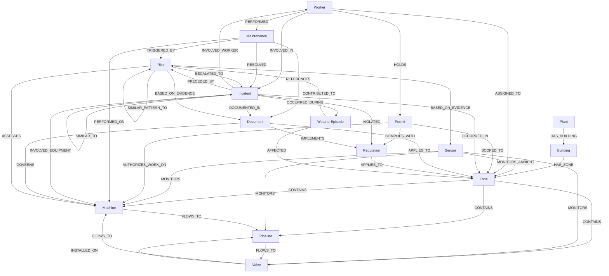

# AEGIS AI — The Neo4j Knowledge Graph
### Ontology, Relationships, and Cypher Reference

**Classification:** Internal — Engineering / Data
**Document Owner:** Office of the CTO / Data Platform
**Version:** 1.0
**Companion Documents:** `ARCHITECTURE.md` §13 (this document is the full specification of what that section sketched), `DATABASE_SCHEMA.md` (the relational counterpart — this document explains the division of labor between the two), `RISK_FUSION_ENGINE.md` §3.2 (Graph-Constrained Candidate Generation — the reason this graph exists), `AGENT_ARCHITECTURE.md` §6 (Knowledge Agent — the sole authorized writer to this graph)

---

## 0. Why a Graph Database Is Needed

This is the question a relational-database-literate reviewer will ask first, and it deserves a real answer rather than "graphs are good for connected data."

### 0.1 The Concrete Problem Relational Joins Don't Solve Well

Consider the single most common query this system runs, dozens of times per second at scale: *"if Valve V-12 fails, what else downstream is affected, and how many hops away is it?"* In PostgreSQL, even with the `upstream_equipment_id` self-reference `DATABASE_SCHEMA.md` §5.1 deliberately added as a narrow convenience column, answering this for an unknown, variable depth requires a recursive CTE:

```sql
-- The relational answer: variable-depth traversal via recursive CTE
WITH RECURSIVE downstream AS (
    SELECT id, tag, 1 AS depth FROM equipment WHERE upstream_equipment_id = 12
    UNION ALL
    SELECT e.id, e.tag, d.depth + 1
    FROM equipment e
    JOIN downstream d ON e.upstream_equipment_id = d.id
    WHERE d.depth < 5
)
SELECT * FROM downstream;
```
This works for a strictly linear chain. It falls apart the moment topology is genuinely graph-shaped rather than linear — a valve with two downstream branches, a pipeline that rejoins another line further down, a piece of equipment monitored by three different relationship types simultaneously (physical flow, electrical supply, control-system dependency). Modeling *that* relationally means either a single generic (and therefore meaningless) `related_equipment` join table, or a proliferation of separate join tables per relationship type, each requiring its own recursive CTE, each performing worse as depth increases because every hop is a fresh join against an index, not a pointer-chase.

The equivalent Cypher query, at any depth, on any topology shape:
```cypher
MATCH (v:Equipment {tag: 'V-12'})-[:FLOWS_TO*1..5]->(downstream)
RETURN downstream, length(path) AS hops
```
This is not a stylistic preference — Neo4j physically stores relationships as pointers on each node (index-free adjacency), so traversing one hop is a fixed-cost pointer dereference regardless of total graph size, while a relational join's cost scales with the size of the tables being joined and the query planner's ability to reason about recursion depth. **A graph query gets faster relative to a relational one specifically as the traversal gets deeper or the topology gets less linear — exactly the two properties AEGIS AI's real plant topology has.**

### 0.2 The Four Query Shapes That Justify This Investment

1. **Variable-depth impact traversal** — "what's downstream/upstream of this equipment" (Digital Twin's What-If mode, `ARCHITECTURE.md` §16.2's Simulation Layer).
2. **Graph-constrained evidence scoping** — "which sensors, cameras, and history are even relevant to assessing this equipment's risk" (`RISK_FUSION_ENGINE.md` §3.2 — this is the single most-executed query type against this graph, running on every hazard assessment cycle).
3. **Similarity-by-structure** — "find past incidents on equipment with a similar role in the topology, not just the same equipment type" (a query relational schemas answer poorly because "similar role in the topology" is itself a graph-shaped concept).
4. **Multi-relationship-type reasoning** — "is this equipment connected to that equipment by physical flow, by electrical dependency, or by shared control system" — three overlapping but distinct relationship types over the same two nodes, trivial in a labeled-property graph, awkward relationally (requiring either three separate join tables or an overloaded, type-tagged generic one).

### 0.3 What This Graph Is Not For

Stated as clearly as `DATABASE_SCHEMA.md` stated its own boundaries: this graph does **not** store raw sensor telemetry, raw camera frames, or every computed risk score — those remain in TimescaleDB (`DATABASE_SCHEMA.md` §20, §14, §10) for exactly the reasons that document gave (high-frequency, append-only, queried by time-range far more often than by relationship). This graph stores **the structure that gives that telemetry meaning**, plus the discrete, relationship-relevant *events* drawn from it (a specific incident, a specific significant weather episode, a specific noteworthy risk assessment) — never the continuous stream itself. Getting this boundary wrong in either direction — putting time series in the graph, or leaving genuine topology in flat relational tables — is the most common and most expensive knowledge-graph design mistake, and §2 below states, node type by node type, how each of the fourteen requested entities was kept on the correct side of it.

---

## 1. Design Principles

### 1.1 Multi-Label Subtyping, Matching the Relational Supertype Pattern

`DATABASE_SCHEMA.md` §5.2 modeled `Machine` as a class-table-inheritance subtype of the generic `Equipment` table (shared primary key, separate extension table) — because static equipment (a valve, a length of pipe) and powered machinery (a pump, a compressor) share a great deal of structure but not everything. Neo4j's idiomatic equivalent of that same pattern is **multi-label nodes**: a centrifugal pump is a single node carrying labels `:Equipment:Machine`, a manual valve is `:Equipment:Valve`, a pipe segment is `:Equipment:Pipeline`. A traversal that only cares about generic equipment topology matches on `:Equipment`; a query that needs machine-specific properties (rated RPM, control system) matches on `:Machine` specifically. This is not a new pattern invented for this document — it is the graph-native expression of the exact same design decision `DATABASE_SCHEMA.md` already made, restated in the vocabulary of the tool that best fits it.

### 1.2 Node Identity and Cross-Database Consistency

Every node carries an `id` property equal to its corresponding PostgreSQL row's primary key (e.g., `Equipment.id` in Neo4j = `equipment.id` in Postgres) — **never a separately-generated graph-native ID as the primary identity**. This is what makes the two databases genuinely one system rather than two independently-evolving copies of similar-looking data: any service holding a Postgres foreign key can look up the corresponding graph node directly, and vice versa, with no translation table in between.

### 1.3 What Becomes a Node vs. What Stays a Property or Relationship Attribute

A recurring modeling judgment call, resolved consistently throughout §2: **if a "thing" has its own identity, its own lifecycle, and needs to participate in multiple relationships from multiple directions, it is a node.** If a "thing" is only ever a descriptive attribute of exactly one other thing (a sensor's calibration date, a valve's diameter), it is a property. This is why, for instance, "Weather" becomes a node representing a discrete, graph-relevant *episode* (a named storm, a heatwave period) rather than a node per weather reading — a reading has no independent identity or relationship structure of its own; an episode does (it can affect multiple zones, correlate with multiple incidents, and be referenced by multiple risk assessments).

---

## 2. The Node Catalog

### 2.1 Overview Table

| Label(s) | Postgres Counterpart | Represents | Written By |
|---|---|---|---|
| `:Plant` | `plants` | Root of the physical hierarchy (kept lightweight here; full detail lives relationally) | Digital Twin Service |
| `:Building` | `buildings` | A physical structure within a plant | Digital Twin Service |
| `:Zone` | `zones` | The operational/hazard/RBAC-scoping unit | Digital Twin Service |
| `:Equipment:Machine` | `equipment` + `machines` | Powered, rotating, or operationally-active machinery | Digital Twin Service |
| `:Equipment:Valve` | `equipment` (type = Valve) | A flow-control device | Digital Twin Service |
| `:Equipment:Pipeline` | `equipment` (type = Pipe) | A physical pipe/line segment | Digital Twin Service |
| `:Sensor` | `sensors` | A monitoring device's registry entry (never its readings) | Ingestion Gateway (on registration) |
| `:Worker` | `workers` | A tracked person | Worker Agent / Identity Service |
| `:Permit` | `permits` | A work authorization record | Permit Agent |
| `:Incident` | `incidents` | A safety incident case record | Incident Service |
| `:Maintenance` | `maintenance_records` | A maintenance work order/record | Maintenance Agent |
| `:Document` (+ `:Manual`, `:Procedure`, `:InspectionReport`) | RAG corpus metadata | A citable knowledge source | Knowledge Agent (sole writer) |
| `:Regulation` | RAG corpus metadata (regulatory subset) | An external legal/regulatory clause | Knowledge Agent (sole writer) |
| `:WeatherEpisode` | `weather_observations` (aggregated) | A discrete, graph-relevant weather event | Learning Agent (periodic aggregation) |
| `:Risk` | `risk_scores` / `predictions` | A significant, graph-anchored hazard assessment snapshot | Risk Fusion Agent (via Knowledge Agent) |

**Every writer above is deliberately narrow** — this table is the graph-database expression of the single-writer discipline established in `AGENT_ARCHITECTURE.md` §0.4: no agent writes directly into a node type it doesn't own, and `Document`/`Regulation` (the corpus) is written exclusively through Knowledge Agent regardless of which agent's finding motivated the update, exactly as that document specified.

### 2.2 Physical & Topological Nodes

```cypher
// Building
(:Building {id, plantId, code, name, floorCount})

// Zone
(:Zone {id, buildingId, code, name, zoneType, hazardClass, safeOccupancyLimit, floorLevel})

// Machine — multi-label, matching the Equipment/Machine class-table-inheritance split in DATABASE_SCHEMA.md §5.2
(:Equipment:Machine {
  id, tag, name, manufacturer, criticality, status,
  machineClass, ratedPowerKw, ratedRpm, controlSystem, plcTag
})

// Valve — multi-label; note valve-specific properties absent from generic Equipment
(:Equipment:Valve {
  id, tag, name, criticality, status,
  valveType, diameterMm, normallyOpen, actuationType
})

// Pipeline — represents a physical segment, distinct from the logical flow relationships it participates in
(:Equipment:Pipeline {
  id, tag, name, criticality, status,
  material, diameterMm, designPressureBar, medium, lengthMeters
})

// Sensor — metadata only; readings never enter the graph, per §0.3
(:Sensor {id, tag, sensorType, unit, minRange, maxRange, sampleRateHz, calibrationDate, status})
```
**Why Pipeline is a node and not merely a relationship:** a length of physical pipe has its own identity independent of what it connects — it has a material, a design pressure rating, an age, and its own maintenance/incident history, and it can host sensors and valves *along* its length, not just at its endpoints. Modeling it purely as a `CONNECTS` relationship between two equipment nodes (a tempting simplification) would lose the ability to attach a sensor to "the pipeline itself" or to ask "which incidents involved this specific pipeline segment" — exactly the kind of question `DATABASE_SCHEMA.md` §0.2's normalization discipline would flag as a modeling error if a real, independently-referenced entity were flattened into an edge attribute.

### 2.3 Human & Process Nodes

```cypher
// Worker
(:Worker {id, badgeId, fullName, workerType, active})

// Permit
(:Permit {id, permitNumber, permitType, status, validFrom, validTo, requiresDualSignoff})

// Maintenance
(:Maintenance {id, maintenanceType, status, scheduledDate, completedAt, findings})
```
These three mirror their Postgres tables closely (`DATABASE_SCHEMA.md` §6.2, §7, §8) because their *value* in the graph is almost entirely relational-to-other-entities (who did what, where, under what authorization) rather than requiring deep traversal in their own right — they appear in the graph specifically so `Incident`, `Risk`, and topology traversals can reach them, not because permits or maintenance records have rich internal graph structure of their own.

### 2.4 Event & Knowledge Nodes

```cypher
// Incident
(:Incident {id, incidentNumber, severity, status, openedAt, closedAt, rootCause})

// Document — multi-label by document type, matching the Manual/Procedure/InspectionReport
// distinction ARCHITECTURE.md §14.2 draws in the RAG corpus
(:Document:Manual {id, title, equipmentTypeScope, version})
(:Document:Procedure {id, title, hazardClassScope, version})
(:Document:InspectionReport {id, title, equipmentId, inspectedAt})

// Regulation — external, jurisdictional; distinct from internally-authored Documents
(:Regulation {id, code, title, jurisdiction, clauseRef, effectiveDate})
```
**Why Regulation is separate from Document rather than a `Document` subtype:** a `Document` (a manual, an internal procedure) is something AEGIS AI's own corpus manages and versions; a `Regulation` is an external legal fact the organization does not author and cannot change — merging them would blur an important distinction the Compliance Agent (`AGENT_ARCHITECTURE.md` §10) relies on: internal procedures can and should be revised through the Playbook-authoring governance process (`ARCHITECTURE.md` §15.4), while regulations can only be tracked and complied with. The relationship between them (`Document -[:IMPLEMENTS]-> Regulation`, §3) is exactly where that "we wrote this procedure *because of* that external requirement" fact lives.

### 2.5 Derived, Graph-Anchored Nodes

```cypher
// WeatherEpisode — a discrete, named period, NOT a per-reading node (§0.3)
(:WeatherEpisode {id, episodeType, startAt, endAt, severity, description})

// Risk — a significant, graph-relevant hazard assessment snapshot, linked back to its
// full-fidelity Postgres record; NOT a node per continuous risk_scores tick (§0.3)
(:Risk {
  id, postgresPredictionId, hazardClass, score, confidence,
  epistemicFlag, assessedAt, gateStructureVersion
})
```
**Why these two node types exist at all, given §0.3's caution against time-series-as-nodes:** both represent the *discrete, relationship-bearing* subset of an otherwise continuous stream — a `WeatherEpisode` node is created only when the Learning Agent's periodic aggregation (`AGENT_ARCHITECTURE.md` §11) identifies a period worth naming (a storm, not every five-minute reading); a `Risk` node is created only for assessments that cross a significance threshold (matching `RISK_FUSION_ENGINE.md` §3.6's Evidence Bundle generation) — routine, unremarkable risk fluctuation never touches this graph at all, staying entirely in `risk_scores` (`DATABASE_SCHEMA.md` §10) where it belongs.

---

## 3. The Relationship Catalog

### 3.1 Full Diagram



### 3.2 Relationship Reference Table

| Relationship | From → To | Cardinality | Meaning / Why It Exists |
|---|---|---|---|
| `HAS_BUILDING` | Plant → Building | 1:N | Physical containment, mirrors `buildings.plant_id` |
| `HAS_ZONE` | Building → Zone | 1:N | Mirrors `zones.building_id` |
| `CONTAINS` | Zone → Equipment (any subtype) | 1:N | Mirrors `equipment.zone_id` |
| `MONITORS` | Sensor → Equipment (any subtype) | 1:N (equipment can have many sensors) | Mirrors `sensors.equipment_id` |
| `MONITORS_AMBIENT` | Sensor → Zone | 1:N | Mirrors `sensors.zone_id` for ambient/zone-level sensors |
| `FLOWS_TO {medium, direction}` | Equipment → Equipment | N:N | **The core process-topology relationship** — directional physical flow; the property this entire document exists to make traversable at arbitrary depth (§0.1) |
| `INSTALLED_ON` | Valve → Pipeline | N:1 | A valve's physical location on a specific pipe segment — distinct from `FLOWS_TO`, since a valve controls flow *on* a pipeline without the pipeline itself being upstream/downstream of the valve in the process sense |
| `ASSIGNED_TO` | Worker → Zone | N:N (time-bounded via relationship property `since`/`until`) | Current or scheduled physical presence, feeding Worker Agent (`AGENT_ARCHITECTURE.md` §3) |
| `HOLDS` | Worker → Permit | 1:N | Mirrors `permits.worker_id` |
| `PERFORMED` | Worker → Maintenance | 1:N | Mirrors `maintenance_records.performed_by` |
| `INVOLVED_IN` | Worker → Incident | N:N | A worker who was present/injured/involved, mirrors `ppe_violations`/incident-context join |
| `AUTHORIZES_WORK_ON` | Permit → Equipment | 1:N | Mirrors `permits.equipment_id`; the exact relationship Permit Agent's conflict-check (`AGENT_ARCHITECTURE.md` §4) traverses |
| `SCOPED_TO` | Permit → Zone | 1:1 | Mirrors `permits.zone_id` |
| `COMPLIES_WITH` | Permit → Regulation | N:N | Which regulatory clause(s) this permit's conditions satisfy — the fact Permit Agent's free-text conditions parser (`AGENT_ARCHITECTURE.md` §4) ultimately resolves toward |
| `PERFORMED_ON` | Maintenance → Equipment | N:1 | Mirrors `maintenance_records.equipment_id` |
| `REFERENCES` | Maintenance → Document | N:N | The manual excerpt a work order was drafted from (Maintenance Agent, `AGENT_ARCHITECTURE.md` §5) |
| `TRIGGERED_BY` | Maintenance → Risk | N:1 (optional) | Mirrors `maintenance_records.related_prediction_id`, now graph-anchored |
| `RESOLVED` | Maintenance → Incident | N:1 (optional) | The maintenance action that closed out an incident's root cause |
| `OCCURRED_IN` | Incident → Zone | N:1 | Mirrors `incidents.zone_id` |
| `INVOLVED_EQUIPMENT` | Incident → Equipment | N:N | Mirrors `incidents.equipment_id` |
| `SIMILAR_TO {score}` | Incident → Incident | N:N | Computed via embedding/structural similarity, periodically refreshed — the relationship `ARCHITECTURE.md` §13.2 originally specified, unchanged here |
| `PRECEDED_BY` | Incident → Risk | N:N | Which graph-anchored risk assessments predicted this incident before it happened — the direct link the continuous-learning feedback loop (`ARCHITECTURE.md` §9.5) traverses to evaluate prediction quality |
| `VIOLATED` | Incident → Regulation | N:N | A regulatory breach associated with this incident — Compliance Agent's (`AGENT_ARCHITECTURE.md` §10) primary traversal target |
| `DOCUMENTED_IN` | Incident → Document | N:N | The formal incident report / investigation record |
| `OCCURRED_DURING` | Incident → WeatherEpisode | N:1 (optional) | Environmental correlation context |
| `IMPLEMENTS` | Document → Regulation | N:N | An internal procedure written specifically to satisfy an external regulation |
| `GOVERNS` | Document → Equipment | N:N | A manual's applicability to specific equipment (or, more commonly, to an equipment *type* — see note below) |
| `APPLIES_TO` | Document / Regulation → Zone | N:N | Hazard-class or jurisdictional scoping |
| `AFFECTED` | WeatherEpisode → Zone | N:N | Which zones a weather episode's conditions were relevant to |
| `CONTRIBUTED_TO` | WeatherEpisode → Risk | N:N | Direct causal link when weather was a Category C contributing factor (`RISK_FUSION_ENGINE.md` §2) |
| `ASSESSES` | Risk → Equipment / Zone | N:1 | What the hazard assessment is about |
| `BASED_ON_EVIDENCE` | Risk → Sensor / Document / Maintenance | N:N | The graph-anchored portion of the Evidence Bundle (`RISK_FUSION_ENGINE.md` §7) — which nodes were actually traversed and used |
| `ESCALATED_TO` | Risk → Incident | N:1 (optional) | The risk assessment that caused this incident to be opened |
| `SIMILAR_PATTERN_TO {score}` | Risk → Risk | N:N | Precursor-sequence similarity matches (`RISK_FUSION_ENGINE.md` §3.3) — the graph-level record of "this evidence pattern resembled that one" |

**A note on `GOVERNS`:** in practice, most manuals apply to an *equipment type* ("all centrifugal pumps of this model line"), not one physical instance — for this common case, `Document -[:GOVERNS]-> EquipmentType` (a lightweight reference node mirroring `equipment_types`, `DATABASE_SCHEMA.md` §3) is used instead, and individual equipment inherit their type's governing documents by traversing `Equipment -[:INSTANCE_OF]-> EquipmentType -[:GOVERNED_BY]- Document` — avoiding the data-maintenance burden of re-linking every single valve of the same model to the same manual individually.

---

## 4. Cypher — Schema Setup

Constraints and indexes are declared once, at graph provisioning time, and mirror the uniqueness guarantees already established relationally (`DATABASE_SCHEMA.md` §0.3) — the graph does not invent its own identity rules independent of the source of truth.

```cypher
// Uniqueness constraints — one per node label with a natural business identity
CREATE CONSTRAINT plant_id IF NOT EXISTS FOR (n:Plant) REQUIRE n.id IS UNIQUE;
CREATE CONSTRAINT building_id IF NOT EXISTS FOR (n:Building) REQUIRE n.id IS UNIQUE;
CREATE CONSTRAINT zone_id IF NOT EXISTS FOR (n:Zone) REQUIRE n.id IS UNIQUE;
CREATE CONSTRAINT equipment_id IF NOT EXISTS FOR (n:Equipment) REQUIRE n.id IS UNIQUE;
CREATE CONSTRAINT sensor_id IF NOT EXISTS FOR (n:Sensor) REQUIRE n.id IS UNIQUE;
CREATE CONSTRAINT worker_id IF NOT EXISTS FOR (n:Worker) REQUIRE n.id IS UNIQUE;
CREATE CONSTRAINT permit_id IF NOT EXISTS FOR (n:Permit) REQUIRE n.id IS UNIQUE;
CREATE CONSTRAINT incident_id IF NOT EXISTS FOR (n:Incident) REQUIRE n.id IS UNIQUE;
CREATE CONSTRAINT maintenance_id IF NOT EXISTS FOR (n:Maintenance) REQUIRE n.id IS UNIQUE;
CREATE CONSTRAINT document_id IF NOT EXISTS FOR (n:Document) REQUIRE n.id IS UNIQUE;
CREATE CONSTRAINT regulation_id IF NOT EXISTS FOR (n:Regulation) REQUIRE n.id IS UNIQUE;
CREATE CONSTRAINT weather_episode_id IF NOT EXISTS FOR (n:WeatherEpisode) REQUIRE n.id IS UNIQUE;
CREATE CONSTRAINT risk_id IF NOT EXISTS FOR (n:Risk) REQUIRE n.id IS UNIQUE;

// Note: the uniqueness constraint on :Equipment (the supertype label) is sufficient for
// :Machine / :Valve / :Pipeline nodes too, since every such node also carries :Equipment —
// no separate per-subtype constraint is needed, avoiding redundant constraint maintenance.

// Indexes supporting the highest-frequency lookup patterns (tag-based search, Command Palette)
CREATE INDEX equipment_tag IF NOT EXISTS FOR (n:Equipment) ON (n.tag);
CREATE INDEX sensor_tag IF NOT EXISTS FOR (n:Sensor) ON (n.tag);
CREATE INDEX incident_severity IF NOT EXISTS FOR (n:Incident) ON (n.severity);
CREATE INDEX risk_hazard_class IF NOT EXISTS FOR (n:Risk) ON (n.hazardClass, n.assessedAt);

// A full-text index for Document/Regulation title search, backing Knowledge Agent's
// keyword-retrieval component (RISK_FUSION_ENGINE.md §3.4's hybrid retrieval, restated
// at the graph layer for graph-native search rather than only the vector store)
CREATE FULLTEXT INDEX document_title_search IF NOT EXISTS FOR (n:Document|Regulation) ON EACH [n.title];
```

---

## 5. Cypher — Write Patterns

### 5.1 Node Creation (Idempotent, Matching the Single-Writer Discipline)

```cypher
// Registering a new valve — written by the Digital Twin Service on equipment onboarding
// (ARCHITECTURE.md §17.3), mirroring the corresponding Postgres INSERT into equipment.
MERGE (v:Equipment:Valve {id: $equipmentId})
SET v.tag = $tag, v.name = $name, v.criticality = $criticality, v.status = $status,
    v.valveType = $valveType, v.diameterMm = $diameterMm, v.normallyOpen = $normallyOpen

// Linking the valve into its zone and onto its pipeline
MATCH (v:Equipment:Valve {id: $equipmentId}), (z:Zone {id: $zoneId}), (p:Pipeline {id: $pipelineId})
MERGE (z)-[:CONTAINS]->(v)
MERGE (v)-[:INSTALLED_ON]->(p)
```
`MERGE`, not `CREATE`, is used throughout — every write into this graph is idempotent by node `id`, because the graph is a consumer of the same event stream (`ARCHITECTURE.md` §10) that could, under normal at-least-once delivery semantics, redeliver an equipment-registration event; `MERGE` guarantees a replayed event updates the existing node rather than creating a duplicate.

### 5.2 Recording a New Incident and Its Immediate Context

```cypher
MATCH (z:Zone {id: $zoneId}), (eq:Equipment {id: $equipmentId})
CREATE (i:Incident {
  id: $incidentId, incidentNumber: $incidentNumber, severity: $severity,
  status: 'open', openedAt: datetime($openedAt)
})
MERGE (i)-[:OCCURRED_IN]->(z)
MERGE (i)-[:INVOLVED_EQUIPMENT]->(eq)
WITH i
MATCH (r:Risk {id: $riskId})
MERGE (r)-[:ESCALATED_TO]->(i)
```
`CREATE` (not `MERGE`) is correct here — an incident's `id` is only ever generated once, at the moment the Incident Service opens it (`DATABASE_SCHEMA.md` §9), so there is no replay-duplication risk analogous to equipment registration.

### 5.3 Anchoring a Risk Assessment's Evidence Bundle (Knowledge Agent, on Behalf of Risk Fusion Agent)

```cypher
CREATE (r:Risk {
  id: $riskId, postgresPredictionId: $predictionId, hazardClass: $hazardClass,
  score: $score, confidence: $confidence, epistemicFlag: $epistemicFlag,
  assessedAt: datetime($assessedAt), gateStructureVersion: $gateVersion
})
WITH r
MATCH (eq:Equipment {id: $equipmentId})
MERGE (r)-[:ASSESSES]->(eq)
WITH r
UNWIND $evidenceSensorIds AS sensorId
MATCH (s:Sensor {id: sensorId})
MERGE (r)-[:BASED_ON_EVIDENCE]->(s)
```
This is the exact write pattern that materializes `RISK_FUSION_ENGINE.md` §7's Evidence Bundle into traversable graph structure — every `evidence_refs` entry in that document's schema becomes a `BASED_ON_EVIDENCE` edge here, which is what makes "show me every past risk assessment that relied on this specific sensor" a one-hop traversal rather than a search through JSONB blobs.

---

## 6. Cypher — Read & Traversal Patterns (The Payoff)

These are the queries that justify §0's entire argument — each one is either impractical or substantially slower to express relationally.

### 6.1 Variable-Depth Downstream Impact (Digital Twin's What-If Mode, `ARCHITECTURE.md` §16.2)

```cypher
MATCH path = (v:Equipment {tag: 'V-12'})-[:FLOWS_TO*1..6]->(downstream)
RETURN downstream.tag, downstream.name, length(path) AS hopsAway
ORDER BY hopsAway
```

### 6.2 Graph-Constrained Candidate Generation (`RISK_FUSION_ENGINE.md` §3.2 — the Highest-Frequency Query Against This Graph)

```cypher
// For a given equipment, find every sensor, camera-monitored zone, active permit,
// and recent incident history within a 2-hop structural neighborhood — exactly the
// set of evidence the Risk Fusion Engine's Bayesian networks are permitted to consider.
MATCH (eq:Equipment {id: $equipmentId})
OPTIONAL MATCH (eq)-[:FLOWS_TO|INSTALLED_ON*1..2]-(neighbor:Equipment)
OPTIONAL MATCH (s:Sensor)-[:MONITORS]->(eq)
OPTIONAL MATCH (s2:Sensor)-[:MONITORS]->(neighbor)
OPTIONAL MATCH (eq)<-[:CONTAINS]-(z:Zone)<-[:SCOPED_TO]-(p:Permit {status: 'active'})
OPTIONAL MATCH (eq)<-[:INVOLVED_EQUIPMENT]-(pastIncident:Incident)
RETURN eq, collect(DISTINCT neighbor) AS graphNeighborhood,
       collect(DISTINCT s) + collect(DISTINCT s2) AS admittedSensors,
       collect(DISTINCT p) AS activePermits,
       collect(DISTINCT pastIncident) AS historicalIncidents
```

### 6.3 Incident Similarity by Topological Role (Not Just Equipment Type)

```cypher
// Find past incidents on equipment that plays a structurally similar role
// (same number of upstream/downstream connections, same zone hazard class) —
// a genuinely graph-shaped notion of "similar" a relational query cannot express directly.
MATCH (target:Equipment {id: $equipmentId})<-[:CONTAINS]-(z:Zone)
MATCH (target)-[:FLOWS_TO]-(targetNeighbor)
WITH target, z, count(DISTINCT targetNeighbor) AS targetDegree
MATCH (candidate:Equipment)<-[:CONTAINS]-(z2:Zone {hazardClass: z.hazardClass})
WHERE candidate <> target
MATCH (candidate)-[:FLOWS_TO]-(candidateNeighbor)
WITH target, candidate, targetDegree, count(DISTINCT candidateNeighbor) AS candidateDegree
WHERE abs(targetDegree - candidateDegree) <= 1
MATCH (candidate)<-[:INVOLVED_EQUIPMENT]-(i:Incident)
RETURN candidate.tag, i.incidentNumber, i.severity, i.rootCause
ORDER BY i.openedAt DESC
LIMIT 10
```

### 6.4 Permit Conflict Check (Permit Agent's Core Gate, `AGENT_ARCHITECTURE.md` §4)

```cypher
MATCH (eq:Equipment {id: $proposedActionEquipmentId})<-[:AUTHORIZES_WORK_ON]-(p:Permit)
WHERE p.status = 'active' AND p.validFrom <= datetime() <= p.validTo
RETURN p.permitNumber, p.permitType, p.conditions
```
This single, constant-time pattern-match is the entire graph-side implementation of the fail-closed gate `AGENT_ARCHITECTURE.md` §4 specifies: an empty result set means "no conflict," and Emergency Agent proceeds; any result means "flag for human review," full stop.

### 6.5 Worker Exposure Query (Worker Agent, Feeding Emergency Agent)

```cypher
// Which currently-assigned workers are in a zone whose most recent Risk assessment
// is above the Critical threshold?
MATCH (w:Worker)-[:ASSIGNED_TO]->(z:Zone)<-[:ASSESSES]-(r:Risk)
WHERE r.score >= 80 AND r.assessedAt > datetime() - duration('PT10M')
RETURN w.fullName, w.badgeId, z.name, r.hazardClass, r.score
```

### 6.6 Compliance Traversal (Compliance Agent, `AGENT_ARCHITECTURE.md` §10)

```cypher
// For a given regulation, find every piece of equipment it governs (directly or via
// equipment type), and flag any whose most recent maintenance predates the regulation's
// required inspection interval — a genuine multi-hop compliance-gap query.
MATCH (reg:Regulation {code: $regulationCode})<-[:IMPLEMENTS]-(doc:Document)-[:GOVERNS]->(eq:Equipment)
OPTIONAL MATCH (eq)<-[:PERFORMED_ON]-(m:Maintenance)
WITH eq, reg, max(m.completedAt) AS lastServiced
WHERE lastServiced IS NULL OR lastServiced < datetime() - duration({days: $requiredIntervalDays})
RETURN eq.tag, eq.name, lastServiced, reg.code AS violatedRegulation
```

### 6.7 Precursor-Pattern Lookup (Novel-Combination Handling, `RISK_FUSION_ENGINE.md` §6)

```cypher
// Has any risk assessment on structurally similar equipment ever shown a similar
// evidence pattern, and what did it lead to?
MATCH (r:Risk {id: $currentRiskId})-[:SIMILAR_PATTERN_TO]->(pastRisk:Risk)
OPTIONAL MATCH (pastRisk)-[:ESCALATED_TO]->(i:Incident)
RETURN pastRisk.hazardClass, pastRisk.score, pastRisk.assessedAt,
       i.incidentNumber, i.severity, i.rootCause
ORDER BY pastRisk.assessedAt DESC
```

---

## 7. Sync Strategy — Neo4j as a Derived, Rebuildable View

Consistent with `DATABASE_SCHEMA.md` §12.2's "source-of-truth" rule (the event log is canonical; every database is a rebuildable projection), **this graph is not an independent system of record** — it is a materialized view over the same event backbone (`ARCHITECTURE.md` §10) every other store consumes. Concretely: a stream-processing consumer (owned by Knowledge Agent, the graph's sole writer per §2.1) subscribes to `equipment.*`, `incident.*`, `permit.*`, `maintenance.*`, and `risk.updated` topics and applies the corresponding `MERGE`/`CREATE` patterns from §5 as each event arrives. **If this graph were lost entirely, it could be fully rebuilt by replaying the event log from the beginning** — the same durability guarantee `DATABASE_SCHEMA.md` established for every relational table, extended here to the graph without exception. This is precisely why no write path in this document bypasses the event stream to write Postgres and Neo4j "simultaneously" from application code — doing so would create two independently-drifting sources of truth, exactly the failure mode single-writer, event-sourced synchronization exists to prevent.

---

## Closing Note: How This Graph Fits the Rest of the System

This document is the full specification of the node/relationship model `ARCHITECTURE.md` §13 introduced at a sketch level and every subsequent document assumed was already fully designed — `RISK_FUSION_ENGINE.md` §3.2's "graph-constrained candidate generation" is §6.2 of this document; `AGENT_ARCHITECTURE.md` §4's Permit Agent conflict check is §6.4; the Digital Twin's What-If simulation (`ARCHITECTURE.md` §16.2) is §6.1. Nothing here introduces a new capability the rest of the series didn't already promise — this document is where those promises become fourteen node labels, thirty-some relationship types, and Cypher a reviewer can actually run.

**End of Document.**

