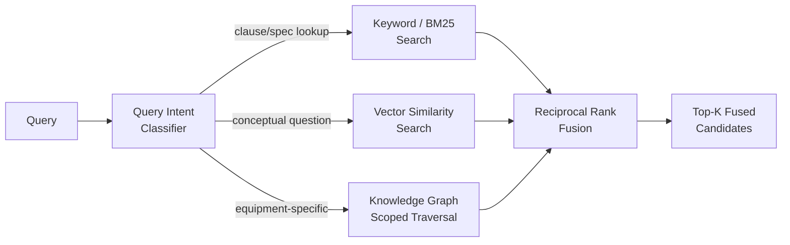

# AEGIS AI — The Enterprise RAG System
### Grounded Retrieval Over Ten Heterogeneous Document Classes

**Classification:** Internal — Engineering / AI Systems
**Document Owner:** Office of the CTO / AI Systems Architecture
**Version:** 1.0
**Companion Documents:** `ARCHITECTURE.md` §14 (this document is the full specification of that section), `AGENT_ARCHITECTURE.md` §6 (Knowledge Agent — the sole consumer/writer of this system), `KNOWLEDGE_GRAPH.md` §2.4 (`Document`/`Regulation` nodes — this corpus is what those nodes point into), `RISK_FUSION_ENGINE.md` §3.4 (safety manuals and regulations as CPT-shaping Category C inputs — this document is where those inputs actually come from)

---

## 0. The One Design Rule Everything Else Follows

> **A citation that doesn't resolve to a real, version-correct, textually-supporting source is worse than no answer at all.**

This is the same commitment `ARCHITECTURE.md` §14.3 stated ("cite chunk IDs, no unsourced causal claims") and `AGENT_ARCHITECTURE.md` §6 restated as Knowledge Agent's strictest discipline in the fleet. This document exists because *implementing* that commitment across ten document classes as different as a 1948 statute and a same-day near-miss report requires real engineering, not a single generic RAG pipeline — a Factory Act clause and an equipment torque spec cannot be chunked, embedded, or cited the same way and still both be trustworthy.

---

## 1. The Corpus: Ten Document Classes, and Why Each Needs Different Handling

Treating all ten inputs as "documents, chunk and embed them" is the single most common enterprise RAG failure mode. Each class below has a genuinely different authority model, update cadence, internal structure, and citation-precision requirement — and the pipeline stages in §§3-8 are differentiated by these properties throughout, not applied uniformly and hoped to work.

| Document Class | Authority / Source | Update Cadence | Structural Shape | Citation Precision Required |
|---|---|---|---|---|
| **Safety SOPs** | Internal (Safety Officer-authored, `ARCHITECTURE.md` §15.4's governance process) | Revised on process/lesson-learned change | Numbered procedural steps | Step number within a specific SOP version |
| **Equipment Manuals** | External (equipment vendor) | Rare — tied to equipment model, not time | Sections, diagrams, spec tables | Section + page, tied to equipment model |
| **Factory Act** (Factories Act, 1948) | Statutory (Government of India) | Extremely rare, amendment-driven | Sections, sub-sections, clauses | Exact section/sub-section/clause number |
| **DGMS** (Directorate General of Mines Safety) circulars | Regulatory (Government of India, mining safety) | Periodic circulars, each independently numbered | Circular number, date, directive text | Circular number + date |
| **OISD** (Oil Industry Safety Directorate) standards | Industry-regulatory (OISD-STD/OISD-GDN series) | Periodic revision per standard | Numbered standard, clause-structured | Standard number + clause (e.g., "OISD-STD-118, Cl. 4.3") |
| **Maintenance Manuals** | External (vendor) or internal (adapted procedure) | Tied to equipment model / internal revision | Procedure steps, torque/tolerance tables | Section + step, table row where relevant |
| **Incident Reports** | Internal (Incident Service, `DATABASE_SCHEMA.md` §9) | Generated per incident, immutable once closed | Summary, timeline, root cause, corrective action | Incident number + section |
| **Near Misses** | Internal (same lifecycle as incidents, lower severity) | High volume, generated continuously | Brief structured narrative | Near-miss record number |
| **Audit Reports** | Internal/external (compliance audits) | Periodic (annual/semi-annual) | Checklist findings, each independently referenced | Audit ID + finding number |
| **Inspection Reports** | Internal (equipment-specific) | Per inspection cycle | Checklist + equipment-specific observations | Inspection ID + equipment tag |

**Mapping onto the Knowledge Graph (`KNOWLEDGE_GRAPH.md` §2.4):** Factory Act, DGMS, and OISD are `:Regulation` nodes — external, unauthored-by-us, legally fixed text. SOPs, equipment/maintenance manuals, incident reports, near misses, audit reports, and inspection reports are `:Document` nodes (multi-labeled `:Document:Manual`, `:Document:Procedure`, `:Document:InspectionReport` as established there) — internally-managed, versioned, and connected to regulations via `IMPLEMENTS` edges where a procedure exists specifically to satisfy a regulatory requirement. This RAG system is the retrieval layer sitting *underneath* those graph nodes — the graph tells you a document exists and what it's connected to; this system is how you get inside it.

---

## 2. Ingestion

### 2.1 Three Ingestion Paths, Not One

- **Event-driven, automatic ingestion** — Incident Reports, Near Misses, Audit Reports, and Inspection Reports are generated *by AEGIS AI's own services* (Incident Service, Compliance Agent, Maintenance Agent), so ingestion is simply a subscription to the corresponding event topic (`incident.closed`, `audit.completed`, `inspection.completed`, per `ARCHITECTURE.md` §10.3) — the moment one of these records is finalized, it flows into the corpus with zero manual step and zero lag, because delaying ingestion of a just-closed incident's findings is delaying exactly the lesson the continuous-learning loop (`ARCHITECTURE.md` §9.5) exists to capture quickly.
- **Managed document upload** — Safety SOPs and Maintenance Manuals enter through a controlled internal authoring/upload workflow (tied to the same Safety-Officer governance process that authors Playbooks, `ARCHITECTURE.md` §15.4), version-controlled from the moment of upload.
- **Regulatory Watch** — Factory Act, DGMS circulars, and OISD standards are the one input class where AEGIS AI does not control the update cadence at all; a dedicated **Regulatory Watch** process (a scheduled Knowledge Agent job, not a live event subscription, since these change on the government's schedule, not ours) periodically checks for new/amended regulatory text, ingests it, and — critically — **never silently replaces the prior version**. Both the old and new clause text are retained, version-tagged by effective date, because a historical incident investigation must be able to cite "the Factories Act section as it read on the date of the incident," not today's amended text.

### 2.2 Format-Aware Parsing

Layout-aware parsing (preserving heading hierarchy, numbered-clause structure, and table boundaries as structural metadata, not flattened prose) is applied per document, with an OCR fallback specifically for scanned legacy documents (older DGMS circulars in particular are frequently only available as scanned PDFs) — OCR output carries its own `ocr_confidence` field, and any chunk sourced from a below-threshold-confidence OCR pass is flagged in its metadata (§6) so a low-confidence-source citation can be visually distinguished from a clean-text one in the UI, rather than presenting a garbled-OCR-derived fact with the same apparent authority as a perfectly parsed statute clause.

### 2.3 De-Duplication and Version Supersession

Every ingested document is checked against the existing corpus by both a content hash (exact re-upload) and a structural-similarity check (a revised version of the same SOP, not a byte-identical duplicate). On detecting a new version of an existing document, the ingestion pipeline marks the prior version `superseded_at = <new version's effective date>` rather than deleting it — **the old version remains fully retrievable, just no longer returned by default for present-tense queries** (§5.4 covers how retrieval respects this). This single design decision is what makes the Knowledge Copilot's answers legally defensible under investigation: an incident closed under a since-revised SOP must be explainable against the SOP that was actually in effect at the time, not a version that didn't exist yet.

### 2.4 Access Classification at Ingestion Time

Every document is tagged at ingestion with an access classification tied to the RBAC scope model (`ARCHITECTURE.md` §21.1) — most manuals/SOPs/regulations are broadly readable, but some audit findings and incident root-cause narratives may be classified for Safety Officer/Plant Manager eyes only. This tag travels with every chunk derived from the document (§6) and is enforced at retrieval time (§5.5), not applied as an afterthought filter on generated answers — a document a user isn't authorized to see must never be retrieved for them in the first place, let alone cited.

---

## 3. Chunking

### 3.1 The General Principle, Restated From `ARCHITECTURE.md` §14.4

Chunking is **semantic-boundary-aware, never a fixed token window** — a chunk is a coherent unit of meaning, not an arbitrary 512-token slice that might cut a sentence, a clause, or a table row in half. This document's contribution is specifying *what "a coherent unit" means*, concretely, per document class — because that answer genuinely differs.

### 3.2 Chunking Strategy by Class

| Document Class | Chunk Boundary | Overlap Policy | Rationale |
|---|---|---|---|
| **Factory Act / DGMS / OISD** | One chunk per clause/sub-clause, never split | **None** | A legal clause split across two chunks risks a citation that quotes half a requirement — regulatory text is chunked at its own natural, authoritative boundary and that boundary is never crossed, full stop |
| **Safety SOPs** | One chunk per numbered procedural step or logically grouped step-sequence | Minimal (one step of trailing context) | A step must be citable and actionable on its own, but adjacent-step context prevents "step 4 says X" from losing the precondition established in step 3 |
| **Equipment / Maintenance Manuals** | Section-bounded; tables and diagrams kept fully intact within their own chunk, never split mid-row | None across tables; light overlap across prose sections | A torque spec table split across two chunks could silently present an incomplete spec as complete — tables are treated as atomic |
| **Incident Reports / Near Misses** | One chunk per report section (Summary, Timeline, Root Cause, Corrective Action) | None — sections are semantically distinct | These sections answer different question types ("what happened" vs. "why" vs. "what was done"), and merging them would force retrieval to return irrelevant sections alongside relevant ones |
| **Audit / Inspection Reports** | One chunk per finding/checklist item | None | Findings are queried atomically ("what did the last audit say about valve seals") — an audit report is a collection of independent facts, not a narrative to be read start to finish |

### 3.3 Structured Fields Become Metadata, Not Prose

For Incident Reports, Near Misses, Audit Reports, and Inspection Reports specifically, structured fields already living in `DATABASE_SCHEMA.md` (`incidents.severity`, `incidents.equipment_id`, `maintenance_records.completed_at`) are **never re-embedded as prose text inside the chunk** — they attach as chunk metadata (§6) instead. Embedding "Severity: Critical" as part of a text chunk wastes embedding-space precision on a fact that a metadata filter answers exactly and instantly; the chunk's embedding is reserved for the genuinely unstructured content (the narrative, the root-cause reasoning) that a metadata filter cannot capture.

---

## 4. Embedding

### 4.1 A Single Domain-Adapted Model, Not a Model Per Document Class

Rather than maintaining separate embedding models per document class (an operational burden that would multiply the versioning problem in §4.3 tenfold), AEGIS AI uses **one domain-adapted embedding model, continuously fine-tuned on the union of the corpus** — Indian industrial-safety regulatory language (Factory Act/DGMS/OISD), technical/engineering vocabulary (manuals), and internal incident-narrative style (incident/near-miss reports) all need to live in the same embedding space, because a real query ("what does the regulation say, and have we had incidents related to this before") must retrieve across document classes in one pass, not run three separate model calls a user has to mentally reconcile.

### 4.2 Fine-Tuning Signal Sources

- **Initial adaptation:** continued pretraining on the raw corpus (unsupervised) to shift the base embedding model's vocabulary sensitivity toward regulatory and technical language it wasn't originally trained on (generic embeddings measurably underperform on part numbers, chemical names, and statutory phrasing, per `ARCHITECTURE.md` §14.4).
- **Contrastive fine-tuning from real usage** (the feedback loop, §9): confirmed-good query-to-chunk pairs from Knowledge Copilot interactions (`UI_UX_SPECIFICATION.md` §11) become positive training pairs; chunks a user explicitly marked as irrelevant become hard negatives — the embedding space is shaped by what Dr. Kwan and other Safety Officers actually find useful, not just by generic semantic similarity.

### 4.3 Embedding Versioning — A Hard Operational Rule

**A query embedding is never compared against chunk embeddings from a different model version.** When the embedding model is updated (via the same human-gated process the Learning Agent uses for any model promotion, `AGENT_ARCHITECTURE.md` §11), the entire corpus is re-embedded in a background re-indexing pass, and the vector store serves exclusively from the new version once re-indexing completes — there is no partial-migration state where old and new embeddings coexist in one similarity search, because a similarity score computed across two different embedding spaces is meaningless, not just imprecise.

### 4.4 A Narrow Multi-Modal Exception

Equipment and Maintenance Manuals frequently reference diagrams and schematics inline. Where a diagram is load-bearing to a chunk's meaning (a torque-sequence diagram, a wiring schematic), a **separate image-embedding pathway** (a vision-capable embedding model) runs alongside the text embedding, and the two are stored as sibling vectors against the same chunk ID — a query can match against either, and the retrieved chunk carries both its text and its associated diagram reference forward into re-ranking and citation, rather than forcing every visual reference to be manually transcribed to text and losing information in the process.

---

## 5. Hybrid Search

### 5.1 Three Retrieval Signals, Fused



### 5.2 Why All Three, Not Just Vector Search

- **Vector similarity** captures conceptual/semantic matches ("what should I do if a gasket is leaking" matching a chunk about seal failure even without shared vocabulary) — but is measurably weak on exact identifiers: a query for "OISD-STD-118 clause 4.3" or "part number RV-9-2214" needs an exact-match signal vector similarity alone doesn't reliably provide.
- **Keyword/BM25 search** catches exactly those exact-match cases — clause numbers, part numbers, chemical names, regulation codes — trivially and precisely, where semantic embedding similarity would blur the sharp distinction between "clause 4.3" and "clause 4.2."
- **Knowledge Graph-scoped traversal** (`KNOWLEDGE_GRAPH.md` §6.2's graph-constrained pattern, applied here to documents rather than sensors) restricts or boosts candidates to those actually connected — via `GOVERNS`, `IMPLEMENTS`, `APPLIES_TO` — to the specific equipment, zone, or regulation the query concerns, dramatically improving precision over a corpus-wide search whenever the query has identifiable equipment/zone context (which, for most Knowledge Copilot queries triggered from a Machine Health or Incident Center screen, `UI_UX_SPECIFICATION.md` §7/§5, it does).

### 5.3 Query Intent Classification

A lightweight classifier (not the generation LLM itself — a fast, narrow, purpose-built classification step) routes each query toward the retrieval signal(s) most likely to serve it: a query containing an apparent clause/standard number or part number is weighted toward keyword search; a query naming a specific equipment tag is weighted toward graph-scoped traversal; an open conceptual question ("why do gaskets fail on this equipment class") is weighted toward vector search. All three signals still run in every case — this classifier sets **fusion weights**, not an exclusive routing decision, so a query never loses a retrieval path entirely on a misclassification.

### 5.4 Temporal Scoping — Retrieval Respects Document Supersession

Every retrieval call carries an implicit or explicit **as-of date**. Present-tense queries ("what's the current inspection interval") default to `as_of = now()`, retrieving only currently-effective document versions (§2.3). Historical/investigative queries (a Safety Officer reviewing a two-year-old incident) explicitly set `as_of = <incident date>`, and retrieval instead resolves to whichever document version was in effect at that date — the single most legally consequential correctness property of this entire system, and one a naive RAG implementation (indexing only "current" documents) would silently get wrong.

### 5.5 Access-Control Filtering

RBAC-based filtering (§2.4's ingestion-time classification) is applied as a **pre-retrieval filter**, not a post-retrieval redaction — a document a requesting user's role cannot access is excluded from the candidate set before hybrid search even scores it, consistent with the defense-in-depth principle `ARCHITECTURE.md` §21.3 established for the rest of the system (enforcement at the data layer, not a UI-layer convenience filter that a determined query could bypass).

---

## 6. Metadata Schema

Every chunk, regardless of document class, carries a common metadata envelope — this is what makes §5's temporal scoping, access filtering, and graph-boosting possible without per-document-class special-casing at query time:

```
ChunkMetadata {
  chunk_id, document_id, document_class,       // 'sop' | 'equipment_manual' | 'factory_act' |
                                                 // 'dgms' | 'oisd' | 'maintenance_manual' |
                                                 // 'incident_report' | 'near_miss' |
                                                 // 'audit_report' | 'inspection_report'
  authority: 'internal' | 'vendor' | 'statutory' | 'regulatory',
  version, effective_date, superseded_at,       // null superseded_at = currently effective
  section_reference,                            // e.g. "Section 87(2)", "Cl. 4.3", "Step 6", "Finding 12"
  equipment_type_scope[], hazard_class_scope[], jurisdiction,
  graph_node_id,                                 // the KNOWLEDGE_GRAPH.md Document/Regulation node this chunk belongs to
  access_classification,
  ocr_confidence,                                // null if natively digital
  citation_template                              // how to render this chunk's citation string, §7.1
}
```
**Why this schema is not an afterthought bolted onto the vector index:** every field above is either directly load-bearing for a retrieval-correctness property already established in this document (`effective_date`/`superseded_at` for §5.4, `access_classification` for §5.5, `graph_node_id` for §5.2's graph-scoped boosting) or for the citation/hallucination-prevention guarantees in §7-8 — this is the schema that makes those sections implementable, not a generic "tags" field hoping to be useful later.

---

## 7. Re-Ranking

### 7.1 Cross-Encoder Re-Ranking

Hybrid search (§5) produces a fused candidate list ranked by a *bi-encoder* similarity (query and chunk embedded independently, compared by vector distance) — fast enough to run over the full corpus, but structurally less precise than a *cross-encoder*, which jointly encodes the query and each candidate chunk together and can therefore model subtle query-chunk interactions a bi-encoder's independent embeddings cannot. The top-K (typically 20-50) candidates from hybrid search are re-scored by a cross-encoder, and this second-pass score — not the original hybrid score — determines the final ranking handed to generation.

### 7.2 Graph-Aware Re-Rank Boost

Chunks whose `graph_node_id` (§6) is directly connected — via `GOVERNS`, `IMPLEMENTS`, or `APPLIES_TO` (`KNOWLEDGE_GRAPH.md` §3.2) — to the specific equipment, zone, or regulation the query concerns receive an explicit re-rank boost over topically-similar-but-structurally-unlinked chunks. Concretely: for a query about Valve V-12, a maintenance manual chunk `GOVERNS`-linked to V-12's equipment type outranks an equally semantically-similar chunk from a manual for an unrelated pump, even if the raw cross-encoder score alone might have ranked them closer together.

### 7.3 Diversity-Aware Re-Ranking

A naive top-K re-rank can return five near-duplicate chunks from the same document section, starving the final answer of source-type diversity. A lightweight diversity penalty (maximal marginal relevance-style: penalize a candidate for being highly similar to an already-selected higher-ranked candidate) ensures a query like "what's required for this valve's inspection, and are we compliant" surfaces **both** the OISD clause **and** the internal SOP implementing it **and** the most recent inspection report — the mix of source types a Safety Officer actually needs to answer a compliance question completely, not five paraphrases of the same regulatory sentence.

### 7.4 Recency/Version-Aware Re-Ranking

Consistent with §5.4's temporal scoping: for present-tense queries, a re-rank penalty is applied to any candidate chunk whose `superseded_at` is set (even if it somehow passed the pre-retrieval temporal filter due to a scoping edge case) — currently-effective text should never be outranked by superseded text for a query asking about the present state of a requirement.

---

## 8. Citation Generation

### 8.1 Citation Format Is Class-Specific, Not Generic

A single `[source 1]`-style generic citation is inadequate for a corpus this heterogeneous — a regulatory citation must follow the actual statutory citation convention a Safety Officer or auditor would recognize and could independently verify. The `citation_template` field (§6) maps each chunk's metadata into the correct rendered format at generation time:

| Document Class | Rendered Citation Example |
|---|---|
| Factory Act | *"Factories Act, 1948, Section 87(2)"* |
| DGMS | *"DGMS Circular No. 4/2019, dated 12 Mar 2019"* |
| OISD | *"OISD-STD-118, Clause 4.3 (Rev. 3, 2021)"* |
| Safety SOP | *"SOP-1042, v3, Section 4.2"* |
| Equipment Manual | *"[Manufacturer] Model X-200 Manual, §6.1, p.42"* |
| Incident Report | *"Incident INC-2026-000482, Root Cause section"* |
| Audit Report | *"Audit AUD-2026-014, Finding 12"* |

### 8.2 Generation Under a Strict Grounding Contract

The generation prompt (`AGENT_ARCHITECTURE.md` §6's Knowledge Agent Prompt) requires every factual or causal claim to carry an inline chunk-ID citation *during generation*, not appended afterward — the LLM is instructed to write in a citation-interleaved style ("...per [chunk:c_4471], the inspection interval is..."), which is what makes the verification pass in §8.3 possible at the level of individual sentences rather than only the answer as a whole.

### 8.3 Post-Generation Citation Verification — the Hallucination Backstop

After generation, a separate, narrow verification pass checks two things independently for every cited claim:

1. **Citation existence** — does the cited chunk ID actually appear in the retrieved-and-re-ranked candidate set the generator was given (catching a fabricated or drifted chunk-ID reference)?
2. **Textual entailment** — using a lightweight natural-language-inference (NLI) model, does the cited chunk's actual text *entail* the specific claim made, rather than merely being topically related to it (catching the subtler failure mode where the LLM cites a real, relevant chunk but the claim itself overstates or misstates what that chunk says)?

A claim failing either check is not silently dropped — it is flagged inline in the delivered answer (`UI_UX_SPECIFICATION.md` §11's "low confidence / no source" treatment) rather than removed invisibly, because silently deleting an unverifiable sentence can leave a technically-accurate-but-incomplete answer that reads as more confident than the underlying evidence supports.

### 8.4 Numerical Claims Get a Stricter Check

Any claim containing a quantitative value (a pressure limit, an LEL threshold, an inspection-interval day-count) is verified against the source chunk via **near-exact numeric matching**, not semantic entailment alone — semantic similarity models are well-documented to treat "10% LEL" and "12% LEL" as highly similar text, which is exactly the failure mode that matters least for prose and most for a safety threshold. A paraphrased number is usually a wrong number, and this system treats it as such.

---

## 9. Hallucination Prevention — The Full Layered Defense

Citation verification (§8.3-8.4) is one layer of a five-layer defense, stated together here because no single layer is sufficient alone:

1. **Retrieval-grounding contract** (§8.2) — the model is instructed, structurally, to answer only from retrieved context, mirroring `ARCHITECTURE.md` §14.3's original citation-enforcement design.
2. **Citation existence + entailment verification** (§8.3) — catches drift between what was cited and what was actually said.
3. **Numeric strict-matching** (§8.4) — catches the highest-consequence class of subtle factual error.
4. **Explicit refusal on low retrieval confidence** — when hybrid search + re-ranking (§5, §7) fail to surface any chunk above a minimum relevance threshold, the system states its inability to answer confidently rather than generating a fluent, plausible-sounding, ungrounded response — the same discipline `AGENT_ARCHITECTURE.md` §6 specified as Knowledge Agent's Decision Strategy, now given its concrete triggering condition.
5. **Conflicting-source detection** — when two retrieved, currently-effective chunks materially disagree (most commonly: an internal SOP not yet updated to match a recently revised OISD standard, a known real-world lag this system must handle honestly rather than silently picking one source), the answer surfaces the conflict explicitly ("the current SOP states X, but this appears to predate the most recent OISD revision, which states Y — this discrepancy should be flagged for SOP review") rather than arbitrarily preferring one source's phrasing. This is a direct, practical consequence of §2.3's supersession-tracking: because the system knows *which* document is more recently effective, it can detect this exact class of drift instead of being blind to it.

---

## 10. The Feedback Loop

### 10.1 Signal Sources

Every Knowledge Copilot interaction (`UI_UX_SPECIFICATION.md` §11) that receives explicit user feedback (a thumbs up/down, a "Verify this" trigger, or an implicit signal like the user immediately re-asking a rephrased version of the same question — itself evidence the first answer didn't satisfy) becomes a labeled training example, routed to three distinct downstream uses:

- **Re-ranker fine-tuning** — confirmed-good (query, chunk) pairs and confirmed-bad pairs directly train the cross-encoder re-ranker (§7.1) toward this specific user population's actual judgment of relevance, not a generic relevance notion.
- **Embedding fine-tuning** — the same pairs feed the contrastive fine-tuning process described in §4.2, gradually specializing the embedding space to this corpus and this user base's query patterns.
- **Corpus-gap detection** — a query that repeatedly receives negative feedback, or repeatedly triggers §9's explicit-refusal-on-low-confidence layer, is logged and escalated to the human Safety Officer role as a documentation-gap item — the exact escalation path `AGENT_ARCHITECTURE.md` §6 already specified for Knowledge Agent, now given its concrete upstream trigger.

### 10.2 Citation-Accuracy Monitoring as a Standing Corpus-Health Metric

The entailment-verification pass rate from §8.3 is tracked over time, per document class, as a first-class operational metric (alongside the observability stack in `ARCHITECTURE.md` §25.3) — a declining verification pass rate for a specific document class is an early warning that either the corpus for that class has drifted out of date relative to how it's being queried, or the embedding/re-ranking models need attention, well before it manifests as a user-visible bad answer.

### 10.3 Human-Gated, Not Autonomous, Model Updates

Consistent with the Learning Agent's governing principle (`AGENT_ARCHITECTURE.md` §11): neither the embedding model nor the re-ranker is ever automatically retrained-and-promoted from feedback signal alone. Proposed updates are batched, evaluated offline against a held-out query set, and require explicit Safety Officer sign-off before promotion — an unsupervised drift in how this specific system decides what counts as a relevant safety citation is exactly the kind of autonomous self-modification this entire document series has consistently refused to allow anywhere in the stack.

---

## Closing Note: How This System Fits the Rest of the Series

This document is the full specification of the box `ARCHITECTURE.md` §14 drew as "RAG Service" and every other document since has queried without re-explaining: `RISK_FUSION_ENGINE.md` §3.4's Category C priors are retrieved via §5 of this document; `KNOWLEDGE_GRAPH.md`'s `Document`/`Regulation` nodes are what §5.2's graph-scoped traversal signal actually traverses; `AGENT_ARCHITECTURE.md` §6's Knowledge Agent is the sole caller of everything specified here. Ten document classes, five ingestion/chunking/embedding decisions each made differently on purpose, three fused retrieval signals, two independent verification checks per generated claim, and one rule none of it is allowed to violate: an answer this system gives must always be traceable to a real source, in the version that was actually in effect, or it must say so honestly instead.

**End of Document.**

