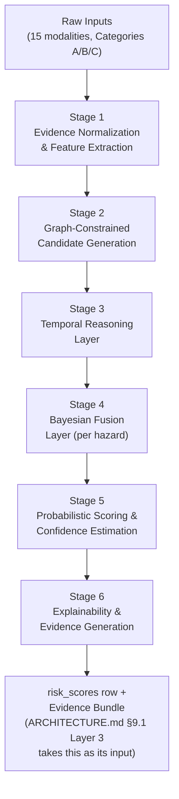
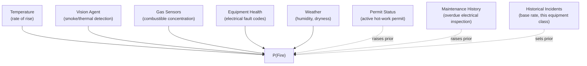
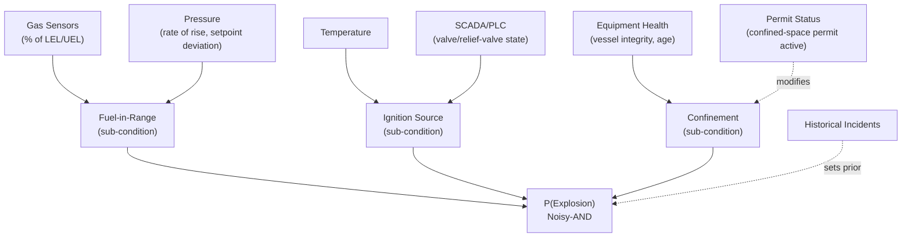
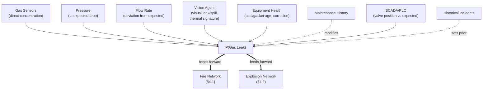
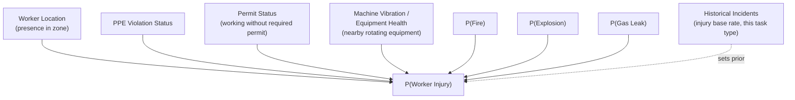
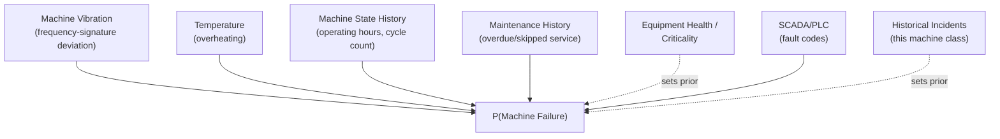

# AEGIS AI — The Risk Fusion Engine
### Multi-Formalism Probabilistic Reasoning Over Fifteen Heterogeneous Evidence Streams

**Classification:** Internal — Engineering / AI Systems
**Document Owner:** Office of the CTO / AI Systems Architecture
**Version:** 1.0
**Companion Documents:** `AGENT_ARCHITECTURE.md` §7 (Risk Fusion Agent — this document specifies that agent's Core in full), `ARCHITECTURE.md` §9.1 (Layer 2: Cross-Signal Correlation), §13 (Knowledge Graph), §14 (RAG); `DATABASE_SCHEMA.md` §10 (`risk_scores`), §14 (Camera Events), §19-21 (Weather, Sensor History, Machine History)

---

## 0. What This Document Is

`AGENT_ARCHITECTURE.md` §7 specified the Risk Fusion Agent's mission, memory, and escalation policy at the fleet level, and stated one hard constraint without fully unpacking it: *"never correlates signals the graph doesn't structurally connect... publishes an assertion only above a calibrated joint-confidence threshold."* This document is that unpacking — the actual reasoning engine inside that Core, specified in enough mathematical and structural detail that "how does it combine fifteen different kinds of evidence into one number" has a real answer, not a hand-wave.

---

## 1. Why Not If-Statements — The Design Philosophy

A rule engine ("IF gas > 10% LEL AND temperature > 80°C THEN raise explosion alert") is the obvious first design anyone reaches for, and it fails this domain in four specific, non-negotiable ways:

1. **Real hazards are conjunctive and probabilistic, not boolean.** An explosion requires fuel concentration in an explosive range *and* an ignition source *and* confinement — three genuinely uncertain conditions whose joint probability is not well-modeled by three independent thresholds ANDed together, because each condition itself exists on a continuum (18% LEL is meaningfully more dangerous than 11% LEL; both are "above threshold" to an IF-statement, but they are not equally dangerous).
2. **Threshold logic cannot express partial, corroborating, or conflicting evidence.** A gas reading at 9% LEL (just under a 10% rule threshold) combined with a confirmed thermal hotspot and an overdue relief-valve inspection is more dangerous than a reading at 11% LEL in isolation — but a threshold rule either fires or doesn't, per signal, with no mechanism to let weaker-but-corroborating evidence from other modalities change the picture.
3. **Threshold logic doesn't degrade gracefully or express uncertainty.** A rule engine facing an unfamiliar combination of evidence, a partially-missing sensor, or a genuinely novel equipment class either fires a rule it shouldn't or stays silent when it should speak up — there is no native way for an IF-statement to say "I am 60% confident, based on partial evidence."
4. **Threshold logic doesn't compose.** Fifteen input modalities against five hazard classes is, naively, a combinatorial rule-authoring problem that grows unmanageable and untestable well before commercial scale (`ARCHITECTURE.md` NFR-7's 500,000-sensor target) — and every new equipment type or sensor class would require hand-authoring new rules rather than the system generalizing from structure it already understands.

**The Risk Fusion Engine instead combines four distinct reasoning formalisms, each doing the job it is actually suited for:** graph reasoning decides *what evidence is even relevant* to a given hazard hypothesis for a given piece of equipment; temporal reasoning turns raw time series into features that capture trend, persistence, and precursor-sequence similarity — not just instantaneous value; Bayesian reasoning fuses heterogeneous, uncertain evidence into a calibrated posterior probability per hazard class; and probabilistic scoring converts that posterior into the risk score, confidence band, and time-to-event window the rest of the system consumes. Explainability and evidence generation are not a separate add-on stage bolted on afterward — they fall out naturally from the Bayesian network's own structure, which is precisely why this architecture was chosen over a less transparent alternative (e.g., a deep neural fusion model) that would have required a *separate*, potentially unfaithful explanation mechanism.

---

## 2. The Fifteen Inputs, Categorized by Functional Role

Not all fifteen named inputs play the same role in the reasoning pipeline. Treating them as if they did (as a flat feature vector) is itself a common design mistake this engine deliberately avoids. Each input is one of three functional types:

| Type | Role | Inputs |
|---|---|---|
| **A — Live Sensory Evidence** | Produces real-time likelihood ratios that directly move a hazard's posterior probability, moment to moment | Gas sensors, Temperature, Pressure, Machine vibration, Computer vision, SCADA/PLC status |
| **B — Contextual State Modifiers** | Does not itself constitute evidence of a hazard, but shifts *how much* a given piece of live evidence should count, or feeds a different hazard network downstream | Worker location, Permit status, Maintenance history, Equipment health |
| **C — Structural / Historical Priors** | Shapes the network's structure, its conditional-probability curves, and its starting base rates *before* any live evidence arrives | Historical incidents, Weather, Safety manuals, Government regulations |

This categorization is what prevents the classic naive-fusion mistake of treating "the ambient temperature is 34°C because it's July" (a Category C prior-shaping fact) as equivalent evidence to "the process temperature just spiked 12°C in ninety seconds" (a Category A live observation) — conflating the two is exactly how threshold-based systems generate false alarms during a heat wave.

**Category A in the reasoning pipeline** produces a **likelihood ratio** per observation — how much more (or less) likely is this specific reading given the hazard is developing, versus given it is not — computed against a baseline the Category C priors and Category B modifiers have already shaped.

**Category B** does not produce its own likelihood ratio against a hazard directly; instead, it **rescales the likelihood ratios Category A evidence produces**, or — in the case of Worker Location — feeds a *different* hazard network (Worker Injury) as a conditioning variable rather than as evidence for Fire/Explosion/Gas Leak/Machine Failure at all.

**Category C** operates once, upstream of any live event, to construct the Bayesian network's structure and its conditional probability tables (CPTs) — detailed in §3.4 and §4.

---

## 3. The Six-Stage Reasoning Pipeline



### 3.1 Stage 1 — Evidence Normalization & Feature Extraction

Every raw input, regardless of modality, is converted into a common **Evidence Node** representation before anything else happens: `{source_type, source_id, raw_value, normalized_value, unit, timestamp, quality_flag}`. Normalization is modality-specific but the output shape is uniform — a gas-sensor reading in ppm, a vibration RMS in mm/s, and a CV bounding-box detection confidence all become a `normalized_value` on a comparable [0,1] deviation-from-expected-baseline scale, computed against that specific sensor's own historical distribution (`ARCHITECTURE.md` §9.1 Layer 1's per-signal statistical baseline), not a single global constant. **SCADA/PLC evidence receives special handling here**: rather than being normalized as a simple value, control-state observations (commanded valve position, interlock state, relief-valve status) are converted into a distinct **discrepancy feature** — the difference between commanded state and observed physical state (e.g., "valve commanded closed, flow sensor shows continued flow of 40% of nominal") — because a control/actual mismatch is one of the single highest-diagnostic-value evidence types available to this engine, and collapsing it into an ordinary normalized value would waste that signal.

### 3.2 Stage 2 — Graph-Constrained Candidate Generation

Before any probabilistic combination happens, the Knowledge Graph (`ARCHITECTURE.md` §13) answers one question for the specific equipment or zone under assessment: **which of the available Evidence Nodes are even structurally eligible to be evidence for which hazard hypothesis?** A gas sensor two zones away with no `CONNECTED_TO` path to the equipment in question is graph-excluded from that equipment's Explosion network entirely — not down-weighted, *excluded* — because including it at any weight would reintroduce exactly the spurious-correlation risk this pipeline exists to avoid, and would not scale past a few hundred sensors before every hazard assessment considered thousands of irrelevant nodes.

This stage queries a bounded neighborhood (typically 1-2 hops, matching the Knowledge Graph's traversal pattern in `ARCHITECTURE.md` §13.5) around the equipment/zone, returning: directly-monitoring sensors, upstream/downstream connected equipment and their sensors, the zone's cameras, any active permits scoped to that equipment/zone, that equipment's maintenance history, and that equipment's historical incident record (via the graph's `SIMILAR_TO` incident relationships). **This is the single mechanism, more than any other in this pipeline, that makes the "no simple IF-statements" claim real** — the relevant-evidence set is *computed from topology*, not hand-authored per equipment or hazard type, meaning a newly-onboarded piece of equipment automatically gets a correctly-scoped hazard assessment the moment it's registered in the graph (`ARCHITECTURE.md` §17.3), with zero new rules written.

### 3.3 Stage 3 — Temporal Reasoning Layer

Raw instantaneous values are weak evidence on their own; *how a signal is moving* is almost always more diagnostic than *where it currently is*. This stage computes, per graph-admitted Evidence Node, four temporal features:

- **Rate of change (first derivative)** — a gas reading holding steady at 8% LEL is a different fact than one that reached 8% LEL by climbing 3 points in the last ninety seconds; the latter's rate of change is itself an input to the likelihood ratio computed in Stage 4, independent of the absolute value.
- **Persistence / dwell time** — matching the same anti-false-positive discipline established for Vision Agent (`ARCHITECTURE.md` §18.2): a two-second spike and a ten-minute sustained deviation are not equally weighted, regardless of peak magnitude.
- **Lead-lag cross-correlation** — for pairs of graph-connected Evidence Nodes, this stage tests whether one signal's movement reliably precedes another's by a consistent time offset (e.g., does this equipment's vibration signature change roughly ninety seconds before its temperature rises) — a genuine causal-sequence signal, distinct from simple co-occurrence, and one of the strongest indicators that two anomalies are the *same* developing event rather than two unrelated coincidences.
- **Precursor-sequence similarity** — the current signal trajectory (across all graph-admitted nodes jointly, not one at a time) is compared, via a sequence-similarity measure (dynamic time warping against labeled historical pre-incident windows retrieved from the Knowledge Graph's incident history), to the trajectories that preceded past confirmed incidents on this or structurally similar equipment. A high similarity score to a known pre-explosion trajectory is itself treated as a distinct piece of evidence in Stage 4, separate from and additive to the individual signal-level likelihood ratios.

The output of this stage is not a single fused number — it is a *feature-enriched* Evidence Node set, still per-modality, now carrying trend/persistence/sequence context forward into Stage 4's actual fusion.

### 3.4 Stage 4 — The Bayesian Fusion Layer

This is the heart of the engine: a distinct **Bayesian network per hazard class** (five networks — Fire, Explosion, Gas Leak, Worker Injury, Machine Failure, detailed individually in §4), each structured as a hypothesis node (`P(Hazard)`) with graph-admitted, temporally-enriched Evidence Nodes as parents, combined via **explicit probabilistic gates** rather than a flat weighted sum:

- **Noisy-OR gates** model *disjunctive* causal structure — several independent pathways, any one of which is sufficient to raise hazard probability (e.g., Fire can be caused by an electrical fault *or* a hot-work ignition source *or* a chemical exotherm; each pathway contributes its own likelihood ratio, combined such that multiple weak independent signals corroborate each other without requiring all of them).
- **Noisy-AND gates** model *conjunctive* causal structure — several conditions that must jointly hold for the hazard to be physically possible at all (e.g., Explosion structurally requires fuel-in-explosive-range **and** an ignition source **and** confinement; the absence of any one factor caps the network's output regardless of how strongly the other two are indicated — a rule real IF-statement logic could in principle express, but only as a brittle boolean; here it is a continuous, probabilistically-weighted joint condition where "explosive range" itself is a graded likelihood, not a step function).

**Where do the conditional probabilities in these gates come from?** Three sources, corresponding directly to Category C inputs, combined via genuine Bayesian updating rather than static hand-tuning:

1. **Safety manuals and government regulations** (retrieved via Knowledge Agent's RAG pipeline, `ARCHITECTURE.md` §14) supply the *initial structure and shape* of each likelihood function — critically, a regulatory threshold like "10% LEL alarm point" is not implemented as a step function that contributes zero likelihood below the line and maximum likelihood above it; it becomes the **inflection point of a continuous sigmoid likelihood-ratio curve**, so a reading at 8% LEL still contributes meaningfully elevated (if not maximal) likelihood. This is the specific, concrete mechanism by which a regulation is honored without becoming an IF-statement.
2. **Historical incident data** (via the Knowledge Graph's incident records and the `predictions.actual_outcome` feedback loop, `ARCHITECTURE.md` §9.5) provides empirical base rates and lets the network's CPTs be updated toward observed reality — this equipment class's actual historical frequency of explosion given a comparable evidence pattern, not merely a manual's theoretical prior.
3. **Expert-elicited priors** (Safety Officer input via the Playbook/procedure authoring tools, `ARCHITECTURE.md` §15.4) fill gaps for novel equipment with no incident history yet — explicitly given a *decaying influence weight* that recedes as real observational data accumulates for that equipment, a standard Bayesian hierarchical-prior technique that lets the network start informed rather than uniform, without letting an initial guess ossify into permanent bias.

### 3.5 Stage 5 — Probabilistic Scoring & Confidence Estimation

The Bayesian network's posterior `P(Hazard | Evidence)` is converted into the product's user-facing artifacts:

- **Risk Score (0-100):** a calibrated transform of the posterior probability, calibrated against the historical base-rate distribution for that hazard class so that a score of 78 means something consistent across equipment types (a rare hazard class's raw posterior probabilities live at a very different numeric scale than a common one, and the score must be interpretable uniformly regardless).
- **Time-to-Event Window:** the posterior probability, combined with the Stage 3 temporal trend features, feeds a survival-analysis model (`ARCHITECTURE.md` §9.1 Layer 3, owned operationally by the Prediction Agent, `AGENT_ARCHITECTURE.md` §8) — the Risk Fusion Engine's output is this stage's *input*, not a duplicate computation; this document's Stage 5 produces the calibrated probability and its uncertainty band, and time-to-event forecasting proper happens one layer downstream.
- **Confidence Estimation** decomposes uncertainty into two distinct kinds, reported separately rather than merged into one fuzzy number:
  - **Aleatoric uncertainty** — irreducible noise inherent to the process itself, present even with perfect, complete data (e.g., gas concentration naturally fluctuates within a band even under identical conditions). This uncertainty shrinks the confidence band around an otherwise well-supported posterior but does not change what action it implies.
  - **Epistemic uncertainty** — uncertainty from insufficient or missing evidence: a degraded/offline sensor in the graph-admitted evidence set, a genuinely novel equipment class with sparse incident history informing its CPTs, or an evidence combination the network has never encountered. High epistemic uncertainty triggers a qualitatively different response than high aleatoric uncertainty — specifically, a flag back to Knowledge Agent (`AGENT_ARCHITECTURE.md` §6) proposing that the missing relationship, sensor, or precedent be reviewed and incorporated, rather than simply reporting a wider confidence band and moving on. This distinction is what lets the engine honestly say "I am uncertain because the world is noisy" versus "I am uncertain because I don't have enough information yet" — two situations that call for different responses, which a single scalar confidence number cannot express.

### 3.6 Stage 6 — Explainability & Evidence Generation

Because Stages 2-4 are graph-structured and gate-explicit rather than an opaque learned embedding, explainability is not a separate model bolted on afterward — it is read directly off the Bayesian network's own internal state:

- **Contributing-factor ranking** — every Evidence Node's marginal contribution to the final posterior (its log-likelihood-ratio magnitude) is directly available and rankable, becoming the `contributing_factors` payload (`DATABASE_SCHEMA.md` §10's `risk_scores.contributing_factors` JSONB column) without any additional model needed to "explain" a separate black-box score.
- **Counterfactual generation** — because each Evidence Node's contribution is an explicit multiplicative factor in the network, the engine can cheaply recompute "what would the posterior be if this one node were at its baseline value instead," producing statements like *"if gas concentration were at its normal baseline, the fused probability would fall from 88% to approximately 15%"* — a genuine causal-attribution statement, not a post-hoc rationalization.
- **Evidence Bundle assembly** — every contributing Evidence Node's `evidence_refs` (raw sensor reading IDs, camera event IDs, permit/maintenance record IDs, per the Agent Bus envelope standard in `AGENT_ARCHITECTURE.md` §0.3) are packaged into a single retrievable bundle, which Knowledge Agent (§6 of that document) narrates into natural language under its strict citation-enforcement contract — the LLM Shell narrates a bundle the Bayesian network has already assembled; it never constructs the explanation independently, preserving the "interpretable-first, LLM-last" boundary established in `ARCHITECTURE.md` §9.2 all the way through to this engine's most detailed internals.

---

## 4. Per-Hazard Bayesian Network Design

Each of the five hazard classes gets its own network structure, because the *causal shape* of each hazard is genuinely different — Fire is disjunctive (several independent sufficient pathways), Explosion is conjunctive (several simultaneously-necessary conditions), Worker Injury is fundamentally an *interaction* between another hazard's probability and human presence, and Machine Failure is dominated by temporal/degradation reasoning rather than acute-event reasoning. Modeling all five with one generic structure would force a false uniformity onto genuinely different physical phenomena.

### 4.1 Fire


**Gate structure:** Noisy-OR across three independent ignition pathways (electrical fault, hot-work source, chemical exotherm), each itself a small sub-network of its own contributing evidence — this disjunctive structure directly reflects that a fire can start multiple genuinely different ways, and evidence for one pathway should not be diluted by the absence of evidence for another. **Vision Agent's confirmed smoke/thermal detection is weighted as strong, near-direct evidence** (a high baseline likelihood ratio) precisely because it is the modality closest to a direct observation of the hazard itself, rather than an indirect precursor signal — a deliberate design choice distinguishing "an indicator that fire is more likely" from "an observation that looks like fire is already happening."

### 4.2 Explosion


**Gate structure:** a Noisy-AND across three sub-conditions — Fuel-in-Range, Ignition Source, and Confinement — each itself a small noisy-OR sub-network over its own contributing evidence. This is the network in the fleet where the "no simple IF-statements" distinction is most consequential: a boolean AND over three threshold rules would treat "fuel at 9.9% LEL" as fully absent evidence; this noisy-AND gate instead treats each sub-condition as a graded probability, so a near-miss on one dimension combined with strong evidence on the other two still produces a meaningfully elevated (if capped) joint probability — matching how real explosion risk actually behaves.

### 4.3 Gas Leak


**Gate structure:** predominantly Noisy-OR — direct gas-concentration evidence, a pressure/flow discrepancy (loss of containment), and visual/thermal confirmation are largely independent corroborating pathways to the same underlying fact (material is escaping containment). **Gas Leak is also the clearest example of hazard-to-hazard causal chaining** (§4.6): its own output posterior is not just a terminal answer but an *input evidence node* into the Fire and Explosion networks, since a confirmed gas leak materially changes the fuel-in-range likelihood those networks compute.

### 4.4 Worker Injury


**Gate structure:** genuinely different from the other four networks — Worker Injury probability is dominated by a **multiplicative interaction** between (a) the probability of another hazard occurring at all and (b) whether a human is currently exposed to it without adequate protection, rather than a disjunctive-or-conjunctive combination of independent evidence. Concretely, `P(Worker Injury) ≈ P(any active hazard) × P(worker present in affected zone) × P(injury | exposure, current PPE/permit compliance)` — this is why Worker Location and Permit Status, which contribute nothing to Fire/Explosion/Gas Leak/Machine Failure's own physical-causality networks, are the dominant inputs here: the physical hazard's probability is imported as a single upstream node, and this network's real job is modeling the *exposure and protection* factors layered on top of it.

### 4.5 Machine Failure


**Gate structure:** the network in this set most heavily weighted toward the Stage 3 Temporal Reasoning Layer (§3.3) rather than acute conjunctive/disjunctive logic — Machine Failure is fundamentally a degradation/survival-analysis problem (classic predictive maintenance), where rate-of-change and precursor-sequence-similarity features (does this vibration signature's trajectory resemble the trajectory that preceded past confirmed bearing failures on this machine class) carry more diagnostic weight than any single instantaneous reading, and the noisy-OR combination here is comparatively simple relative to Explosion's conjunctive structure.

### 4.6 Hazard-to-Hazard Causal Chaining

The five networks above are not five independent, parallel computations — they form a small causal graph among themselves, computed in a specific order per assessment cycle: **Gas Leak and Machine Failure compute first** (they depend only on direct physical evidence), **Fire and Explosion compute second** (each takes the other's posterior, and Gas Leak's posterior, as an additional input evidence node — a confirmed gas leak measurably raises Explosion's fuel-in-range sub-condition, and a developing Machine Failure with electrical fault codes measurably raises Fire's electrical-pathway likelihood), and **Worker Injury computes last** (it takes Fire, Explosion, and Gas Leak's posteriors as direct inputs, per §4.4). This ordered, DAG-structured computation is itself graph-informed — the Knowledge Graph encodes which hazard classes are causally relevant to which others for a given equipment/zone context (a Worker Injury assessment in a zone with no combustible materials at all correctly excludes the Fire/Explosion nodes as parents, rather than always wiring in all five networks uniformly).

---

## 5. Worked Example: A Six-Minute Trace to 88% Explosion Probability

This trace is illustrative (the specific likelihood-ratio values are chosen for pedagogical clarity, not fitted to real data) but the *mechanism* — sequential Bayesian updating via odds multiplication, informed by graph-scoped, temporally-enriched evidence — is exactly how the engine operates. The scenario: Zone 3, Reactor Feed Line, equipment V-12 and its graph-connected neighborhood.

**t = 0 (baseline).** No live evidence yet. The Explosion network's prior comes from Category C sources: Historical Incidents supplies a base rate for this equipment class of roughly 0.0008 (8 explosions per 10,000 equipment-years of comparable process units, over a comparable 30-minute exposure window) — expressed as **prior odds ≈ 0.0008 : 1**.

**t = 1 min.** Gas sensor GS-14 (graph-connected, direct-monitoring) rises to 18% LEL against a stable historical baseline of ~2% LEL, and Stage 3's persistence check confirms this is sustained, not a transient spike. The Fuel-in-Range sub-condition's likelihood ratio for this pattern — informed by the safety-manual-derived sigmoid curve centered near the regulatory 10% LEL alarm point (§3.4) — evaluates to **LR₁ = 40**.
`Posterior odds = 0.0008 × 40 = 0.032` → **P(Explosion) ≈ 3.1%**

**t = 2 min.** Pressure sensor PT-22, one hop away on the same feed line (graph-admitted), shows a rate of rise of +2.4%/min against a normal baseline of ~0.1%/min, sustained for over 90 seconds (Stage 3 persistence gate passed). This evidence contributes to the same Fuel-in-Range sub-condition (an unexpected pressure rise on a feed line is consistent with contained gas accumulation). Historical-incident-calibrated **LR₂ = 15**.
`Posterior odds = 0.032 × 15 = 0.48` → **P(Explosion) ≈ 32.4%**

**t = 3 min.** Graph-context check: Permit Agent confirms no active hot-work/ignition-source permit nearby (a null result — this does *not* lower the estimate, since absence of one ignition pathway doesn't rule out others already reflected in the Ignition Source sub-condition's own prior). Maintenance Agent flags relief valve RV-9 — one hop away in the graph — as 45 days overdue for inspection, which modifies (Category B) the Confinement sub-condition's likelihood: an overdue-for-inspection relief valve raises the probability that over-pressure protection is compromised. **LR₃ = 2.5**.
`Posterior odds = 0.48 × 2.5 = 1.2` → **P(Explosion) ≈ 54.5%**

**t = 4 min.** Vision Agent's thermal camera near the line detects a hotspot at the flange adjacent to GS-14, confirmed across 4 consecutive frames (Stage 3/Vision Agent's temporal-persistence gate, `ARCHITECTURE.md` §18.2). This contributes to the Ignition Source sub-condition. **LR₄ = 6**.
`Posterior odds = 1.2 × 6 = 7.2` → **P(Explosion) ≈ 87.8%**

**t = 4.5 min.** Worker Agent confirms one worker currently present in Zone 3. This evidence is **graph-topologically irrelevant to the Explosion network itself** (per §4.2's structure, Worker Location is not a parent of Explosion) and does not move the 87.8% figure at all — instead, per §4.6's ordering, it becomes a direct input to the now-downstream Worker Injury computation: `P(Worker Injury) ≈ P(Explosion=0.878) × P(worker present=1.0) × P(injury | exposure, current PPE compliance)`, computed as its own separate posterior.

**Final Risk Fusion Engine output at t = 4 min:** Explosion risk score ≈ **88/100**, confidence **High** (four independent modalities corroborating, all graph-admitted, all temporally persistent — low epistemic uncertainty; moderate aleatoric uncertainty from normal process noise, reflected in a ±4-point confidence band). This posterior and its trend are handed to the Prediction Agent's survival model (`AGENT_ARCHITECTURE.md` §8) for the time-to-event window shown on the Risk Timeline (`UI_UX_SPECIFICATION.md` §9).

**Contributing-factor ranking (Stage 6 output, by log-likelihood-ratio magnitude):**
1. Gas concentration (GS-14) — LR 40 — dominant factor
2. Pressure rate of rise (PT-22) — LR 15
3. Thermal hotspot (Vision Agent) — LR 6
4. Relief valve RV-9 overdue inspection — LR 2.5

**Counterfactual (generated per §3.6):** *"If GS-14's gas concentration were at its normal baseline (~2% LEL) instead of its current 18%, the fused Explosion probability would fall from 88% to approximately 15% — the remaining elevated probability reflects the pressure, thermal, and maintenance evidence considered independently of the gas reading."* (Recomputed as `0.0008 × 15 × 2.5 × 6 = 0.18` odds → `P ≈ 15.3%`, exactly the figure a human reviewer could reproduce by hand from the numbers above — a direct, checkable demonstration that this engine's explanations are read off its actual computation, not generated separately from it.)

---

## 6. Confidence Estimation in Practice

Building on §3.5's epistemic/aleatoric distinction, the engine's confidence output is a structured object, not a single number:

```
{
  posterior_probability: 0.878,
  confidence_band: [0.838, 0.918],       // aleatoric — irreducible process noise
  epistemic_flag: "low",                  // all graph-admitted nodes had fresh, good-quality data
  corroborating_modalities: 4,            // gas, pressure, vision, maintenance — independent sources
  graph_relationship_novelty: "known",    // this evidence combination matches prior incident precedent
  data_completeness: 1.0                  // no graph-admitted sensor was degraded/missing at assessment time
}
```
Contrast this with a scenario where GS-14 itself is flagged `quality: 'uncertain'` (`DATABASE_SCHEMA.md` §20) at the moment of assessment: the same 88% posterior would instead carry `epistemic_flag: "elevated"` and a widened confidence band, and — critically — this would trigger a distinct downstream behavior (a flag to Maintenance Agent to prioritize GS-14's inspection, and a note in the Evidence Bundle explicitly stating that the dominant contributing factor's own data quality is in question) rather than simply reporting a vaguer number and moving on. This is the concrete difference the epistemic/aleatoric split makes in practice, not just in principle.

**Novel-combination handling:** when Stage 3's precursor-sequence similarity search (§3.3) returns no close match to any historical incident trajectory — a genuinely unprecedented evidence pattern — `graph_relationship_novelty` is set to `"novel"`, epistemic uncertainty is elevated regardless of how strong the individual likelihood ratios are, and the assessment is routed to Knowledge Agent with a request to treat this pattern as a candidate new precedent once its outcome is known (whether or not it turns out to be a real hazard) — directly feeding the Learning Agent's corpus-growth mechanism (`AGENT_ARCHITECTURE.md` §11).

---

## 7. The Evidence Bundle — Schema and Guarantee

Every posterior probability this engine produces is accompanied by an Evidence Bundle with the following guarantee, stated as a hard contract: **every number in the bundle is traceable to a specific, retrievable raw record, and every raw record cited was actually graph-admitted and used in the computation that produced this posterior — nothing is cited for plausibility that wasn't actually load-bearing.**

```
EvidenceBundle {
  hazard_class, equipment_id, zone_id, assessed_at,
  posterior_probability, confidence_band, epistemic_flag,
  contributing_factors: [
    { evidence_node_id, source_type, likelihood_ratio, evidence_refs: [sensor_reading_ids...] },
    ...  // ranked by |log(likelihood_ratio)|, per §3.6
  ],
  counterfactuals: [
    { removed_node_id, resulting_probability, delta }
  ],
  graph_context: { equipment_neighborhood_snapshot_id },  // the exact 1-2 hop subgraph used, versioned
  gate_structure_version, cpt_version                      // which version of this hazard's network structure and CPTs produced this result — reproducibility, not just explainability
}
```
`gate_structure_version` and `cpt_version` matter for a reason worth stating explicitly: this engine's networks are themselves versioned artifacts (updated via the Learning Agent's human-gated retraining proposals, `AGENT_ARCHITECTURE.md` §11), and a compliance-grade explanation (`ARCHITECTURE.md` §19.5, Post-Incident Review) must be able to state not just *what* evidence produced a historical assessment, but *which version of the reasoning engine* produced it — the same reproducibility discipline demanded of any safety-critical model, applied here at the level of a Bayesian network's structure rather than a neural network's weights.

---

## Closing Note: How This Engine Fits the Rest of the System

This document specifies the mechanism inside a single box in `ARCHITECTURE.md`'s Layer 2 (§9.1) and a single agent's Core in `AGENT_ARCHITECTURE.md` (§7) — it does not introduce a new service, a new database table, or a new autonomy tier; every output here (`risk_scores.contributing_factors`, the Evidence Bundle's `evidence_refs`) already had a home in `DATABASE_SCHEMA.md` before this document existed, and every consumer of this engine's output (Prediction Agent, Emergency Agent, Knowledge Agent's narration) was already specified expecting exactly this shape of input. What this document adds is the answer to the question a technical reviewer would ask first and a rule-based system could never satisfactorily answer: **not "does it raise an alert," but "why does it believe what it believes, to what degree, and what would change its mind."**

**End of Document.**

